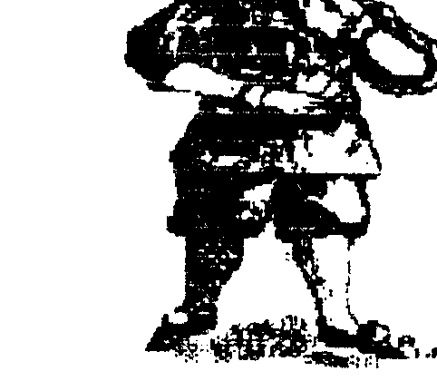
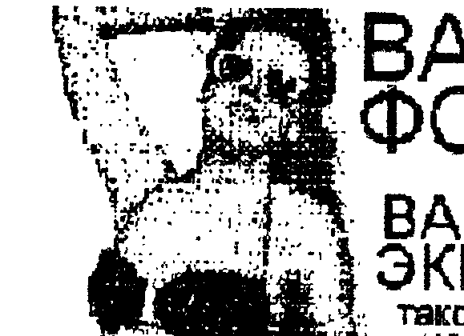

Издается фирмой COMAN, 111402 Москва а/я 20.

## НАША ЦЕНОВАЯ ПОЛИТИКА - 94

Продолжающаяся инфляция заставляет нас немного скорректировать свою ценовую политику.

Отменяются все "талоны", все вопросы о скидках решаются индивидуально.
В определении цен на программы вводится система "баллов".
Т.е. программа оценена в баллах, и для того, что бы определить сумму заказа, надо просуммировать все баллы и умножить на коэффициент.
Текущая величина коэффициента будет постоянно сообщаться в бюллетенях.

Нами издан каталог программ для ПК "Вектор" с указанием цен программ в баллах.
Желающие получить каталог (в нем приведен список программ с 1-й по 282-ю, а так же прайслист) должны прислать нам 3 ЧИСТЫХ конверта (без своего адреса) с марками на 20 руб. каждый.
Это будет своеобразная плата за каталог.

Сообщаем, что готовящаяся к изданию "Антология..." находится в работе.
Но из телепередач вы знаете, что сейчас стоит что то напечатать.
Просим вас не беспокоиться, мы постараемся максимально ускорить издание брошюр.

Все новые программы, приобретаемые у нас, будут сразу же комплектоваться сброшюрованным подробным описанием.

## Телеграфика на Векторе



Те, кто приобрел у нас журнал на дискете "Умник", наверняка были приятно удивлены графикой этого журнала.
Расскажем, как мы это делаем.

Во-первых, нами разработана программа, которая позволяет "передергивать" спрайты, которые имеют формат PCX на IBM PC, в формат Рембрандта, а затем при помощи NEWMM записывать их на дискеты CP/M-53.

Во-вторых, к нашей "писишке" подключен сканер, позволяющий за несколько секунд ввести любое плоское графическое изображение в нее.
А при помощи редакторов оно может быть подвергнуто любой деформации.
Вы наверное узнали в заголовке карточного джокера.
Теперь наши бюллетени будут богаче по части пояснительных рисунков, схем и просто картинок.

И в третьих, нами разработано, изготовлено и успешно эксплуатируется специальное устройство (пока без названия), которое мгновенно вводит видеоизображение (от телевизора, видеомагнитофона, телекамеры) в ПК "Вектор" в формате Рембрандта.
Практически весь "Умник1" был изготовлен при помощи этого аппарата.
Как вы могли убедиться, качество спрайтов, полученных при помощи этого аппарата ненамного хуже обычного телеизображения.
А на ч/б мониторе их вообще трудно различить.

Все это открывает огромные горизонты по части создания игровых и прикладных программ с отличной графикой, позволяет использовать весь потенциал ПК по части графики.
А применение упаковки изображения позволит размещать на одной дискете не 18-20 полноформатных спрайтов, а 40 - 50!
Ну чем не иллюстрированный журнал или комикс.
В ближайшее время вы увидите продукцию, изготовленную по новой технологии.

> ## Друг по переписке
>
> 348901 Украина г.Луганск п.Екатериновка ул. Центральная д. 20-А Гоповко А. ПК "Радио-86РК"
>
> 454070 г. Челябинск ул. 40 лет Октября д. 9 кв. 27 Серков М.И. ПК "Вектор-06ц"

## ВАШЕ ФОТО на ВАШЕМ ЭКРАНЕ - такого еще не было



Хотите приятно поразить домашних, друзей, соседей и остальных ПК-шников (особенно, если у них пресловутый ZX)?
А заодно сделать приятное, и главное, очень полезное приобретение.
Закажите свою фотографию в виде спрайта!

Ну приятное, это понятно, скажете вы, но чем же оно полезное?
Что я, свою ...лицо в зеркале не увижу?
Увидеть то увидите, да вот сделать ничего на сможете (уж как испекся).
Мы не предлагаем пластические операции в натуре, но на экране монитора - вы полный хозяин.
Причем, всегда можно вернуться на "исходные позиции".

Вот некоторые из применений вашего фотоспрайта:

- из черно/белого вы можете сделать его цветным - достаточно только "перейграть" палитру, что в Рембрандте займет 7 сек.
  Ведь можно прислать нам не только свой портрет, но и семейный, групповой, ребенка, девушки и т.д.
  А простота копирования, делает его "неуничтожимым".
  Если вы сделаете копии, то он не потеряется, не пожелтеет и не покоробится.
  Выслав несколько фотографий, вы можете сделать очень оригинальные фото-телеальбомы.
  Подобные оболочки вы уже можете приобрести.
- с одной фотографии мы высылаем несколько фотоспрайтов, разного масштаба.
  Вы можете вставлять их куда вам угодно, в программы, в заставки, рекламу, печатать на бумаге с разными масштабами и т.д. и т.д. и т.д.
- если вы высылаете фото в полный рост, то можете придумывать себе одежду, составлять из нескольких портретов групповой и наоборот, одевать/раздевать, вставлять себя на фон какого-либо пейзажа, или подставлять себя вместо другого персонажа.
  Например "Мы с Мухтаром на границе.." или "я со своим Мерседесом".
  Да мало-ли как можно похохмить.
- мы ведь можем сделать не только фотографию, а любое изображение - из журнала, газеты и т.д.

Итак, выслав нам 1500 рублей и оригинал (фото, вырезка и т.п. НЕ измятые и НЕ более формата А4), вы получаете:
дискету с 6-ю фотоспрайтами (1:1; 1:1,5; 1:2; 1:3; 1:4; 1:5) в формате Рембрандта 1 (оригинал возвращается).

То же самое, но на кассете, стоит 2000 рублей.

Если вы имеете доступ к IBM PC/AT, то вам есть резон приобрести то же, но в формате BMP (для Paintbrush), где вы можете покуражиться покруче, чем в Рембрандте.
Тем более, что это будет стоить на 500 дешевле - т.е. 1000 руб.

Кроме того, мы предлагаем для IBM PC:

- NEWMM - эмулятор CP/M (и др. ОС) - 2000 руб.
- FISH - программы для перекачки спрайтов .PCX в формат Рембрандта. - 3000 руб. с инструкцией.

## СУПЕР ОБЛОЖКА для ваших дискет

Те, кто приобрел у нас программы в конце прошлого и начале этого года на дискетах, получили их вместе с оболочкой, которая называется COVER.
Оболочка выводит на экран спрайт и список программ, находящихся на диске, а так же развлекает вас музыкой, пока вы выбираете программу для запуска.
Для запуска надо подвести курсор к программе и нажать <ВК>.
Оболочка с автозапуском, и пользоваться ей может даже неграмотное дитя.

За 1500 руб. мы предлагаем дискету, на которой: программа COVER, 5 полноразмерных спрайтов, инструкция по вставке спрайта в оболочку, инструкция "Как сделать программу с АВТОзапуском".
Спрайты каждому разные.
Инструкции в формате .TXT

Мы так же предлагаем СПРАЙТЫ для Рембрандта 256 х 256.
Называете тему и количество.
Цена одного - 100 руб. плюс дискета и пересылка - 500 руб.
На одной дискете - до 18-ти шт.
Вы можете использовать их для создания заставок, игровых фонов, совместно с фотоспрайтами и обложкой COVER.

## ТЕХНОЛОГИЯ ОБРАБОТКИ БОЛЬШИХ СПРАЙТОВ

Пожалуй, единственным недостатком граф. редактора Рембрандт, является то, что в нем не возможно обрабатывать спрайт размером больше чем 256 х 190 пиксел.
С появлением достаточно производительных устройств, выдающих заготовки спрайтов размером 256 х 256, возникает проблема их обработки в ГР.
Конечно, не всегда это требуется, т.к. в "дело" обычно идет не весь спрайт, а часть его.
Но иногда спрайт имеет большую высоту (тем более, что глаз лучше воспринимает "вертикальные" изображения), и от обработки его не уйти.

Если речь идет о создании спрайта "с нуля", то тут проблем больших нет.
Нарисовали верхнюю часть, вывели, сдвинули нарисованную часть вверх или вниз на требуемое количество пиксел, освободив тем самым место под недостающую часть.
Затем останется только состыковать две части в мониторе или текстовом редакторе.
Как это лучше сделать - чуть ниже.

Другое дело, если вы приобрели заготовку спрайта размером 256 х 256.
Разумеется, обрабатывать его придется по частям.
Обычно спрайт делится на 2 части, т.к. больше не требуется.
При этом надо правильно поделить спрайт.
При этом вовсе не обязательно делить его пополам.
Заготовки спрайтов, продаваемые нами, имеют максимальный размер, однако в байте "размер по вертикали" записано "B4", а не "FF".
Это сделано умышленно для того, что бы заготовки можно было просматривать в ГР.
Однако, как показала практика, делить спрайты удобнее в следующей пропорции.
Загрузив спрайт в Монитор или XSID, измените содержимое ячейки памяти, отвечающей за вертикальный размер.
Ее адрес - 111Н.
Запишите туда величину, соответствующую 80 - 90 строкам - 50Н, например.
Затем сохраните верхнюю часть спрайта - соответствующее количество строк.
При определении размеров вам поможет таблица, показывающая, начиная с какого адреса начинается строка.

ВНИМАНИЕ! Эта таблица составлена для спрайта 256 х 256 и для 4-х плоскостей.

| номер строки спрайта | адрес (начало - 100Н) |
| --- | --- |
| 1 | 0113H |
| 20 | 0B13H |
| 80 | 2913H |
| 90 | 2E13H |
| 180 | 5B13H |

Недостающие значения вы легко расчитаете сами, зная формат.

Затем вам следует переместить нижнюю часть спрайта вверх под самую палитру, для того, что бы не нарушить формат по вертикали.
Не забудьте снова изменить размер по вертикали.

Порядок действий поясним на примере.

1) Загрузить спрайт в Монитор, записать адреса начала и конца.
2) Директ. S111 записать в ЯП 0111Н число 50Н
3) Вывести на МЛ или диск верх. часть (ВЧ) с адреса 100Н по 3000Н (лишнее не повредит, а с целыми числами удобнее).
4) Переместить нижн. часть (НЧ) снизу вверх, сохранив палитру.
   Директива M2913, 8000, 113
5) Директивой S111 записать в ЯП 0111Н число B4H (180 стр.)
6) Вывести НЧ с адреса 100Н по 8000Н.

Таким образом, мы разбили спрайт на два (с перекрытием в несколько строк).
Теперь с каждым из них можно начинать работать.

Начинать работать лучше с НЧ, т.к. он содержит в себе 2/3 информации.
При загрузке НЧ в ГР, полезно установить режим "прием с палитрой" (но не обязательно).
Отредактировав НЧ, сохраните ее.
Затем перенесите верхние 20 - 50 строк спрайта в самый низ рабочего поля и загрузите в ГР ВЧ (на этот раз без палитры).
После загрузки, опять же переносом верхние строки НЧ к нижним, еще не отредактированным строкам ВЧ.
Такая процедура необходима для того, что бы обеспечить качественное редактирование стыка двух частей.
Но редактировать строки от НЧ уже нельзя (вернее, не надо).

Отредактировав ВЧ, выведете ее с несколькими строками НЧ.
Будьте особенно внимательны, если вы изменяли размер спрайта по горизонтали.
Следите за тем, что бы части имели одинаковый размер.
Иначе все у вас "поедет".

Соединяют две части следующим образом.
Загрузив ВЧ в Монитор с адреса 100Н, загружают НЧ с таким смещением, что бы не было наложения.
После чего находят начало НЧ, ее палитру и 3 служебных байта.
После них лежит собственно спрайт.
Запишите адрес, откуда он начинается, и его первые 5-10 байт.
После этого, по директиве Q100, 3000 (поиск, см. инструкцию монитора), сделайте поиск записанной последовательности.
После того, как вам будет сообщен адрес, начиная с которого лежит точно такая же последовательность в ВЧ, директивой M подстыкуйте НЧ к ВЧ (без палитры и размеров).

Осталось только изменить размер спрайта по вертикали в ЯП 111Н и вывести его на внешний носитель.

## СПРАЙТ на принтере

Появление возможности получать спрайты в неограниченном количестве и достаточно высокого качества, включая фотоспрайты (см. стр. 1 этого бюллетеня), делает вновь актуальным вопрос о качественной распечатке спрайтов на принтере.
Ведь одно дело, распечатывать спрайты качеством а-ля-Казаков, и другое - свою собственную фотографию, или свои "фирменные" бланки или колонтитулы на документацию.

Подавляющее большинство принтеров, находящихся на руках, черно/белые.
Поэтому, передать всю выразительность спрайта, можно только оттенками серого цвета.
Но и эти оттенки можно формировать различными способами.
Но, как правило, вы пользуетесь уже готовыми программами, написанными кем-то, поэтому лучше вести речь о подготовке спрайта к печати конкретной программой.

На настоящий момент нам известны 3 программы (не считая Бейсика), которые что-то выводят на принтер в виде картинки.
Первая и самая ранняя - это Карандаш (ГР).
Он достаточно распостранен, но программа печати, встроенная в него - достаточно примитивна и речи о градациях своего там не идет.

Другой программой является программа, зашитая в СУПЕР-ПЗУ и предназначенная для распечатки экрана - режим "Print Screen".
Она может переключать граф. режимы принтера, и как следствие этого, добиваться полутонов в некоторых режимах (правда, за счет деформации изображения).
Справедливости ради надо сказать, что перед этой программой и не ставилась задача получить полутона.
Ее назначение - выхватить в определенный момент информацию и получить "твердую" копию экрана - инструкцию, картинку, план, схему и т.п.

Наконец, третья программа, совершающая аналогичные действия - это SpritePrinter, сокращенно SPRINT.
На настоящее время это наиболее совершенная программа, специально ориентированная на получение бумажной копии спрайтового оригинала, с минимальным расхождением.
Но и она требует своего подхода.

Многие, купив эту программу, и поработав с ней, испытали разочарование.
Как-так? на экране одно - на бумаге другое.
Так в чем дело?
Давайте разберемся.

Дело в том, что принтер не может печатать градации серого цвета.
Он либо ставит черную точку на бумаге, либо нет, таково уж у него свойство.
Первые две программы работают по правилу - фон (0-й матем. цвет) - НЕ ставим точку.
Любой другой (1 - 15) - ставим точку.
Для получения градаций необходимо формировать изображение искусственно - т.е. обрабатывать спрайт по определенным правилам.
Правила могут быть самыми разными, но мы посмотрим, как это делает SPRINT.

Каждый пиксел спрайта превращается в матрицу, размером 3х3.
А весь спрайт как бы увеличивается в 3 раза по горизонтали и в 3 раза по вертикали.
Заполнение матрицы производится в зависимости от того, какой МАТЕМАТИЧЕСКИЙ цвет имеет этот пиксел.
Правила тут такие: чем больше НУЛЕЙ - тем темнее будет матрица, тем больше черных точек будет в ней.
Например, фон (мат. цвет 0000) - будет весь черный, цвет 3-й (цвет 0011) или 6-й (0110) - будут "средней серости", 7-й (0111) или 14-й (1110) - более светлые, 1-й (0001) или 8-й (1000) - темно-серые, а 15-й цвет - белый (т.е. матрица 1111 и принтер в этом месте бумагу не пачкает).
Обратите внимание на то, местарасположение нулей и единиц не имеет значение - важно лишь их количество.
Таким образом на матрице 3х3 мы получаем пять градаций серого цвета.
Черный, темносерый, серый, светлосерый и белый.

Программа при запуске запрашивает достаточно много параметров, и вы можете настроить принтер и программу.

И всего сказанного можно сделать вывод, что для того чтобы качественно распечатать спрайт на бумаге, надо его подвергнуть дополнительной обработке.
Т.е. загрузив его в ГР, надо перекрасить (не подобрать палитру, а именно перекрасить, т.е заменить одни цвета на другие) его таким образом, что бы более светлые места были закрашены цветами, содержащими больше "единиц".
При этом удобно изменить физические цвета, для наглядности, выбрав из них те же пять градаций от черного до белого.
Тогда вы на экране будете видеть практически то же, что и потом получите на бумаге.

Конечно, трудно назвать всю эту механику удобной в работе, но, как говорится, без труда не вынешь....
Но к слову сказать эта процедура в Рембрандте занимает немного времени, т.к. существуют различные "заливки", "маски" (дающие, кстати, некоторый простор для маневра градациями серого), и другие приемы.

Мы готовим новую программу для распечатки спрайтов.
Вот с ней действительно будет удобно работать.
СЛЕДИТЕ ЗА РЕКЛАМОЙ!

## Textas: управление принтером

Прежде чем рассказать, как в ТР можно управлять принтером, остановимся на распределении памяти при работе с ТР и назначении некоторых служебных ячеек памяти.

- E000H - FFFFH - используемая экранная плоскость.
- 0100H - 0BFFH - п/программы интерфейса и связи.
- 0C00H - 1600H - транслятор ассемблера
- 1600H - 16FFH - буфер строки редактора
- 1700H - 17FFH - буфер словаря.
- 1800H - 3800H - собственно текстовый редактор.
- 3800H - 4000H - область трансляции.
- 4000H - ..... - начало текстового буфера
- ..... - таблица меток ассемблера.
- ..... - стек

Назначение ячеек интерфейса.

- 0100H - старт редактора.
- 0103H - 0118H - старт на п/п монитора (при работе с М-О)
- 011EH - п/п вывода символа на экран (D - Y 0-24 E - X 0-39 C - код символа)
- 0121H - п/п вычисления верт. координаты по № строки. (D - № строки, A - координата в точках)
- 0124H - п/п включения курсора по координатам D,E
- 0127H - п/п выключение курсора.
- 0130H - п/п скроллинга экрана (флаг C=0 - вверх, =1 -вниз) (DE - количество текст. строк)
- 0133H - п/п включения обработки клавиатуры.
- 0136H - п/п установки палитры HL - адрес 16-байтов с палит.
- 013CH - тип курсора (0 - линия, 1 - "блок")
- 013DH - значение регистра скроллинга
- 013EH - "1" - заявка на переустановку палитры.
- 013FH - цвет символов (BBGGGRRR)
- 0140H - цвет фона (BBGGGRRR)
- 0141H - старш. байт адреса используемой экран. плоск.

Как видите, область трансляции не велика (2 Кб.).
Поэтому, если вы собираетесь транслировать достаточно большой текст, сохраните его перед трансляцией (или ту часть, которая может быть затерта текстом оттранслированной программы).

Прежде чем вставлять управляющие символы в текст, вы должны "вооружиться" таблицей управляющих символов для вашего принтера и таблицей кодов ASCII.

Вставить коды в текст можно несколькими способами.
Первый - при помощи Монитора-Отладчика.
Загрузив монитор, надо написать последовательности байт следующего содержания: 0D 0A N1 N2 .. NN 0D 0A N1 N2 ... NN и т.д., где N1,N2,NN это управляющие последовательности символов.
Составьте последовательности для всех случаев жизни (вернее все, что воспринимает ваш принтер).
После этого выведете этот файл на МЛ и введите в ТР.
Вы увидите, что на экране появились заветные символы, которые вам не удавалось создать при помощи клавиатуры.
Теперь надо войти в режим "Запись в словарь" и занести в него нужные вам символы.
В дальнейшем, вы можете вставлять их в любое место и время из словаря.
Управляющие символы сохраняются и при выводе файла.
Т.к. словарь теряется при выключении питания, рекомендуем а) сделать в ТР поясняющие надписи об управляющем символе, и б) сохранить этот файл, что бы не изготавливать его каждый раз заново.
Тогда, перед началом работы с любым текстом, вы загружаете этот файл и пользуетесь им.
Лишние символы удаляете.

Можно поступить и по-другому, используя встроенный монитор.
Когда вы набиваете текст, в те места, где бы вы хотели поместить управляющие символы, забейте несколько пробелов или каких либо символов.
После того, как текст, или часть его набита, перейдите в режим монитора и просмотрите дамп памяти (текстовый буфер, разумеется).
Там вы увидите свой текст и в нем символы, вместо которых вам надо вставить управляющие последовательности кодов.
После перехода в текстовый режим, вы так же увидите, что вместо "левых" символов появились управляющие.

Как видите, все "болезни" TextAs-а лечатся за одну минуту, если знать как.
А вы теперь знаете.
Поэтому попробуйте, и вы увидите, что он гораздо лучше пресловутого RETEX-а.
Вы даже можете вставлять картинки в свой текст.
Для этого надо загрузить спрайт и обрамить его соответствующими управляющими символами.
Как это сделать, мы расскажем подробнее в следующий раз, а пока попробуйте TEXTAS - райское наслаждение.

## БУКВАРЬ ПРОГРАММИСТА

При написании программ, каждый программист иногда сталкивается с проблемой арифметических вычислений.
То, что на Бейсике делается одним оператором, на ассемблере превращается в такой огород, что диву даешься.
Приведенные ниже программы помогут начинающим преодолеть некоторые барьеры арифметических вычислений.
Ведь без этих вычислений невозможно реализовать достаточно большой круг задач как прикладного характера, так и игровых.
Некоторые интересные решения приведены в брошюре "От Бейсика к Ассемблеру".
Мы пополним эту библиотеку п/программ.

СЛОЖЕНИЕ: Сложение одно- и двухбайтных чисел производится без проблем - есть соответствующие команды процессора.
Но максимальный результат 65536.
Сейчас такой цифрой и зарплату не выразишь.
Пора переходить на 3-хбайтные числа.

п/п сложения трехбайтных чисел, где SL0,SL1,SL2 - адреса ЯП первого слагаемого.
SL3, SL4, SL5 - второго и результата.

```
SUM3:   LHLD SL0  ; чтен. 2-х младш. байт первого слаг.
        XCHG      ; запись их в рег. пару
        LHLD SL3  ; чтен. 2-х младш. байт втор. слаг.
        DAD D     ; сложение двух пар.
        SHLD SL3  ; сохран. в памяти результата.
        LDA SL2   ; чтен. старш. байта первого слаг.
        LXI H,SL5 ; чтен. старш. байта второго слаг.
        ADC M     ; сложение с учетом переноса.
        MOV M,A   ; запись старш. байта результата.
        RET
```

ВЫЧИТАНИЕ: Тут немного сложнее, т.к. просто вычитать можно только однобайтные числа.

п/п вычитания 2-байтных чисел, где HL уменьшаемое, DE вычитаемое, BC разность

```
VYCH2:  MOV A,L
        SUB E     ; вычит. младш. байтов
        MOV C,A   ; запоминание результата
        MOV A,H   ; перемещение старш. байта
        SBB D     ; вычитан. с учетом переноса
        MOV B,A   ; запись результата
        RET
```

п/п вычитания 3-хбайтных чисел, где SL3, SL4, SL5 уменьшаемое и результат, SL0, SL1, SL2 вычитаемое

```
VYCH3:  LXI H,SL0 ; загр. адр. пары младш. байт вычитаемого
        LXI D,SL3 ; загр. адр. пары младш. байт уменьшаемого
        LDAX D    ; загр. младш. байта уменьшаемого
        SUB M     ; вычитание
        STAX D    ; сохран. младш. байта разности
        INX D     ; инкрем. адресов
        INX H
        LDAX D
        SBB M     ; получ. второго байта разности
        STAX D    ; и сохранен. его
        INX H
        INX D
        LDAX D
        SBB M     ; а вот и третий байт
        STAX D
        RET
```

УМНОЖЕНИЕ: Производится обычно между 2-хбайтным числом и однобайтным.
Если оба сомножителя однобайтные, то просто считают, что старш. байт одного из сомножителей = "0".
Перемножения 2-х двухбайтных чисел не производится, т.к результат всегда превосходит ожидание, да и один сомножитель всегда можно разбить на два однобайтных.

п/п умножения, где A - множитель, DE множимое, HL результат

```
UMNOG:  LXI H,0   ; сброс промежут. результата.
STEP1:  ORA A     ; проверка множит. на равенство "0"
        RZ        ; конец, если он = "0"
STEP2:  RAR       ; младш. бит множителя в переносе
        INC STEP3 ; если перенос ="0" - пропуск сложен.
        DAD D     ; сложен. множимого и промеж. результ
STEP3:  XCHG      ; сдвиг множимого
        DAD H
        XCHG
        JMP STEP1
```

В следующий раз мы рассмотрим деление и преобразование чисел.

Просим вас присылать свои варианты различных п/программ которые совершают интересные действия.
Это могут быть звуковые и видеоэффекты, различные преобразования и др.

## Прайс-лист от 15 янв. по 15 февр. 1994 г.

- Контроллер дисковода "Вектор", "Львов" — 15000 руб.
- Принтер MC6312 с головкой и кабелем — 60000 руб.
- Дискеты (Гонконг) — 400 руб.
- Почтовые услуги — 300 р. за 1 кг.
- Кабель 40 жил пл. — 800 р.
- Головка принт. — 3000 р.
- ВЧ модулятор — 1500 р.
- Исполнительное устройство — 1000 руб.
- Геркон. клавиша — 50 руб.
- Блок дисковода для "Вектор", "Львов" с сист. диском — 70000 руб.
- Дисковод — 42000 р.
- ROM-диск 64/128 Кб (с супер ПЗУ) — 15000 р.
- Программатор ППЗУ УФ с драйвером — 7000 р.
- Плата печатная для того и другого — 1000 р.

Справки по тел. 302-8222 с 9 до 18 мск.

Для получения товара, необходимо выслать почтовый или телеграфный перевод по адр. 111402 Москва а/я 20 Тимошенко К.А.
Содержание заказа укажите в письме или на обратной стороне перевода.

## Головка MC6902. Некоторые проблемы и их решения

Струйные принтеры, как известно, работают совместно со струйной головкой MC6902.
Как работает эта головка.
Внутри корпуса находится материал, напоминающий губку или поролон, пропитанный красящим веществом - специальными чернилами.
При печати на электроды, расположенные на части головке, обращенной к бумаге, подается напряжение (ок. 16 вольт) и под действием электростатических сил, чернила начинают высасываться из головки.
На рабочей поверхности появляется микроскопическая капелька, которая тут же впитывается в бумагу.
Чем бумага более рыхлая, тем лучше на нем печатает головка.
Но след при этом становится расплывчатым.
Как показывает практика, наилучшей бумагой для струйного принтера является сорт бумаги "Писчая №1" и "Писчая №2".
Применять специальную бумагу (бамбуковую или рисовую) для игольчатых принтеров не рекомендуем, т.к. она плохо впитывает чернила, они долго сохнут и есть вероятность их размазать.

Если головка немного подсохла (такое бывает при длительном хранении "про запас"), то вернуть ее к жизни можно несколькими способами.

1) Возьмите кусок поролона и хорошо пропитайте его водой.
Затем возьмите полиэтиленовый пакет и положите туда этот поролон и подсохшую головку и тщательно заверните.
Положите этот сверток в теплое место (например на батарею) на 1-3 дня.
Водяные пары проникнут внутрь головки и немного "размочат" ее.

2) Дозаправка головки.
Речь идет не о заправке, а о ДОЗАПРАВКЕ.
Чернила, находящиеся внутри, заодно служат охлаждающим реагентом.
Поэтому, если вы хотите, что бы головка служила долго, то не дожидайтесь, пока она совсем концы отдаст, а потом лечите.
Старайтесь вести хотя бы приблизительный подсчет количества отпечатанных листов.
Головка расчитана примерно на 500 листов текста.
Графическая печать увеличивает расход чернил.
Поэтому заведите для себя порядок - дозаправлять через 100 или 200 листов.

Чем можно заправлять головку.
Как показала практика, наиболее оптимальный состав состоит из смеси профильтрованных чернил "Радуга" и штампельной краски.
Соотношение примерно такое: 80% чернил и 20% краски.
Если будет больше чернил, то печать будет жирнее, сохнуть они будут быстрее, но результаты будут смываться водой.
Если же будет больше краски, то печать будет прочнее, но долго сохнет, что не всегда удобно при печати.
Но вообще говоря, это соотношение достаточно условно.
Вы сами можете поэкспериментировать с составом.
Более того, вы даже можете промыть головку, желательно дистилированной водой и заправить ее цветными чернилами.
Заправка производится при помощи шприца, игла которого вводится в отверстие на тыльной стороне головки.

Справедливости ради надо сказать, что "вечной" головку все равно сделать не удастся, и всегда надо иметь запасную.

## ПРОГРАММЫ ДЛЯ ПК "ВЕКТОР"

| Индекс | Название | Описание |
| --- | --- | --- |
| 268 | AGRESSOR (2) | прорыв на катере по реке к базе противника |
| 269 | BILLY (2) | бой десантника с разной нечистью в лабиринте. |
| 270 | DRAGON (2) | дракончик ловит призы, уворачиваясь от пауков. |
| 271 | KOBRA (2) | игрушка из семейства "Удав". |
| 272 | LIFE2 (2) | упрощенная версия этой демонстрацион. прогр. |
| 273 | PIF/PAF (3) | динамичная стрелялка а-ля-Спейскоммандер. |
| 274 | ROBBO3 (3) | продолжение приключений робота. |
| 275 | TARZAN (2) | игра типа "Раннер". |
| 276 | TV-SERVIS (3) | поможет подстроить телик или монитор. |
| 277 | COSMAN (2) | космонавт бегает, прыгает, стреляет.... |
| 278 | DOWN T.E.-4 (3) | очередные планеты.... |
| 279 | RAINBOW (4) | самая крутая цветомузыкальная программа. |
| 280 | SOCOBAN2 (3) | известная головоломка. Хорош. графика. |
| 281 | ПЕЩЕРА (2) | игра типа "Раннер". |
| 282 | COOKY2 (2) | упращенная версия игры. |

В скобках указана цена копии в условных единицах.
При составлении заказа, необходимо просуммировать баллы, прибавить стоимость кассеты (МК60 - 10 баллов; С90 (Кит.) - 15; С90 "фирма" - 25; дискета (Кит.) - 8; дискета "фирма" - 20 бал.)
Затем прибавьте стоимость пересылки - 8 бал. за 1 КГ и умножьте на коэффициент.

1 балл = 50 руб. (до 15 февраля 1994 г)

## Фирма COMAN предлагает свои услуги по разработке оригинальных электронных устройств по технич. заданию заказчика. Изготовление добротных прототипов, макетов, серийное производство.

К читателям и заказчикам! В последнее время у нас небольшие проблемы с телефоном.
Мы сидим на месте, поэтому советуем налегать на почту, а не ждать, пока прозвонитесь.

Подписная цена на инфо-бюллетень 100 руб/номер.
Для подписки необходимо выслать ПОЧТОВЫЙ перевод на любую сумму по адресу: 111402 Москва а/я 20 Тимошенко Конст. Андр.
Не забудьте указать на переводе с какого номера вы хотите получить бюллетень и разборчиво свой адрес.
