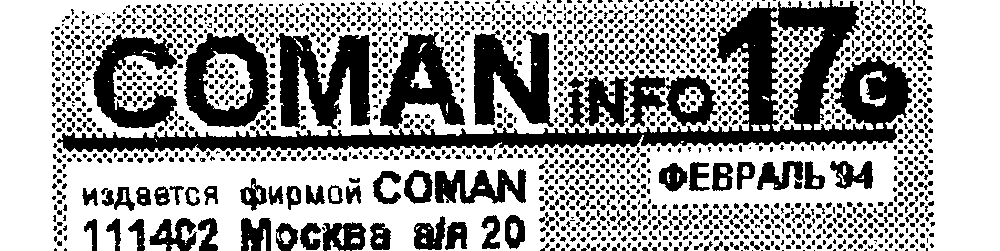
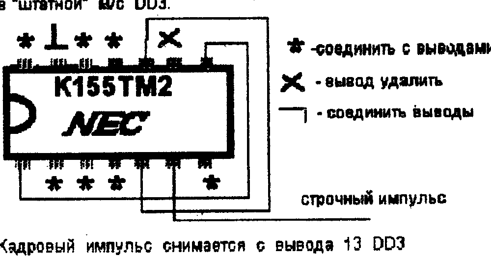
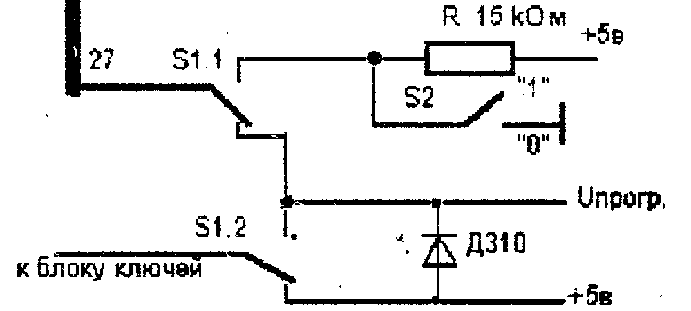

Издается фирмой COMAN, 111402 Москва а/я 20.

## PROM-SYSTEM. Второе дыхание ПК "Львов"

Нами закончена разработка и испытания PROM-SYSTEM-ы для ПК "Львов".
И начато ее серийное производство.
Скажем не похваляясь, что эта штука дает "Львову" если не вторую жизнь, то второе дыхание точно.
И все это благодаря простоте доработки самого ПК, а также благодаря содержимому системы.

Конечно, прежде чем бежать на почту и отправлять нам перевод за PS, вам хочется узнать, а что "зашито" в ней и вообще, что как.

Прежде всего, вы должны решиться на доработку своего ПК.
Правда, доработка эта заключается, как вы знаете из №15, всего в двух проводах.
Напомним о ней еще раз.

1) Соединить проводом вывод 6 м/с Д9 с контактом 8 разъема "Внеш.1"
2) Соединить проводом вывод 5 м/с Д5 с контактом 12 разъема "Внеш.1"

Кстати, не открывая некоторых коммерческих тайн, советуем сделать вам эту доработку в любом случае - поверьте - пригодится.

Теперь о том, ЧТО ТАМ и как с ним работать.
Как мы уже писали, после того, как доработка сделана, заветный картридж вставлен в разъем и нажата клавиша <СБР>, на экран выводится следующая картинка.

```
UMgroup PROM-SYSTEM Lvov

PROM 1                    PROM 2
BASIC 2.0
TURBOCOPY
MONITOR +
PICASSO                   пока чистое поле, но
ASM-91                     если вы вставите
EPSON                      еще одно ПЗУ, то и
DATABASE                   тут будет список
ARJ                        программ.
MUZ.ED
GPM
```

Для выбора какой либо программы, достаточно подвести к ее имени цветной курсор (на ч/б мониторе он тоже заметен) и нажать <ВК>.
Программа загрузится из ПЗУ и запустится.
Кроме того, в ПЗУ присутствует программа "Commander", хотя она и не выводится в директорий.
Она сразу стартует и выводит приведенную картинку, обеспечивает перегрузку и запуск.
Те, кто приобретут PS получат в прилагаемой инструкции исчерпывающие сведения о ней, а так же инструкцию по "набивке" другой м/с.

Как видите, в системе присутствуют как старые знакомые, так и программы, названия которых вам ничего пока не говорят.
Посмотрим, что это за программы, и стоит ли тратить на них деньги.

BASIC 2.0 - как догадались, старый добрый Бейсик, зашитый в "родном" ПЗУ "Львова" его разработчиками (что 5 их так хоронили, как они его сделали).
Ведь старое ПЗУ осталось на месте и Бейсики еще не отменили.

TURBOCOPY - то же всем известный турбо-копировщик. (В нашем каталоге он проходит под именем S13).

MONITOR+ - мощнейший монитор со встроенным дизвссемблером и графическим редактором. (описание в №6).

PICASSO - наиболее мощный графический редактор. (№3).

ASM-91 - компилятор Ассемблера (описание в №11).

Судя по письмам, эти программы наиболее популярны в народе и удовлетворят почти всех. (Хотя есть борцы за чистоту веры).

DATABASE - русифицированная база данных (СУБД). В свое время, ее автор, страдающий русофобией, напихал в нее инструкцию на английском.
Эта СУБД "шпрехает" на "великом и могучем....".
Удобна как записная книжка, справочник, каталог и т.д.
Даже словарь, если не лениво загружать 30 - 40 Кб.

MUZ.ED - музыкальный редактор (описание № 2).
Простой и не очень удобный, но написание чего то более крутого не представлялось нам целесообразным.
Вот скоро будет SOUND SYSTEM - будет вам и белка и свисток.

GPM - программа печати спрайтов на принтере. (оп. № 8).
позволяет распечатывать спрайты, созданные PICASSO на принтере с разными масштабами.
Позволит вам сделать ваш текст насыщенными рисунками и иллюстрациями.

Более подробно стоит поговорить о двух других программах.

EPSON - новый текстовый редактор, ориентированный только на создание текстов.
(Как вы знаете, SAMARA, наиболее распостраненный редактор, может "писать" и тексты просто и тексты программ, для последующей трансляции).
В этом редакторе можно написать только текст, но зато как!

Основное его преимущество - наличие текстового процессора, что позволяет видеть текст таким, какой он будет на бумаге.
Т.е., если на экране строка "кончилась" и курсор уткнулся в правый (или левый) край, то переноса строк не происходит, просто весь текст сдвигается влево (или вправо).
Смотреть на такой текст менее приятно, зато не надо подгонять строки, что бы все было красиво на бумаге.

Кроме того, редактор имеет очень большой набор символов, включая псевдографику.
Это позволяет вам обрамлять текст или часть его рамочками, рисовать таблицы, схемы и чертежи, и всякие другие прибамбасы.
Короче создавать текст не хуже того, который вы сейчас держите в руках (по оформлению).
К текстовому редактору прилагается подробная инструкция по использованию, управлению принтером и т.п.

ARJ - программа для упаковки (и распаковки) программ и архивирования информации.
С помощью этой программы, вы можете упаковать программу или спрайт от "процентов" до "разов".

Работает она следующим образом.
После запуска, вы вводите в нее файл (это может быть либо программа, либо просто информация - спрайт, например) в обычном формате BLOAD.
Архиватор пакует этот файл.
Спрайты, например, пакуются в 1,5 - 3 раза и больше (зависит от спрайта), готовые программы пакуются в 1,2 - 2 раза (зависит от программы и насыщенности ее спрайтами).
Но в любом случае, уменьшение объема происходит, увеличения - никогда.
После упаковки вы можете вывести спрайт в одном из двух форматов: формат .ARJ и формат TURBO.
Формат ARJ по скорости (да и физически) практически не отличается от обычного BLOAD.
Правда выбор скорости вывода из ряда 800-1200-1600 здесь тоже предоставляется.
Этот формат в основном, предназначен для вывода информации, которую затем "вставят" в другие программы.
Его можно загрузить в Монитор и т.д.
Структура упаковки, а так же методы ее применения и распаковки приведены в инструкции, прилагаемой к PROM-SYSTEM-у.
Однако и просто программы вы можете (а иногда и должны) выводить в этом формате.

Формат TURBO применяют в случае, когда у вас крутой магнитофон, и вы практически не испытываете проблем с вводом программ (по крайней мере, записанных на нем же).
Впрочем, попробовать всегда есть резон.
Этот формат "быстрее" BLOADа в 2,5 - 3 раза.
Правда, вероятность ошибки у него несколько больше, но при хорошем магнитофоне и кассете - одинаковая.

Давайте подсчитаем эффективность.
Упаковка - 2 раза (сред.), скорость работы с маг-ом (1600) - 2 раза, применение формата - 2,5 раза.
Итого 2 х 2 х 2,5 = 10 раз! экономия по времени на загрузке программ.
Согласитесь - очень и очень недурно.
Вместо 10-ти кассет - одна.

Для запуска упакованной программы вам надо ввести ее в тот же Архиватор, только выбрав режим ввода ARJ или TURBO.
В этом случае программа загрузится, распакуется и запустится.

Если вы уже созрели:

PROM-SYSTEM - 15000 руб.
плата для PROM-SYSTEM - 1000 руб.
М/С М27512 - 5$ или 8000 руб.

цены заморожены до 28 февраля 1994 г. спешите!
Оплату высылать почтовым или телеграф. переводом по адр.
111402 Москва а/я 20 Тимошенко К.А. с пометкой "PS для Львова". пересылка - 400 руб.

Ну а если нет, то продолжим агитацию.

Поскольку система во время загрузки своих программ не прочищает память, то возможна в некоторых случаях передача информации (программы) из одной системной программы в другую.
Для этого, правда, надо знать распределение адресного пространства в используемых системных программах.
И если буферы у них совпадают (перекрываются), то такая передача возможна.
Представляете, отработали в ассемблере, оттранслировали, посмотрели, где лежит модуль, перекинулись в монитор, подправили константы, в текстовом редакторе накропали текст, тут же всавили монитором в программу....
И так далее.
Почти как WINDOWS - самая крутая оболочка для IBM/AT.
Тем более распределение памяти приведено в инструкциях и описании к PS.

Но даже в тех случаях, когда такая передача невозможна, вам все равно гораздо легче работать, т.к. вы храните на МЛ только результаты труда, и не забиваете себе голову загрузкой инструментов.
И нет худа без добра - выводя эти результаты, вы как бы автоматически делаете промежуточные версии.
В случае сбоя (бывает и таков) вы не много теряете.
Оперативность работы повышается во много раз.

А если вам надо напечатать короткую справку, то магнитофон вообще ни при чем.
Включили текстовый редактор, набили, распечатали, выключили - электронная пишущая машинка.

Не владельцам "Львова" доказывать, какая у них оригинальная машина.
(Не плохая, а именно оригинальная. Некоторые задумки неплохо бы и на Векторе применить).
Вот именно из-за этой оригинальности ну не идет большинство стандартных программ в ОС CP/M-3б, которую мы посадили на "Львов".
Но справедливости ради скажу, что мы практически закончили изготовление Монитор+/диск и Ассемблер-91/диск (вещь!).
Но есть другой железный аргумент - цена.
Блок сейчас стоит почти 80.000 руб. плюс практически отсутствие дискового инструментария (очень большой кровью дается).
PROM-SYSTEM стоит в 6 раз дешевле.
Скорость работы программиста в основном определяется не скоростью общения с внешними носителями, а скоростью набивки текста программы, транслирования и т.д.
Мы не агитируем против дисководов - тем у кого есть гроши мы можем посоветовать дисковод и только дисковод.
Но тем у кого их не много, и кто не программист - не ждите, что их станет много и дешево.

Применение архиватора приблизило скорость загрузки коротких файлов с МЛ к скорости загрузки их с диска.
А применение прогрессивных методов упаковки вновь вывело кассеты вперед по себестоимости хранения информации.
Посудите сами - на дискете 360 Кб - дискета стоит 500 руб. (Китай).
Т.е. 1,4 руб/Кб.
На кассете МК60 стало помещаться 1 - 2 Мб.
Стоит она столько же.
Себестоимость - 25 коп./Кб.

Ну теперь созрели?

PROM-SYSTEM - 16000 руб.
плата (пустая) - 1500 руб.
М/С М27512 (чистая) - 6 $ - 9000
адрес тот же.

ПРИМЕЧАНИЕ: Программы EPSON и ARJ продаются нами (существуют у нас) только в варианте PS.
Убедительнейшая просьба не просить у нас их дисковый или магнитофонный вариант.
Они оттранслированы автором в адреса ПЗУ и в ОЗУ работают очень плохо.

## БУКВАРЬ ПРОГРАММИСТА

Мы продолжаем публикацию подпрограмм, которые производят арифметические расчеты.

ДЕЛЕНИЕ четырехбайтного числа на четырехбайтное.
DE - адрес делимого, HL - адрес делителя
RES - частное, DE - адрес остатка

```
DELEN:  XRA A
        STA RES
        STA RES+1
        STA RES+2
        STA RES+3   ; обнул. ячеек частного.
        MOV A,M     ; запись делителя
        STA DEL
        INX H
        MOV A,M
        STA DEL+1
        INX H
        MOV A,M
        STA DEL+2
        INX H
        MOV A,M
        STA DEL+3
        INX H
        MOV A,M
        STA DEL+4
        LXI H,RES
R1:     LDA DEL     ; вычитание делимого из делителя
        MOV C,A
        LDA DEL+1
        MOV B,A
        LDAX D
        SBB C
        STAX D
        INX D
        LDAX D
        SBB B
        STAX D
        INX D
        LDA DEL+2
        MOV C,A
        LDA DEL+3
        MOV B,A
        LDAX D
        SBB C
        STAX D
        INX D
        LDAX D
        SBB B
        STAX D
        INX D
        LDAX D
        SBB C
        STAX D
        INX D
        LDAX D
        SBB B
        STAX D
        DCX D       ; восстановл. исходн. значен. регистров
        DCX D
        DCX D
        JC KD       ; если перенос - делитель > делимого
        PUSH PSW    ; сохран. состоян. переноса.
DEL1:   INR M       ; подсчет числа вычитаний, HL - адр.резул.
        JNZ R3
        INX H       ; если = 0, то учесть перенос
        INR M       ; след. байт результата + 1
        JNZ R2
        INX H
        INR M
        DCX H       ; восстановл. исход. знач. регистров
R2:     DCX H
R3:     POP PSW     ; восстан. парен. для слож. в цикле
        JMP R1
KD:     LDA DEL     ; восстановление
        MOV C,A     ; остатка
        LDA DEL+1
        MOV B,A
        LDAX D
        ADD C
        STAX D
        INX D
        LDAX D
        ADC B
        STAX D
        INX D
        LDA DEL+2
        MOV C,A
        LDA DEL+3
        MOV B,A
        LDAX D
        ADC C
        STAX D
        INX D
        LDAX D
        ADC B
        STAX D
        DCX D
        DCX D
        DCX D       ; DE - адрес остатка
        RET
```

Как видите, деление происходит не вдруг, а методом вычитания - сколько раз мы вычли делитель из делимого.

Процессор работает только с двоичными числами - с другими не умеет.
Но человека с детства приучают к десятичной системе.
На экране ему приятней видеть не череду нулей и единиц, а привычные цифры.
И в прикладных, и в игровых программах часто надо преобразовывать числа из двоичной формы в десятичную (вывод информации) и наоборот (ввод).
В соседних колонках приведены п/программы, которые помогут вам это осуществить.
Обратите внимание, что под десятичным числом понимается такое, у которого тетрады не могут быть больше 9.

Преобразование двоичного в десятичное.

BCD2B - п/п перевода 2-хбайтного двоичного числа (исходное число в HL), результаты A - десят.тысяч, B - тысячи и сотни, C - десятки и единицы
BCD1B - перевод однобайтн. числа. Исходное число в рег. H, результаты A - сотни, B - десятки и единицы

```
BCD2B:  MVI E,17    ; устан. счетчика
        CALL COVN   ; выдел. двоич.дес.
        MOV C,A     ; байта
        MVI E,17
        JMP PROGR   ; в основ. програм.
BCD1B:  MVI E,9     ; установ. счетчика
        CALL COVN
        MOV B,A
        MOV A,L
        RET
COVN:   XRA A
SBIT:   DCR E
        RZ
        DAD H
        ADC A
        DAA
        JNC SBIT
        INX H
        JMP SBIT
```

Для преобразования двоичного числа в двоично-десятичное, надо проделать следующее:
Двоичное число вида б7х2^7 + б6х2^6 + б5х2^5 + б4х2^4 + б3х2^3 + б2х2^2 + б1х2 + б0х1, где б... это содержимое соответствующего бита, преобразуется к виду: (((((( б7х2+б6)х2 + б5)х2 + б4)х2 + б3)х2 + б2)х2 +б1)х2 +б0

Для преобразования двоично-десятичного числе в двоичное, надо выделить биты, определяющие десятки тысяч и умножить на 10000, затем выделить биты "тысяч" и умножить на 1000, сложить, и т.д.

П/программа UMNOG, вызываемая для умножения, описана в предыдущем бюллетене.

Напомним, что более тривиальные программы умножения и деления описаны в брошюре "От Бейсика к Ассемблеру".
Она еще продается - 300 руб. с пересылкой.

Преобразование десятичного в двоичное.
Исход. данные: A - десятки тысяч, B - тысячи и сотни, C - десятки и единицы
Результат: HL - двоич. число

```
DVH:    LXI D,10000
        CALL UMNOG  ; обработ. дес.тыс.
        PUSH H      ; сохран. в стеке
        MOV A,B     ; запись и выделение
        RAR         ; четырех бит "тысяч"
        RAR
        RAR
        RAR
        ANI 0FH     ; а вот и они, в мл. битах
        LXI D,1000
        CALL UMNOG
        POP D
        DAD D
        PUSH H
        MOV A,B
        ANI 0FH     ; а тут сотни...
        LXI D,100
        CALL UMNOG
        POP D
        DAD D
        PUSH H
        MOV A,C
        RAR
        RAR
        RAR
        RAR
        ANI 0FH     ; десятки
        LXI D,10
        CALL UMNOG
        POP D
        DAD D
        MOV A,C
        ANI 0FH     ; единицы
        MOV E,A
        MVI D,0
        DAD D       ; полный... абзвц
        RET
```

Конечно, приведенные здесь программы не "панацея", и вы можете их улучшать до бесконечности.
Но они прозрачны и тем хороши для обучения.
Если вы накропаете что оригинальненькое - о благодарностью примем и напечатаем.
В качестве "гонорара" ваш адрес будет напечатан в разделе "Друг по почте".
Просим не слать откровенную "туфту", что бы не было обиды ... я прислал, а вы...... не напечатали...".

## Быстрая очистка экрана на Львове

```
ZALIV:  LXI H,0000H
        DAD SP
        MVI A,0FDH
        OUT 0C2H
        LXI SP,7FFFH
        LXI D,0000H  ; ЦВЕТ ЗАЛИВКИ
        LXI B,0400H
M:      PUSH D
        PUSH D
        PUSH D
        PUSH D
        PUSH D
        PUSH D
        PUSH D
        PUSH D
        DCX B
        MOV A,C
        ORA B
        JNZ M
        MVI A,0FFH
        OUT 0C2H
        SPHL
        RET
```

ЗАВЬЯЛОВ С.Н. Верх. Пышма

Ждем ваших оригинальных программ и подпрограмм!

## UMник-2 в продаже

Подготовлен и продается второй номер дискового журнала для ПК "Вектор" с CP/M-53.
Желающие его приобрести могут это сделать в магазине или по почте, выслав 1300 руб. по адресу: 111402 Москва а/я 20 Тимошенко К.А. "за UMник-2"

## Мы предлагаем вам приобрести систему защиты, аналогичной той, что была в №14

В нашей лаборатории произошел случай, когда из-за перенапряжения ПК выгорел полностью - ВСЕ м/с.

Стоимость системы защиты - 1000 руб. (это дешевле, чем ремонт)

## Модуль формирования сигналов кадровой и строчной синхронизации

Иногда для более качественного подключения к монитору требуется раздельные импульсы кадровой с строчной синхронизации.
Сформировать такие импульсы вам поможет 1 м/с К155ТМ2, установленная в ПК "Вектор".
Микросхема устанавливается "верхом" на "штатной" м/с DD3.



Кадровый импульс снимается с вывода 13 DD3.

## Универсальный программатор

Сегодня мы заканчиваем рассказ об универсальном программаторе ППЗУ УФ.

Схема его практически не отличается от программатора для м/с М27512.
Блок ключей такой же.
Переделке подвергается блок переключателей.
Кроме того, микросхемы с 24 ножками должны вставляться в панель со сдвигом на 2 ножки вправо, т.е. 1-я ножка микросхемы должна попасть в 3-е гнездышко панели.
Если вы собираете на "чистой" плате, то лучше установить 2 разных сакеты - на 28 и 24 вывода, а блок ключей собрать на месте разъема "ПУ", предварительно перерезав дорожки.
Программатор не такой ходовой товар, что бы для него разрабатывать специальную плату, поэтому монтаж придется вести проводами.
Ниже приведена схема переключателей для универсального программатора (нумерация проводов в шине совпадает с шиной ROM-диска, см. бюллетень № 14).



При программировании м/с типа М27512 и М2732, переключатель S1 должен быть в верхнем по схеме положении.
В этом случае выбор первой и второй половины производится переключателем S2.
При программировании других типов м/с, переключатель S1 устанавливается в нижнее по схеме положение.
Переключатель S2 в этом случае перестает действовать.

Работа с драйвером построена в режиме диалога и не представляет сложности.
Кроме того, он содержит файл помощи и дополнительное описание на бумаге.

СТОИМОСТЬ ДРАЙВЕРА (с кассетой) - 1500 руб.

> ## Прайс-лист
>
> - Дисковод MC5313 - 50000 р.
> - Принтер MC6312 - 65000 р.
> - Блок дисковод. - 80000 р.
> - Головка к принт. - 3500 р.
> - Дискета (Китай) - 500 р.
> - Программатор ППЗУ - 8000 р.
> - ROM-диск "Вектор" - 15000 р.
> - Устр. управления - 1200 р.
> - Контрол. дисковода к "Вектору" и "Львову" - 18000 р.

Внимание!
Наши публикации не поспевают за инфляцией!
И похоже, в связи с "коррекцией" экономического курса, не скоро начнут успевать.
Стоит нам только отпечатать очередной номер, как тут же следует изменение почтовых тарифов, стоимости конвертов или требуется увеличение количества смазки при отправке большой партии бандеролей.
В связи с этим предупреждаем, что расчет кол-ва номеров при подписке производится по ценам времени когда перевод получен.

## BAD SECTOR!

Нет-нет, да и появится на экране это сообщение, будоражащее мысли пользователя.
Помянет он при этом всех, и нас, и тех, кто дискеты делает, и дисководы и контроллеры (себя то он конечно, считает самым умным).
Так как обходиться с дискетами, что бы не было этих "секторов".

Основные правила изложены на конверте с дискетой и не будем их повторять.
Скажем только, что плотность записи информации на дискете неизмеримо выше, чем на МЛ и руками хватать за рабочую поверхность не рекомендуется.
Не рекомендуется так же пользоваться дискетами с неполированной поверхностью.
Иначе они быстро "забьют" головки дисковода.
А почистить их без чистящей дискеты - не вдруг.
Рабочая щель головок расположена перпендикулярно движению дискеты, поэтому очистка будет эффективней, если не просто крутить дискету в дисководе, а заставить головку "бегать" от дорожки к дорожке.
Процедура очистки дисковода достаточно редкая, что бы писать специальную программу.
Поэтому для осуществления подобных действий просто "загоните" головку к 80-й головке (например, считыванием какой либо программы, записанной в тех краях), а затем вставив дискету (очистную), попробуйте перезагрузиться.
Головка вволю побегает по дискете.

В свое время у нас были в продаже чистящие дискеты, но потом они закончились.
Но вы можете сделать чистящую дискету самостоятельно.
Для этого вам надо найти нетканный материал (он, вообще говоря, не дефицит - из него делают бинт, скатерти и т.п.).
Вырезав из него круг размером с дискету, вставьте его в конверт из-под какой-либо "битой" дискеты.
Постарайтесь, что бы материал не ворсился.
(Можно применить и обычный материал, но плотный).
Головки дисководов стеклоферритовые, поэтому истереть их тряпкой довольно трудно.
Но в то же время не злоупотребляйте чисткой, проводите ее тогда, когда требуется, а не "для профилактики".
Обычно дисковод сам подсказывает, зачастив "bad sector".
Как практика говорит - раз в два-три месяца.

Но что делать, если и дисковод "чистый", но все равно "BAD..."
Старайтесь не пользоваться откровенно левыми дискетами.
Имейте как минимум 2 запасные копии программы.
Кроме того, знайте, что чем старше номер дорожки, тем хуже запись на дискету.

Наш читатель В.В.Филиппов делится своими доработками программы FORMAT.
Первая из них позволяет производить форматирование без вопроса, о том, какой формат выбирать - все равно надо выбирать 256 б/сектор.
Для этого надо загрузить в XSID программу FORMAT и изменить содержимое ЯП.

040B - 31 040C - 32 040D - C3 040E - 19 040F - 04

Форматирование в этом случае будет начинаться сразу после ответа на вопрос о продолжении.

По мере перемещения головки к центру дисковода, линейная скорость носителя падает и плотность записи информации на дискету возрастает.
Не все дискеты могут такое стерпеть.
И начиная с некоторого момента (обычно около 60 - 65 дорожки) начинаются плохие сектора.
Если у вас детская болезнь "левизны", т.е. вы любитель "числом поболее, ценою подешевле...", то вам есть резон провести следующую доработку.
После нее форматирование дискеты прекращается после первого "bad sectora".
Об'ем дискеты в этом случае будет конечно меньше, и вам надо следить за ее переполнением.
Зато с ней можно хоть как то работать.

```
04B1 - C3
06CB - 06CD - C3 E0 02
02E0 - 02E8 - 21 C1 02 CD 18 D8 C3 F1 03
02C1 - 02CE - 0D 0A 0A 20 42 41 44 20 44 49 53 4B 20 00
```

Но старайтесь не пользоваться подобными дискетами.

Другой причиной, по которой дискета может не форматироваться, может быть прямо противоположная - дискета слишком хороша для данного дисковода.
Профессиональные ПК (типа IBM) имеют стандарты записи 1,2 Мб или 1,6 Мб для дисков 5 1/4 дюйма.

Для осуществления записи с такой плотностью, полив диска осуществляют специальным составом.
Такие дискеты имеют индекс HD.
Стоят они дороже обычных в 2 - 3 раза.
Не применяйте такие дискеты.
Они хоть и крутые, но не для вас.

И не впадайте в панику, если выскочила надпись "BAD...".
Дискеты не такие дорогие, что бы расстраиваться.
Особенно если есть запасная копия программы....

Подписная цена бюллетеня - 150 руб.
Для подписки надо выслать любую сумму по адресу: 111402 Москва а/я 20 Тимошенко К.А.
Укажите в переводе свой адрес и номер, с которого вы хотите получать бюллетень.
