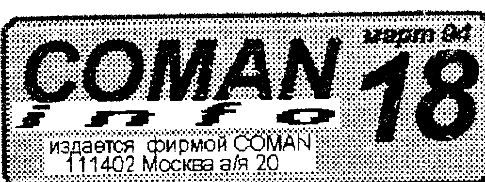
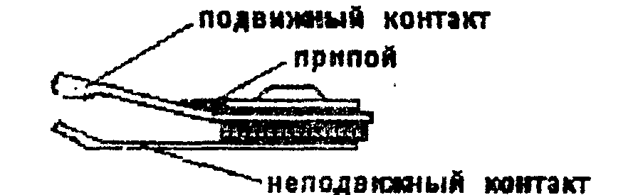
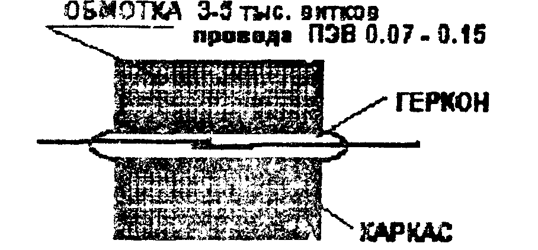

Издается фирмой COMAN, 111402 Москва а/я 20.

## Цены растут, но мы их снижаем!

Нам удалось закупить партию микросхем М27512 по демпинговым ценам (к сожалению, не большую).
Поэтому,

ДО 15 апреля устанавливается пониженная цена на ROM-диск для "Вектора" и PROM-SYSTEM для "Львова" - 12.000 руб.
ОПТОВАЯ (от 10 шт.) - 10.000 руб.!!!
ТОЛЬКО ДО 15-го АПРЕЛЯ!

Во избежание недоразумений, просим отправлять переводы телеграфом или с уведомлением о вручении.
За пересылку "АВИА" (в Якутию, Магадан, Сахалин и т.п.) просим дополнительно высылать 1500 руб.

## Ловите момент!

Кстати, о PROM-SYSTEM-е для "Львова".
Используя оставшиеся несколько килобайт в ПЗУ, мы специально разработали и "вшили" в нее пару отличных логических игрушек MINER & PELENG.
Описание и правила приведены в брошюре, прилагаемой к PS.

> Наш новый контактный телефон: 095-370-4680.
>
> По этому телефону вы можете:
> - узнать о текущих ценах на наши товары и "цену" балла;
> - сделать заказ на товары по телефону и "заморозить" цены для себя на 1-2 недели (при условии оплаты телеграфом);
> - получить бесплатную консультацию по электронике и программированию;
> - выяснить недоразумения.
>
> ПРИМЕЧАНИЕ: Телефон опять временный, поэтому если он однажды "замолчит" - не паникуйте, а читайте бюллетень и пишите письма!

> ВЕКТОР-06ц - с герконовой клавиатурой.
> Оптовые партии (от 50-ти шт.) Ор. цена 100 тыс./шт. (безнал.) Предоплата на московский р/с. Склад в Москве.
> Розничная продажа в Москве и по почте.
> 278000 Молдова г. Тирасполь
> ул. Шевченко д. 90 А/О "Молдавизолит"
> тел. (04233) 37-456 Тилимбик А.П.

## Осторожно! Dendy

В последний год, пол-года мы отмечаем очень агрессивное вторжение на рынок игровых "комп'ютеров" различных приставок, типа "Dendy", "SEGA" и пр.
Нам хотелось бы рассказать о них вам поподробнее, тем более, что ходит очень много легенд, связанных с ними.
Мы не боимся конкуренции с их стороны, просто хочется уберечь некоторых людей от ошибок.
(А такие, к сожалению есть, которые меняют "Вектор", "Львов" или т.п. на "игровой компьютер".

### Легенда №1

Считается, что простой игровой компьютер, якобы дешевый.
Посчитайте сами.
Сама приставка (без игровых картриджей) стоит от 70 до 150 тыс. рублей.
Плюс каждый картридж стоит от 20 и выше тысяч (в зависимости от модели).
Кроме того, приобретая конкретную модель, вы навсегда приковываете себя к конкретной фирме-изготовителю.
А там тоже не дураки - каждый следующий картридж вы купите ДОРОЖЕ предыдущего (а куда вы денетесь?).
Сама игровая приставка состоит из ПЛМ (программируемой логической матрицы), "вскрыть" которую - легче сделать свою, что фирмы и делают.

### Легенда №2

"Да там в одном картридже - тыща игр!"
Ну не "тыща", а 20-30.
Вернее 1-2-3, а к каждой - по десятку других "уровней", каждый из которых (в рекламных целях, разумеется), обзывается "игрой".
Лабиринты разные, да сюжет один.
С таким же успехом можно сказать, что "Down to Earth" - это не одна игра, а 30, "Странник" - 20-25, даже "CHASER" - 128 игр!
Кроме того, сюжет этих игр на 90% одинаков от игры к игре.
Сводится он примерно к следующему: один мужик (черепаха, космонавт, водолаз, пр...) должен обойти все лабиринты и убить всех остальных обитателей этого лабиринта.
И все 111 игр, подобных той же "D.I.E", вы там не найдете.
Графика там не сказать что примитивная, но и не лучше, чем на "Векторе" (не считая, конечно, Кучинского / Лобановского).
И восторг вызывает лишь у подростков младшего возраста.

### Легенда №3

"А я не хочу голову ломать - загрузка, перезагрузка... воткнул картридж - и играй!"
Все это верно, но "втыкаете" вы всегда одну и ту же игру.
Если у вас есть ПК, и вы хотите работать так же (воткнул - поиграл) - закажите себе ROM/PROM-диск с вашими любимыми играми.
Будет то же самое.
Но никто у вас не отнимает возможность работать с клавиатурой, с различными программами, редакторами, самому что-то делать, и главное УМЕТЬ, а не ГЛУПЕТЬ.
Все эти навороты, в виде пистолетов, крутых джойстиков - мягко сказать ТУФТА чистой воды.
В следующем номере мы опубликуем схемы этих "крутых" устройств, и вы сами в этом убедитесь.
Это во-первых.
Во-вторых, никто не мешает ни нам, ни вам, ни другим фирмам принять на вооружение подобные устройства - прибамбасы, а также игровые картриджи по 128 Кб (хотя бы на основе нашего ROM-диска).
Ведь доработки ПК минимальные, и делаются они один раз и навсегда.
А в 128 Кб ох как много можно вместить при желании.
И в ближайшее время мы это продемонстрируем.
Конечно, если вы достаточно богаты, вы можете позволить себе купить "дешевую" игровую приставку.
Но интересно, сколько месяцев (или недель) вы в нее проиграете.
Эта статья не ставит перед собой целью отвратить народ от "Dendy".
Просто мы хотим предостеречь тех, кто готов с радостью променять имеющийся у него ПК на игровую приставку.
Смотрите не пожалейте потом.

## Друг по переписке

> COMAN! компьютеры в вашем доме!
> 344016 г.Ростов-на-Дону а/я 5702
> Курченков С.А.
> "Вектор", "Львов", "ZX"

> COMAN! компьютеры в вашем доме!
> 457040 Челябин.обл г.Южноуральск ул.Сов.Армии д24 кв 103 Курбанов В.Ю.
> "Партнер 91.91."

> МАГАЗИН =FOR A=
> торгует аудио-видео аппаратурой и товарами к ПК "Львов" и "Вектор"
> ул. Сталеваров д.18 т.302-6536
> проезд: м."Новогиреево" авт.662, 509 до ост."Продмаг"
>
> Примечание: Цены на товары в магазине отличаются от цен на аналогичные товары у нас, т.к. это самостоятельная фирма.

## Вечная жизнь в игровых программах

> - Папа, ты можешь прыгнуть с десятого этажа?
> - Могу, сынок, но только один раз.
> (Анекдот)

О "вечной жизни", "бессмертии" разговоров куда больше, чем стоит о ней говорить.
Но судя по тому, как распродаются "бессмертные" версии популярных игр, о ней стоит поговорить особо.
Хотя скажем сразу, у нас не пользуется популярностью идея бессмертия.
Мы больше предпочитаем игры, у которых неограниченное число жизней заложено по сюжету.
В случае проигрыша вас просто "отбрасывают" на предыдущий уровень, и вы, потренировавшись на нем еще раз, вновь идете на штурм.
Или вы можете добывать себе дополнительные жизни по ходу игры (находить, завоевывать и т.п.).
На наш взгляд, это более логичный и интересный вариант, чем поковырявшись немного в программе, с первого захода пройти игру всю от начала до конца.

Обычный аргумент сторонников бессмертия - хочу посмотреть, что там дальше.
Посмотреть, что и говорить, действительно хочется.
Но только один раз.
После этого про игру обычно забывают, т.к. играть в нее уже как-то не очень хочется.
Интересно ли вам играть в Тетрис, в котором завалы не поднимаются выше 4-5 строчки, и на каждую строку, уложенную вами, 5-6 строк исчезают сами по себе?
А в бессмертном "CHASER", где на "желторожего" просто можно не обращать внимания.
После такого "обессмерчивания" игрушка становится тупейшим времяпрепровождением.
Возьмите самый крутой известный вам кинобоевик, замените всех врагов героя на манекенов или просто безвредных.
Согласитесь, "крутое" будет юно.

Что можно сделать, что бы такие ситуации не возникали, а лучше - не могли возникнуть.
Во-первых, в сюжет игры желательно закладывать возможность начать игру с любого уровня, если она "уровневая".
Так например сделано в игре "TANKSWAR" - вы можете начать игру хоть с генерала.
Но если вы НЕ генерал - вас быстро сделают сержантом.
Но если у вас уже есть опыт, вы не тратите время на прохождение простых уровней "для начинающих".
Т.е. игра как бы адаптируется под ваш уровень, и вы играете с соперником, равным себе по силе.

Во-вторых, бессмертие игрока должно быть заложено в самой игре.
Игра не должна заканчиваться из-за "смерти" героя.
Просто надо снижать уровень, упрощать ситуацию, облегчать задачу.
Т.е. изменять критерии оценки мастерства для изменения игровой ситуации (вверх или вниз).
Например, если у героя осталось 1-2 жизни, надо облегчить ему получение новых.
Игрок должен озаботиться пополнением запаса жизней, а не "любой ценой на следующий уровень".
На наш взгляд это удачно сделано в игре "CHEESE" и для Вектора, и для Львова.

В третьих, желательно предусматривать в игре специальные меры по сохранению ТЕКУЩЕГО СОСТОЯНИЯ.
Пройти 50-100 этапов игры просто невозможно физически, даже если вы мастер в данной игре.
Да и время тратить в таком количестве уже вредно и для здоровья.
Выбор уровня вещь хорошая, но она не всегда применима.
Для игрушек а-ля PUTUP - самое оно, но для игр, где идет накопление ценностей, силы, перемещение по пространству - лучше иметь в игре средство сохранения состояния.
Это можно делать сохранением какого либо файла на ленте, диске, даже на бумаге, в виде какого либо кодового сочетания 10-100 байт, характеризующего состояние игры.
В этом случае вы не прекращаете игру, а лишь прерываете ее на время, и в любой момент можете к ней вернуться.

Такие драйверы занимают 1-2 килобайта и практически не давят своим объемом на саму игру.
Зато делают ее несравнимо более удобной в эксплуатации.
В ближайшее время мы планируем выпустить в продажу готовые драйверы ввода-вывода на магнитофон и на диск.
Надеемся, что это поможет разработчикам игр в их работе.
Более того, мы начнем печатать сценарии игр, т.к. похоже многим везде простаивает из-за того, что не знает, а что бы такого сделать.

Но это все пожелания для будущих игровых программ.
А на сегодняшний момент имеется очень порядочное количество программ, которые многие хотели бы обессмертить, поэтому вернемся к этому процессу.

В процессе "обессмерчивания" игры нет никаких особых секретов.
Однако следует различать два подхода.
Первый - вы хотите иметь побольше жизней, потому что вам кажется, что не хватает немного, и вы не хотите портить игру, а просто хотите иметь запас жизненных сил побольше.
Второй - вы хотите сделать игру действительно бессмертной (и тем самым убить ее).
В первом случае, как ни велико число жизней (хоть 255), но они теряются и можно потерять их все.
Во втором случае число жизней действительно бесконечно, и оно постоянно сохраняется на определенном уровне.
Но и в первом, и во втором случае необходимо определить ячейку памяти, где хранятся "жизни".

**ПОИСК ЯП с "жизнями"** не так сложен, как кажется.
Для этого надо запустить игру и посмотреть, сколько жизней устанавливается вначале игры.
Например их 6.
После этого надо загрузить игру в Монитор и найти все ячейки памяти, в которых находится код 06Н.
Таких ячеек может быть достаточно много.
Но рассматривать стоит лишь те, возле которых стоят команды типа "записать в такую-то ячейку код 06Н".
Команды эти могут быть самые разные, и вы их можете посмотреть в литературе по программированию.
Затем во всех этих командах надо изменить коды подлежащей записи.
Например, в первую встретившуюся ячейку пусть записывается не 06, а 01, во вторую - 02 и т.д.
Не забудьте записать на бумаге что-куда записываете.
После этого запишите измененный файл и запустите его.
Число появившихся жизней однозначно укажет на ячейку, где они лежат.

Еще проще обнаружить ЯП с жизнями, если у вас установлено СУПЕР-ПЗУ.
При загрузке системы, оно не портит память, поэтому для определения ячейки проделайте следующую операцию.
Запустив программу и посмотрев число жизней на данный момент, перезагрузите систему и запишите содержимое памяти на диск командой A>SAVE 150 LIF1.XXX.
После чего вновь надо запустить игру и потерять одну жизнь по отношению к предыдущей версии, а затем опять перезапустить систему и записать содержимое ОЗУ на диск под именем "LIF2".
И так надо сделать 3-5 копий, отличающихся друг от друга заведомо известным числом жизней.

После этого загрузив в XSID первую копию, находят все ЯП, в которых хранится число, совпадающее с числом жизней в данной копии.
Составьте список этих ячеек.
Затем составьте список из аналогичных ячеек памяти для другой копии, в которых содержимое совпадает с числом жизней этой копии.
Далее смотрят, в каких ячейках произошло изменение содержимого, аналогичное изменение в копиях.
Для уверенности можно просмотреть еще пару копий.
Наверняка ЯП станет вам известна.

Теперь, когда известно, где "долбить", надо определиться, что делать дальше - "я люблю тебя, жизнь" или "пусть всегда буду Я".
В первом случае надо просто заменить код, определяющий количество жизней на другой, побольше.
Например FFH (255 жизней).
После чего, сохранив измененную копию, можно смело кидаться на штурм неприступных досель вершин и уровней в этой игре.

Во втором варианте немного сложнее, т.к. содержимое этой ячейки надо постоянно возобновлять или прописывать другим значением.
Удобно это сделать в какой либо подпрограмме.
Как только будет к ней обращение, то ваши силы тут же возобновятся.
К подпрограмме добавляется несколько операторов, которые "сохаживают" ЯП с жизнью и заботятся о ее пополнении.
На "Векторе" это удобно делать в прерываниях.

Можно поступить иначе, заблокировав уменьшение жизненных сил, в случае их потери в игре.
Зная ячейку памяти, где они хранятся, надо "вычислить" места в программе, что занимаются тем, что вычитают из этой ячейки что-то.
(Вычитать, кстати, можно различными способами, поэтому "процадите" всю программу на предмет уменьшения содержимого этой ячейки с жизнями).
Найдя такое место, надо уничтожить их, прописав их кодом 00Н (NOP - нет операции).
Но смотрите не увлекайтесь и не "грохните" нужные операторы.
После этого можете проматывать свою жизнь налево и направо - не убудет.

Мы описали лишь несколько методик создания бессмертия, но их достаточно много.
А вообще то, к каждой игре требуется свой подход.
Не сомневаемся, что авторы будут стараться скрыть механизм управления жизнями для затруднения изготовления бессмертных копий своих программ.
Но овладев основами методики обессмерчивания, вы за день будете обессмерчивать по 5-20 программ, если конечно вам не жалко своего времени.

Не являясь сторонниками бессмертия, мы, тем не менее, будем печать адреса ЯП к различным играм, где лежит жизнь, т.к. многие этого хотят. (см. стр. 3).

Для тренировки и проверки, а так же для "затравки", мы сообщаем адреса ЯП с жизнями к некоторым программам.

### Для Вектора

| Игра | Адрес(а) | Значение |
| --- | --- | --- |
| "JET-SET" | 56C0H | 00H |
| "DIAMOND COUNTRY-2" | 025DH, 0475H, 089FH, 08A0H, 3494H | 00H |
| "NINJA KAGE" | 12ABH | 87H |
| "CRONEX" | 7C34H | 07H |
| "SP. MEGATRONIC" | 0A86H, 0EF3H | 87H |
| "КЛАД-BIN" | 13F8H, 13F7H, 13F8H, 13F9H | 00H |
| "ZODIAK STRIP" | 70BEH | 87H |
| "FLAER" | 0DBBH, 0EB1H | 87H |
| ПЕКМАНЕНОК | 0A0EH | 87H |
| "MAGIC PAPER" | 4080H | 87H |
| "STARS" | 3CD8H, 3CB6H | 87H |
| "FATAX" | 60F3H | 87H |
| "CHASER" | 08E5H, 05DEH | 00H |
| "DOWN TO EARTH" | 01EEH | FFH |

### Для Львова

Указан десятичный адрес ячейки и ее содержимое, необходимое для бессмертия.
Для установления бессмертия надо воспользоваться оператором POKE.

| Игра | Адрес (дес.) | Значение |
| --- | --- | --- |
| "БАШНЯ" | 37283 | 255 |
| "МЯЧИК" | 38229 | 255 |
| "ЛЕГЕНДА" | 41894 | 255 |
| "АЛИ-БАБА" | 37938 | 00 |
| "УЗНИК" | 7391 | 0 |
| "ПАТРУЛЬ" | 33303 | 0 |
| "AEROCOBRA" | 38987 | 255 |
| "SQUASH" | 39234 | 255 |
| "KING VALLEY" | 40077 | 255 |
| "OREL" | 18027 | 0 |
| "CAVE" | 34297 | 0 |
| "СТРАННИК" | 35947 | 0 |

Все эти данные приведены по письмам наших читателей, и нами не проверялись.
Нам самим очень лениво тратить время на поиск ЯП с жизнями, но мы охотно будем печатать результаты ваших исследований.

## Букварь программиста

Неожиданно для нас, большой отклик получили наши публикации подпрограмм, предназначенных для математических вычислений и преобразований.
Сегодня мы пополним их список новыми подпрограммами.

### Подпрограмма умножения <2> x <1> = <2>

(число обозначает кол-во байт в операнде).

```
; [DE] x [A] = [HL]
MUL :   LXI H,0
        MVI B,8
L1  :   DAD H
        RLC
        JNC DEC
        DAD D
DEC :   DCR B
        JNZ L1
        RET
```

### Подпрограмма умножения <1> x <1> = <2>

```
; [H] x [E] = [HL]
MUL :   MVI D,0
        MOV L,D
        MVI B,8
C1  :   DAD H
        JNC P1
        DAD D
P1  :   DCR B
        JNZ C1
        RET
```

### Подпрограмма деления <2> / <1> = <1>,<1>

```
; [HL] - делимое, [C] - делитель
; [L] - частное, [H] - остаток
DIV :   MVI B,8
C1  :   DAD H
        MOV A,H
        JC P1
        CMP C
        JC P3
P1  :   SUB C
        MOV H,A
        INR L
P3  :   DCR B
        JNZ C1
        RET
```

Любителям Бейсика V2.5 наверное небесполезно будет знать назначение некоторых ячеек памяти и точек входа в его п/п.
Зная их, можно использовать потенциал интерпретатора более полно.
Да и программы будут работать чуть "шустрее".

- Код нажатой клавиши - т.е. [2B8EH], [A] - код нажатой клавиши.
- Ввод кода нажатой клавиши без остановки программы, т.е. [2CFCH], код в регистре [A].
- Вывод символа на экран - т.е. [1998H], код в [A], т.е. [2800H], код в [C].
- Вывод на экран текстового сообщения до кода 00Н, т.е. [1DDFH], [HL] - адрес начала сообщения.
- Вывод символа на печать - т.е. [1DA4H].
- Начало знакогенератора - 3920Н.

К этим п/программам нельзя обращаться непосредственно через функцию USR.
Под них надо зарезервировать место, а затем организовать переход к ним.
Например:

```
10 HIMEN (&7BFF): REM резервирование памяти
20 POKE &7C00, &C3, &8E, &2B: REM организация перехода
30 A=USR(&7C00): REM вызов п/программы
40 PRINT A
45 GOTO 20
```

Эта программа распечатывает коды нажимаемых клавиш.

Вообще говоря, мы в своем "Букваре" совершенно не упоминаем Бейсик (быть может, незаслуженно).
Хотя и про него можно много чего рассказать.
Например о вызове системных п/программ самого Бейсика, системных подпрограмм, зашитых в ПЗУ "Львова", о графическом расширении Бейсика 2.0 "Львова", организации п/программ в кодах для программы на Бейсике, позволяющих в несколько раз увеличить быстродействие "Бейсичных" программ.
И многое многое другое.
Хотелось бы знать ваше мнение по этому поводу.

## Укрепление клавиши



Значительно укрепить клавишу (и предотвратить облом подвижного контакта) можно, если наплавить немного припоя на место у основания подвижного контакта.
В этом случае контакт будет изгибаться по дуге большего радиуса и прослужит практически вечно.

## Самодельное низковольтное реле



Иногда, для различных целей или "прибамбасов" требуется реле с особыми параметрами, например с током срабатывания в единицы или доли миллиампера, или напряжение срабатывания должно быть более 3-4 вольт.
Такое реле просто сделать из геркона (или нескольких).
Для этого надо намотать поверх него несколько тысяч витков провода.
Для коррекции тока или напряжения срабатывания можно применить маленький постоянный магнит, расположив его неподалеку от реле, или непосредственно от реле.
Управлять подобным реле можно программно, например программой "HNY".

## Вопрос-ответ

> - Ну ты и сказал!
> - Ну ты и спросил!

- Почему вы не занимаетесь "ZX-Spectrum"? Ведь владельцев этих ПК больше, чем других.

1) "Вектор" и "Львов" - стандартные ПК, выпускаемые серийно.
Любой "Вектор" совместим с другими "Векторами" по определению.
"Синклеров" - более 20 разновидностей.
И они тоже в большинстве своем совместимы.
На уровне примитивных программ.

2) Водку пьют еще больше народу, чем владельцев "Синклеров", что же нам теперь водкой по почте торговать?

- Можно ли в ROM-диске применять другие микросхемы?

Можно.
Но надо внимательно смотреть на соответствие выводов, адресных и данных.
Например при применении 8-ми килобайтных м/с надо смотреть на выводы CS.
А если вы хотите применить м/с типа РФ2 (2 кб), то их надо вставлять со сдвигом на две ножки вправо (т.е. 1-я ножка м/с должна попасть в 3-ю дырочку посадочного места на плате).
Кроме смеха, диск на 4 Кб тоже имеет смысл, например, копировщик.
Другое дело, что чем более емкая м/с, тем она выгоднее.

- Можно ли программно производить выбор одной из двух м/с типа М27512 в ROM-диске?

Можно.
При помощи таймера.
На диске один элемент м/с 155ЛА3 незадействован.
Его надо включить в режим инверсии и соединить выводы 20 м/с М27512 с входом и выходом элемента соответственно.
А вход элемента ЛА3 соединить с контактом "В1" штатного разъема "ПУ" (выход таймера OUT 0).
Для управления выбором м/с следует использовать команды:

```
MVI A,30H ; выставить    MVI A,38H ; выставить
OUT 08H   ; "0"          OUT 08H   ; "1"
```

При этом начинает работать либо одна, либо другая микросхема.
Но надо сказать, что подобная процедура достаточно бессмысленна, т.к. ROM-диск на "Векторе" используется лишь как хранилище.
А часто считывать из него пока не приходится.
Другое дело PS-SYSTEM для "Львова".
Там верхние 16-ть Кб аппаратно отданы ПЗУ.
Есть где разгуляться.

- Почему вы не печатаете хит-парад программ?

1) Потому что очень мало приходит писем с вашими "хитами".

2) Мы получили несколько писем примерно такого содержания "...вы задержали мой заказ на 2 недели! (одну неделю, месяц, коробка от кассеты раздавлена и пр.) Поэтому я не включил игры вашей фирмы в хит! Будете знать!".
Ребята! Вы чего оцениваете? Мастерство авторов или работу почты или копировщика.

3) Мы чувствуем себя полными идиотами со своим "ХИТ-парадом", когда получаем список хитов, где на первом месте стоит "РЕМВО", на пятом - "FATAX".

4) Очевидно, следует вести ХИТ по отдельным параметрам.
А иначе трудно оценивать программы.
Например "Атака ниндзя".
Что толку, что заставка красивая, игра-то - дерьмо.
А если хотите картинок - покупайте телеспрайты - телевизионное качество.

- Почему вы на свою СР/М не сделаете оболочку типа "NORTON COMMANDER"?

Как только кто либо нам докажет ее жизненную необходимость при работе с одним дисководом и дискетой в 644 Кб, мы ее тут же сделаем.
Для запуска программ без ковыряния в именах есть "COVER", а работы по массовому копированию с одним дисководом вызывают саркастическую улыбку.
Впрочем, приоткрывая небольшую коммерческую тайну, сообщим, что через 2-3 месяца мы планируем пустить в продажу крутой электронный диск с емкостью до 2 Мб (с кратностью по 256 Кб).
Вот под него уже делается и очередная версия СР/М, и "оболочка" в стиле WINDOWS.
В этой оболочке "NORTON" вам с овчинку покажется.
Так что, будет вам и белка, будет и свисток (слова из песни).

- А сколько такой эл.диск будет стоить? (планируемый вопрос)

Ориентир. цена на сегодня выходит примерно 15-20 тыс. руб., первые 256 Кб + 5 тыс. каждые последующие.
Диск в 2 Мб. выходит около 40-45 тыс.руб.
Но это сегодня.

## Textas-диск и его особенности

Дисковый вариант этого редактора ничем практически не отличается от своего магнитофонного прототипа.
Правда в нем отсутствуют Монитор и Ассемблер (оперативность работы с дисководом сделала их ненужными).
Если вы используете СУПЕР-ПЗУ, то принтер настраивается при загрузке системы.
Если у вас старый загрузчик (на РТ5) и файл редактора не TX.COM, то вы можете доработать свой ТР по методу в №15 (в начале файла есть три "NOP", которые позволят вам добавить в конец короткую программу настройки).
Если коды вашего принтера не совпадают с кодами ТР, прочтите файл TEXTAS.DOC, загрузив его в ТР.

Методика вставки управляющих символов такая же, как и в маг. варианте.
Но дисковый вариант может сохранять содержимое словаря в специальном файле, с расширением .CFG (конфигурация).
Сделав один раз "рыбу" с содержанием всех мыслимых управляющих символов и запомнив ее в спец. файле, начинайте работу всегда с него - словарь будет уже заполнен.
Создать наборы управляющих символов можно при помощи XSID-а или MBASIC-а (см. журнал "УМник-1").

Кстати, для тех кто не знает.
Если вы нажмете одновременно клавиши УС + П, то на принтер будет выдаваться копия экрана (текстовая, в режиме КОИ-7).
Таким образом удобно делать распечатки директорий дискет, и вкладывать их в конверт дискеты.
Для отключения этого режима надо повторить нажатие.

Временно приостановить (а затем возобновить) вывод на экран информации по команде TYPE, можно нажатием клавиш УС + S.

## Price-list 1.03 - 1.04

ВНИМАНИЕ! Фирма оставляет за собой право на изменение цен без предупреждения в случае изменения кредитно-финансовой политики государства, изменения курса валют и пр.
Во избежание недоразумений, вы можете уточнить цены по телефону (095) 370-4680 с 9-00 до 17-00 мск. или выслать заведомо больше указанной цены на 10-20% (с возвратом сдачи).

| Товар | Цена |
| --- | --- |
| ДИСКОВОД MC5313 | 80.000 руб. |
| КОНТРОЛЛЕР ДИСКОВОДА | 18.000 руб. |
| БЛОК (готовый) | 90.000 руб. |
| ROM-ДИСК И PS-SYSTEM | 12.000 руб. |
| ВЧ-МОДУЛЯТОР (ЧБ) | 2500 руб. |
| ПРИНТЕР MC6312 (струйн.) | 70.000 руб. |
| ДИСКЕТЫ (КИТАЙ/ФИРМА) | 600 / 1500 руб. |
| ПРОГРАММАТОР ППЗУ УФ | 10.000 руб. |
| ТО-ЖЕ (с супер-сакетами) | 20.000 руб. |
| УСТРОЙСТВО УПРАВЛЕНИЯ | 1200 руб. |
| БЛОК ЗАЩИТЫ | 1000 руб. |

Стоимость 1-го балла - 80 руб.

Справки о наличии и цене на другие товары, вы можете узнать по телефону 370-4680.

Принимаем заказы от ч/лиц и организаций, заказы на разработку и изготовление радиоэлектронных устройств по ТЗ заказчика.

## Просьба (и очень большая)

Убедительно просим писать свой адрес на почтовых переводах и заказах полностью и разборчиво, желательно печатными буквами.
Поймите, вы ведь не для нас пишите, а для себя.

## Анонс

В следующем номере:

- световое перо: устройство, драйверы, работа, идеи....
- букварь программиста: начинаем писать игру... (наконец-то)
- блок программирующих напряжений (по просьбам)...
- обмен опытом, советы, ответы и пр.. и пр... и пр....

> Подписная цена бюллетеня - 150 руб./номер
> Для подписки следует выслать почтовый перевод по адресу: 111402 Москва д/востр. Тимошенко К.А. Укажите разборчиво свой адрес и номер, с которого вы хотите получать бюллетень.
