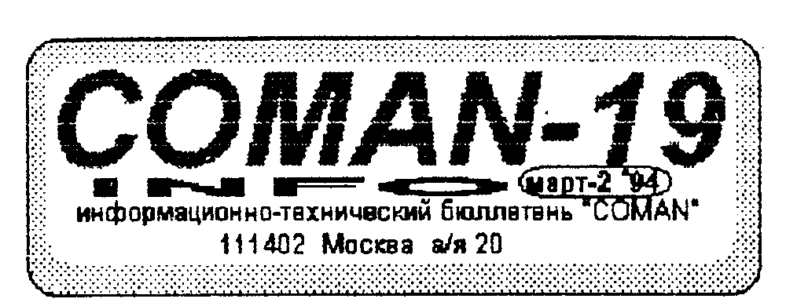
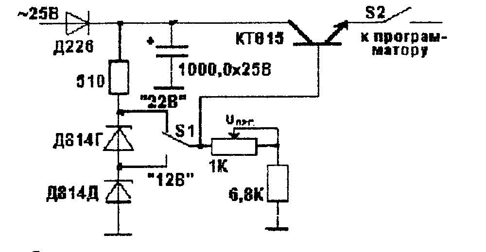
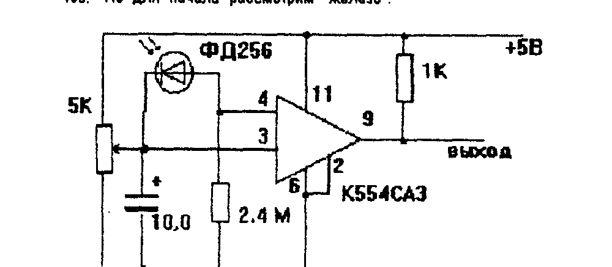
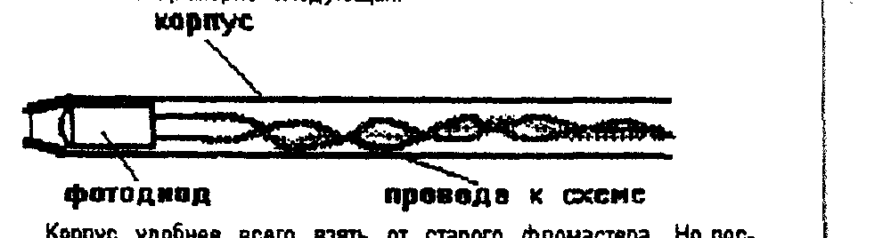
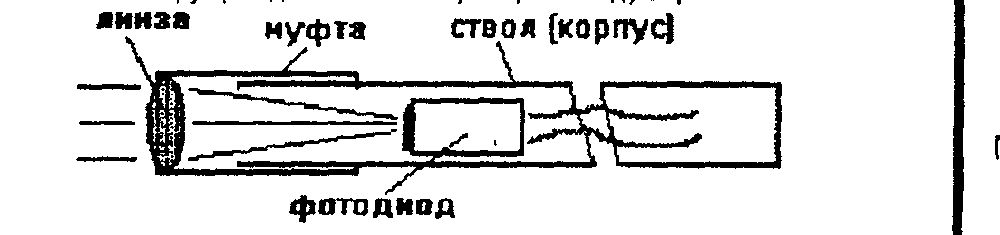
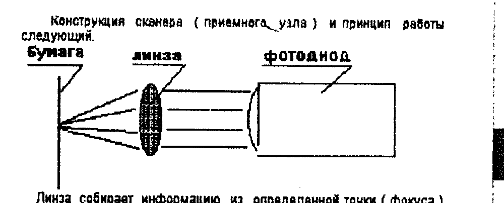

Издается фирмой COMAN, 111402 Москва а/я 20.

## Блок программирующих напряжений

Простота и удобство работы с ROM-диском сделали его достаточно популярным.
А наличие свободного посадочного места так и тянет "зашить" еще одну микросхему.
Схема программатора напечатана, да и сами они распродаются, и многие просят напечатать схему простого источника напряжений, необходимого для программирования м/с.

Обычно достаточно иметь два номинала напряжений - 12+1В и 22+2 В.
Первый нужен для "прошивки" 8-ми и 64-х килобайтных м/с, второй - для РФ2.
Маловероятно, чтобы вам встретились микросхемы с другим напряжением программирования.

В качестве источника напряжения подойдет любой, выдающий указанные напряжения.
Но если таковой отсутствует, можно применить например такой.



Переменное напряжение указанного номинала можно взять от любого трансформатора, обеспечивающего ток до 100 мА.
При работе весьма желательно контролировать выходное напряжение при помощи вольтметра.

Готовый блок (с трансформатором) - 6000 руб.

## Дешевые дискеты!!!

У нас в продаже!!!
Предлагаем дискеты 2S/2D производства "ИЗОТ".
Дискеты имеют сертификат качества.
Стоимость (в зависимости от количества):

| Количество | Цена, руб./шт. | Пересылка |
| --- | --- | --- |
| 001 - 050 шт. | 350 | + 500 руб. |
| 051 - 140 шт. | 300 | 1000 руб. |
| 141 - 500 шт. | 300 | за наш счет |
| 501 и более | 250 | за наш счет |

Больше берешь - будет дешевле!

## IBM. Мы вне игры пока?

В самом конце прошлого года, мы как то неудачно выступили по вопросам, касающимся IBM-компьютеров.
Не сказать, что нас завалили письмами по этому поводу, но их было.
Поэтому даем разъяснения.

1) Опубликованные "мировые" цены - это НЕнаши цены и мы ничего не продаем.
Есть вопросы и желания - обращайтесь отдельно и с конкретными запросами.

2) Рост "бакса" и резкое повышение акцизных налогов, более чем удвоило цены в рублях на импортный товар, и сделало внедрение "писишек" в дом пока неактуальным.
Нетерпеливые и богатые - смотрите п.1.

> 404140 Волгоградская обл.
> г. Ср.Ахтуба ул. Октябрьская
> д 84 кв 61 Прокопенко ВА
> "Вектор-06ц" переписка

## PROM-SYSTEM и ROM-диск

проблемы подключения.

"Купил у Вас систему - ничего не работает!
Замените!"
С начала массовой продажи нами этих устройств прошло 2-3 месяца, но мы уже получили несколько "гневных" писем, и даже пару бандеролей с возвратом.
В чем же дело?

Скажем сразу, что эти два продукта являются нашими фирменными продуктами и проходят очень тщательную проверку, поэтому брак с нашей стороны исключен.
Поэтому, как показывает практика, источником проблем является либо сам владелец ПК, либо его компьютер.

Проблема № 1 - Стойкая аллергия у владельца к чтению инструкций и описаний.
Ребята, у вас отечественные компьютеры.
А как писал еще М.М.Жванецкий - отечественное значит отличное (от других).
Купил - отремонтировал - и работай.
Прежде чем "воткнуть" - прочитай инструкцию, бюллетень или что там прилагается.
От корки до корки.

Проблема № 2 - Техника.
В "Векторе" - дефективная м/с 580ВВ55, обеспечивающая работу с диском.
Причем, даже если пойнтер работает нормально - это не показатель.
Принтер не задействует и 30 % потенциала этой микросхемы.
Хорошо бы ее проверить (см. описание тестов, прилагаемых к ПК).
Надо сказать, микросхема эта достаточно хилая.
И по нашим прикидкам, примерно 20 - 30 % ПК работают с дохлой или полудохлой м/с ВВ55.
Если нет СУПЕР-ПЗУ, но есть 100 %-я уверенность, что порт в порядке, посмотрите ошибку в тексте загрузчика (бюл. № 14).

На "Львове" - непропай разъема "Х1".
Ну разве могли эти ребята подумать, что кто-то когда-то будет в этот разъем что-то втыкать?
Дисководы какие-то, "системы"....
Ни к чему это, баловство.
Поэтому, раз уж вы залезли в ПК, то а) посмотрите пропайку разъема, б) произведите доработки, и в) проверьте, есть ли +5В на контакте 10 этого же разъема.
Если нет, сделайте, что б было.
А для этого припаяйте провод к ближайшей шине "+5 В".

Именно такой "Львов" оказался у нашего читателя П.А.Кузнецова из г.Ижевска.
К чести его сказать, он очень грамотно решил эту проблему.
И еще он правильно заметил, что при включенной PS и при работе с Бейсиком, по "горячему" старту вы выйдите не в Бейсик, а в "Commander".
Знайте об этом и не "теряйте" программы.

Может возникнуть Проблема №3 - микросхема "забыла" информацию.
Такое, в принципе, возможно, и отловить это можно только в процессе эксплуатации.
К счастью, у таких м/с время памяти очень мало - меньше нескольких часов.
А мы "вылеживаем" свои м/с около месяца, поэтому более-менее отлавливаем подобные экземпляры.
Кроме того, в последнюю версию PS мы ввели автотест.
При его запуске он проверяет контрольные суммы программ, зашитых в м/с, и выдает сообщение.
Затем он переходит к тестированию ОЗУ специальным, "ломовым" тестом.
Пользуйтесь этим тестом для периодического контроля исправности системы.

И на "Векторе", и на "Львове", если вышеперечисленные меры результата не дали, прозвоните контакты разъемов - эта последняя надежда.

## Улучшение помехозащищенности контроллера дисковода

Серьезно улучшить помехозащищенность контроллера позволяет конденсатор 100 - 470 пф. включенный между 1-й ножкой м/с 155ЛА2 и "землей" (см. схему в № 2).
Просто эта связь на плате разведена не совсем удачно и ловит помехи.

Как показала практика серийного производства и эксплуатации, контроллеры гораздо устойчивее работают, если питание подавать не от импульсных, а от обычных источников питания.
По этой причине мы отказались от использования "импульсников" - очень высокий уровень помех.

## Телеграфика на Векторе

Многие обращаются к нам с просьбой опубликовать схему этого устройства.
Как бы помягче выразиться.....
Ребята, если вы настаиваете и вас много, то мы посвятим 3-4 номера этой схеме.
Если вы хотите иметь такое же устройство, то за 150 - 200 тыс. руб. мы и вам соберем.
Хотите для Вектора, хотите для IBM.

Если серьезно, то оно может быть полезно студиям кабельного телевидения или самодельным микроиздательствам и пр.

## Световое перо

Компьютер, как мы неоднократно говорили, не только игрушка.
Он прежде всего инструмент.
И мы продолжаем описывать различные несложные "прибамбасы", которые делают ПК более развитым.

Световое перо, несмотря на свою простоту, может очень многое, и вы скоро в этом убедитесь сами.
Но сначала рассмотрим принцип действия светового пера (в дальнейшем СП).

Когда луч кинескопа (поток электронов) попадает на переднюю стенку кинескопа, покрытую люминофором, то люминофор начинает светиться.
Если при помощи светочувствительного прибора можно будет уловить это свечение и сообщить об этом ПК, то тот в свою очередь может принять какое то решение или выполнить действие, определяемое программой - драйвером.
Как видите, СП в первом приближении не что иное, как фотореле.
Но пером оно называется потому, что ему "интересна" состояние освещенности не вообще, а конкретного пикселя на экране (в идеале).
На самом же деле, прибор с разрешением в пиксел достаточно дорог.
А из-за преломления лучей в толще стекла кинескопа и наличия сетки или маски в нем, очень трудно засечь конкретный пиксел.
Другим недостатком СП можно считать низкое быстродействие.
Ведь информация на экране может обновляться не чаще 50-ти раз в секунду (речь идет о растровых мониторах, а не векторных) - с частотой развертки.

Кроме того, за один проход луча вам никак не удастся зажечь и погасить пиксел.
В лучшем случае - за два.
Т.е. остается 25 Герц.
Но и тут не все гладко - люминофор обладает определенным послесвечением.
Более того, его специально подбирают, что бы исключить мерцание (хотя глаз и так слабо реагирует на частоты переключения освещенности более 10-15 Гц).
Поэтому реальное быстродействие падает до нескольких герц.

Но несмотря на все это, если применять перо с умом и хорошими драйверами, то можно добиться неплохих результатов.
Но для начала рассмотрим "железо".



Теперь поговорим о применении СП и его конструкции.
Применение перу можно найти самое разное и от него его конструкция зависит.
Поэтому параллельно с применением мы будем описывать и конструкцию, оптимальную, на наш взгляд, для этого применения.

СВЕТОВОЕ ПЕРО - как световое перо.
Эта ипостась СП предназначена для работы с экраном монитора.
Конструкция может быть примерно следующая.



Корпус удобнее всего взять от старого фломастера.
Но поскольку фломастеры не предназначались для вставки в них фотодиодов, закрепить ФД в корпусе можно при помощи изоленты, наматывая ее на ФД в несколько слоев.
Постарайтесь обеспечить припуск изоленты в 2-5 мм со стороны линзы ФД.
Это защитит его от бокового света.
Плата и разъем - "на выносе", но можно постараться и втиснуть ее в корпус.

Что можно делать с таким СП.

- "целеуказатель". Вы часто сталкиваетесь в прикладных программах с ситуацией, когда надо что то выбирать.
"Если то, нажми такую клавишу, если это - такую..." и т.п.
Но ведь можно выбирать и без кнопок.
(Естественно, речь идет не программах, в которых требуется настройка один раз при запуске программы).
Если есть набор каких-то элементов, то выбор может осуществляться при помощи СП.

Примером такой программы может служить что то типа "Электронных кубиков".
На экран выводится библиотека (или часть ее), а вы указываете, какой элемент взять и куда поместить на рабочем поле.

Другой пример - калькулятор.
Бейсик и "Львова" и "Вектора" могут работать в режиме "калькулятора" - т.е. непосредственных вычислений.
Однако пользоваться ими в таком виде очень неудобно (гораздо удобнее просто калькулятор).
А что если попробывать "нарисовать" калькулятор на экране в привычном виде (с кнопками, индикатором и пр.).
Причем придать ему массу полезных функций - печать результатов работы на принтер, написание не просто цифр, а непосредственно в виде строки

```
156 X 3167 + (34567 / 145^2 - 234) = ответ
```

и т.д.
А поскольку кнопок у него будет ого-го, то и нажимать их удобнее всего при помощи СП.
Вы просто "тычите пальцем" нужную вам кнопку, нарисованную на экране - и все... все...все..

Третий пример - словарь.
Не секрет, что многие описания утилит идут на англицком.
Можно написать специальную программу, которая будет загружать этот текст и выводить его на экран.
Если какое-то слово вам непонятно, вы можете указать на него СП и в служебном окне вам постараются дать перевод.
И такие примеры можно приводить бесконечно.

Проблема тут в определении и различении объектов.
Ведь ни по цвету, ни по голосу СП их не различит.
Путей решения этой проблемы может быть несколько.
Но в основе каждого решения лежит, как правило, СЕЛЕКЦИЯ ПО ВРЕМЕНИ.
Т.е. вы можете однозначно сказать, какой из объектов (удобнее, кстати, использовать рядом с объектом специальное окно опознавания) находится под контролем.
Для этого поочередно зажигают и гасят эти окна, не допуская одновременной работы нескольких из них.
Очень важно позаботиться о защите от ложных срабатываний.
Небесполезен будет и микропереключатель в корпусе пера, который будет пропускать сигнал тогда, когда вы хотите, а не все время.

Рассмотрим несколько примеров.
На Векторе можно задействовать палитру.
Если объектов немного, а экран "свободен", то удобно менять освещенность объектов или их окон сменой палитры.
Удобно так же "привязаться" к прерываниям - они фактически показывают конец/начало движения луча по экрану.
На Львове немного сложнее - прерываний нет.., да и в палитре цвета не вдруг сменить - весь экран мельтешить начнет.
Тут придется либо просто зажигать - гасить окно, либо одно из двух.
Но сколько программистов, столько и решений проблемы.

- "кисть". По другому - рисование на экране.
Согласитесь, заманчиво возить по экрану пером, оставляя на нем след.
Однако проблем тут тоже есть.
Основная из них - разрешение (имеется в виду разрешение экран / фотодиод, а не бумажка).
Нетрудно заметить, что размер пиксела на экране - что то около миллиметра.
У фотодиода диаметр - 3-5 мм (зависит от типа).

Нетрудно подсчитать, что "на морде" у фотодиода поместится не один пиксел, а с десяток.
Да и прочувствовать зажигание/погашение одного пиксела может не всякий ФД.
Что можно предпринять?
Уменьшить диаметр ФД мы не можем.
Надеть ему намордник с отверстием в пиксел или применить линзу?
Можно попробовать, но яркость свечения кинескопа должна быть очень высокой (без глаз останетесь), да и искажения от преломления и маски кинескопа.
Наверное стоит увеличить размер пикселя подстать ФД.
Т.е. рисовать в режиме "лупа".
Выделяется рабочее поле примерно 32 х 32 пиксел, увеличивается раза 4 и рисование происходит в нем.
А рядом - результат вашей работы "в натуральную величину".
Практически так же, как и в граф. редакторах.
Перемещение лупы можно сделать плавным, через 1 байт, тогда и рисовать можно будет по всему экрану.

Другой проблемой является невысокое быстродействие (и чем больше лупа, тем оно ниже).
Но с этим уже ничего не сделать, такие уж мониторы.
Остается лишь подобрать оптимальный размер лупы (самый оптимальный - переменного размера или набор размеров, причем не обязательно квадратных).
Тогда можно будет выбрать "размер по задаче".

Другим применением светового пера может быть игровое.
Правда, конструкция в этом случае должна быть несколько иной.
Например пистолет или автомат.
Любители "Dendy" страшно гордятся своим "оружием" и игрушками - стрелялками.
Если у вас руки растут нормально, или завелось немного деньжат - считайте, что у вас уже все круче, чем у них.

Смело идите в ближайший "Детский мир" или магазин, где есть игрушки, и покупайте самый крутой пистолет.
Впрочем, лучше дочитайте до конца.
Конструкция должна быть примерно следующей.



Пистолет должен быть разъемным на две половины (с таким проще работать).
Фотодиод следует закрепить в стволе, недалеко от выходного отверстия.
Крепить его "наглухо" пока не следует, зафиксировать его надо без люфта.
Очень полезно вложить в ствол трубку из черной фотобумаги или покрасить его изнутри черной краской (но не блестящей) для поглощения отражений от внутренних стенок ствола.
Из плотной бумаги в несколько слоев, или подходящей по диаметру трубки, надо сделать муфту, которая с трением должна ходить по стволу.
В торец муфты надо аклеить линзу (она резко улучшает параметры и "дальнобойность" вашего оружия).
Диаметр линзы может колебаться от 10 до 50 мм.
Можно обойтись и без нее, но тогда стрелять надо будет в упор и кунескоп должен светить как прожвектор.

На курок надо "посадить" выключатель нажимного действия, а то ваш пистолет будет палить непрерывно.
Конструкция конкретного переключателя зависит, конечно, от конкретного пистолета.

После этого следует перейти к фокусировке.
Собрав пистолет, надо направить его на источник не очень яркого света (что бы не сжечь ФД), и перемещая муфту, добейтесь устойчивого срабатывания устройства.
Контролировать его работу можно вольтметром, осциллографом, или ПК.
После этого надо зафиксировать муфту каплей клея или винтом.

Когда пистолет готов, вы можете уже попытаться пострелять по своему монитору, написав простейшую программу игру-стрелялку.
А мы, в самое ближайшее время постараемся вас порадовать красочными игрушками "с пистолетом".

- СКАНЕР. Еще одно, чрезвычайно интересное применение СП.
Что такое сканер.
Это устройство для ввода графической информации в ПК.
Отечественных сканеров мы в жизни не видели, а мало-мальски приличные импортные (даже китайские) стоят за сотню баксов, т.е. больше, чем ваш ПК с дисководом вместе.
Тем более интересно сделать его самому (и обойдется это гораздо дешевле).
Про параметры этого сканера, конечно, особо говорить не будем.
Во первых, он получится черно/белым, во-вторых - разрешающая способность его - ... зависит от вас.

Конструкция сканера (приемного узла) и принцип работы следующий.



Линза собирает информацию из определенной точки (фокуса) и передает ее на фотодиод.
Бумага в фокусе линзы должна быть очень хорошо освещена, иначе чувствительности ФД может не хватить для того, что бы сработать даже от белой бумаги.
Для этого обычно рядом располагают сильный источник света, но так, что бы он не слепил ФД, а освещал лишь локальную область, откуда и снимается информация.

Но основная проблема заключается в другом - надо обеспечить прецизионную подачу исходного текста (или перемещение головки по тексту), для того, что бы объект был просканирован без искажений.
Иначе это будет просто фотореле.

В домашних условиях это можно сделать при помощи принтера, закрепив фотоголовку на печатной или вместо нее.
Принтер может обеспечить подачу бумаги с точностью до 1/256 дюйма (1 дюйм = 2,54 см).
А при помощи драйвера можно отслеживать и горизонтальное перемещение (либо используя сигналы с принтера).
Сканер, конечно получится не ахти какой, но работать он будет.

Если нет принтера, можно сделать какое либо приспособление, которое обеспечит перемещение головки относительно бумаги или наоборот.
Оно может быть как планшетного, так и барабанного типа.
Описывать их тут мы конечно не будем, но можем проконсультировать желающих отдельно.

Больший интерес может вызвать сканер не с одним ФД, а с несколькими.
(В фирменных сканерах их тысячи и десятки тысяч).
Нам такие высоты не по силам, но при известном радении можно изготовить что-нибудь диодов на 8-15.

Выглядеть это будет примерно так.
В приемной головке собрано эн-ное количество ФД с линзами, ориентированное так, чтобы сканировать линию, с определенным разрешением.
Фирмачи поступают просто - берут, например, 1800 ФД и располагают, берут и располагают.
А потом спрашивают - хотите разрешение 400 точек на дюйм?
Конечно хочу!

Но сгородить нечто способное сканировать хотя бы машинописную строчку (для огромного облегчения ввода информации), в принципе по силам.

ПЕРЦЕПТРОН.
Еще одно применение СП, вернее их группы.
Перцептрон - это устройство, распознающее объекты, образы.
Например, почтовый индекс, при автоматической обработке, распознается перцептроном.
Конечно, распознавать он может не все, а то, чему вы его научите.
Чем больше у него "глаз", тем лучше он "видит".
Программа, которая обслуживает перцептрон, обычно работает не по принципу "ЧТО ЭТО?", а по принципу "ЭТО, НЕ ЭТО".

Перцептроны, в основном применяются в промышленности, но и дома на их основе можно сделать несколько забавных игрушек.

"ЛЯГУШАЧИЙ ГЛАЗ".
Лягушка, как говорят, видит только движущиеся предметы.
Используя несколько устройств, подобных СП, можно довольно просто построить систему, которая не только будет регистрировать появление посторонних предметов или лиц, но и место их положения, направление движения, скорость и пр. параметры.
Принцип тут такой же, как и у перцептрона - чем больше рецепторов, тем больше информации, тем правильнее решение.
Все конечно зависит от драйвера.

Такая система может найти применение в качестве системы охраны, слежения, в промышленности и т.д.

Мы рассмотрели лишь часть того, что можно получить из тандема "компьютер - фотореле".
Если у вас возникли какие либо идеи или проблемы по этому поводу - пишите, постараемся помочь.

## Внимание!

Прошло уже достаточно много времени с тех пор, как начал выходить наш бюллетень.
С тех пор много изменилось в стране и странах, разбушевалась инфляция, произошла дифференциация (по доходам и расходам).
Поэтому, мы пришли к выводу, что нам необходима ПЕРЕРЕГИСТРАЦИЯ.
Нет, не нашей конторы, а вас - читателей нашего бюллетеня.
Некоторые в нас разочаровались, некоторые сменили тип ПК, некоторые вообще им больше не занимаются.
Да мало ли что у кого произошло.
Мы тратим достаточно большие средства на издание и рассылку бюллетеня, а может он кому то уже и не нужен.
Пришло время сверить часы.

Мы предлагаем вам ответить на нашу анкету.
Постарайтесь ответить как можно полнее, но без "воды", поконкретней.

ПРЕДУПРЕЖДАЕМ, что эта анкета ОБЯЗАТЕЛЬНАЯ.

Вы должны на нее ответить.
По ответам будет составлен новый список подписчиков (с сохранением текущего количества подписных номеров).
Понимая, что для вас это дополнительные телодвижения и расход средств (конверт нынче 85 целковых), все ответившие получат скидку в ближайшем своем заказе на 100 руб.

В случае, если от вас не будет получен ответ, вам будет повторно выслан этот номер бюллетеня (но в этом случае скидка аннулируется).
А так же приостанавливается высылка вам бюллетеня.
Если же и на второй запрос не будет получен ответ, клиент считается умершим (условно) и из базы данных удаляется.

Анкета:

- Фамилия ______________________
- Имя ______________________
- Отчество ______________________
- Полный адрес ______________________, тел. ______________________
- Возраст _____ лет. Образование ______________________
- Род занятий ______________________ (рабочий, инженер, студент, школьник и т.п.)
- Тип ПК ______________________ с 19____ года
- Оснащен дисководом с ОС ______________________ (если нет, пишите "нет")
- Есть принтер типа ______________________
- В качестве монитора ______________________
- Хочу сменить свой ПК на ______________________ (только осуществимое желание)
- Использую свой ПК (примерно, в %): для игр _____%, для работы с редакторами, создания собственных программ _____%
- Провожу у ПК ______________________ (часов, минут / в день, неделю...)
- Занимаетесь ли вы программированием? Если "Да", то на языке (-ках) ______________________
- Если "Нет", почему? ______________________ (не хочу, нет способностей, нет учителя, литературы и т.п.)
- Занимаетесь ли электроникой? ______________________ (аналоговой, цифровой, любой, не занимаюсь...)
- Уровень ваших "электронных" знаний ______________________ ("пара проводов", простейшие схемы, средней сложности)
- Используете ли вы свой ПК в этих занятиях? Если "да", то в качестве чего? ______________________
- Хотели бы вы на основе ПК сделать "лабораторию" (частотомер, цифров. запоминающий осциллограф, генератор сигналов любой формы, логич. анализатор, и пр. и пр., продолжите список) ______________________
- Какой дополнительной "периферией" (кроме "стандартной" - дисковод, принтер...) вам бы хотелось оснастить свой ПК ______________________ (расшир. ОЗУ до 512-1000 Кб, встроенная ОС, звуковая система, "дом. доктор", метеосистема, модем ... продолжите...)
- О чем бы вы хотели прочитать в бюллетене? ______________________ (темы статей, описание устройств, каких?)
- Много ли ваших знакомых имеют ПК? _____ чел., в основном типа ______________________
- Хотели бы приобрести _____ чел.
- Вы коллективный читатель бюллетеня? ______________________ (да, нет, сколько человек)

> Для подписки на бюллетень необходимо выслать любую сумму, из расчета 150 руб. за один номер, по адресу:
>
> 111402 Москва а/я 20 Тимошенко К.А.
>
> Обязательно разборчиво укажите свой адрес и номер, с которого высылать бюллетень.
