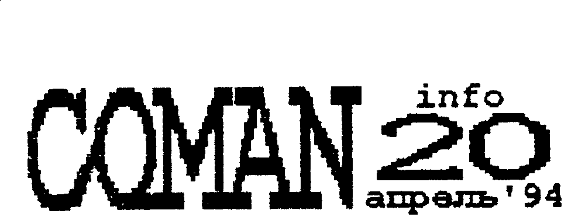
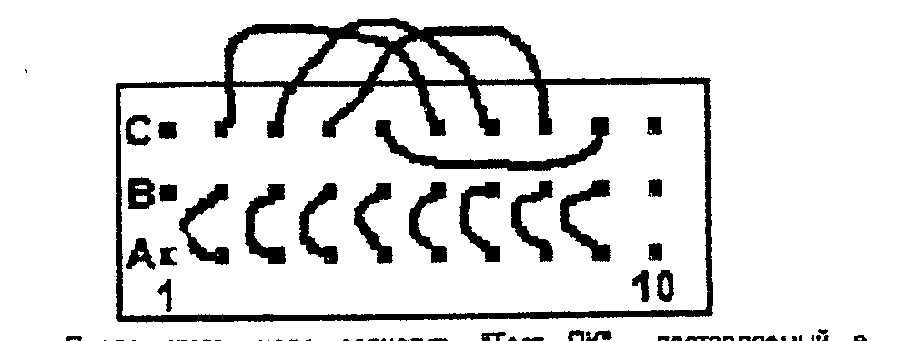

Издается фирмой COMAN, 111402 Москва а/я 20, Тимошенко К.А.

## Анкета.

Сейчас начинают в массовом количестве прибывать анкеты, но какие либо прогнозы делать еще рановато - обработка анкет в разгаре.
Конечно, мы не будем занимать драгоценное место в бюллетене под статистику, но будем сообщать вам по ходу дела и по мере обработки кое-какие интересные результаты.

Большое спасибо тем, кто откликнулся на нашу анкету.
Ну а те, кто не откликнулся ..... для вас, одним изданием по ПК стало меньше.
Если, конечно, вас интересуют ПК.

Ну а мы, с немного поредевшим контингентом подписчиков будем продолжать.
Предварительные итоги уже позволяют нам немного скорректировать направленность содержания.

Так, например, с учетом того, что в процентном отношении Векторов с СР/М-53 не так много среди подписчиков бюллетеня (ок. 25 %), но в то же время достаточно много (нами произведено и продано более 500 контроллеров), большую часть информации по работе с дисководом (описание утилит, работа с Макроассемблером и Линкером, и др. и пр. информацию, касающуюся работы с дисководом и только с дисководом, мы будем "гнать" в "UMниках".
Выпускать их мы постараемся примерно раз в месяц и в увеличенном объеме.
В бюллетенях будет лишь аннотации журнала.
Тем самым, мы освободим место под другие материалы, интересные всем (или почти всем).
Владельцы дисководов, как видите, получат двойную дозу информации.

Мы предупреждали, что СУПЕР-ПЗУ лучше ставить на панель?
Предупреждали.
Получите!

## Вектор. ПЗУ "Супер+"

Всвязи с тем, что разработана новая версия СРМ для электронного диска на 2 Мб, а сам диск запущен в производство (см. соседнюю колонку), мы разработали новую версию СУПЕР-ПЗУ, сохранив все старые функции, и добавив новых.

Новая версия:

- автоматически распознает, какая версия ОС записана на дискете и располагает их куда надо при загрузке.
Поэтому процесс перехода с одной системы на другую будет совершенно безболезненный.
Формат записи на диске так же сохранен, и вам достаточно будет перегенерить систему на диск.
- при загрузке ОС с диска, содержимое ОЗУ с 0100Н до 9AFFH не портится, что удобно для перекачки программ с маг. ленты на диск директивой "SAVE".
- для функции "Print Screen" добавлен режим "8-9", который позволяет переносить нижнюю строку экрана наверх (из-за разной установки начала скроллинга, экран может смещаться).
- для той же функции введено "количество проходов" принтера, для более полного использования лент в игольчатых принтерах.
Теперь, после выбора графического режима, вы должны задать и количество проходов (1...9).
Теперь, как понимаете, даже с белой лентой можно получить сочный черный отпечаток.

Новую систему (она называется СР/М-60) можно конечно использовать и со старой (старой - и года нет) доброй СПЗУ.
В этом случае не надо генерить систему на диск, а надо запускать ее как командный файл с дискеты (лучше через автозапуск - COMMAND.COM - см. "UMник-2").

> ПЗУ SUPER + 2500 руб. с пересыл.

ПЕРЕПИСКА: 662100 Краснояр. кр. г Ачинск м/р 8 д 2 кв 22 Антонов К.И. "Вектор"

## Вектор: ОЗУ 64 К + 2097152 байта.

Разработана новая ОС для ПК "Вектор" - CP/M-60.
Цифра "60" означает объем ОЗУ в распоряжении пользователя (без BDOS - 56 Кб).
Это на 8 Кб больше, чем оставляет пользователю пресловутый "МикроДОС".
Кроме того, система имеет достаточно большую экранную память, и позволяет одновременно оперировать 8-ю цветами - т.е. создавать многоцветные программы под управлением ОС.

Система работает в режимах 80 и 40 символов на строку, абсолютно стандартна (т.е. сохранены все системные вызовы и точки входа в них).

Разумеется, ничего этого не было бы, не будь

### Расширения ОЗУ.

Разработан и запущен в серийное производство БЛОК ОЗУ для ПК "Вектор 06ц".
Почему именно БОЗУ, а не, скажем, "квазидиск".
Известный всем квазидиск от "Микродоса" имеет возможность "чуть-чуть" подменить ваше ОЗУ, а вся остальная память используется как стек, хранилище.
В нашем же БОЗУ, мы заложили возможность разновариантных переключений, включая подмену всего (или почти всего - без 256 байт) ОЗУ.
Т.е. память организована сегментами, и вы в любой момент времени можете переключаться в нужный вам сегмент, размером почти в 64 Кб.
Возможность работы в режиме "хранилища" так же сохранена.
Более подробно о всех возможностях работы с БОЗУ вы почитаете в его описании, которое прилагается к нему.

Переделки в "Векторе" минимальные, в стиле "пара проводов", и по силам любому, кто более-менее уверенно держит паяльник в руках.
О них так же подробно (и с картинками) рассказано в описании БОЗУ.

БОЗУ, при работе с CP/M-60 (а без него она не работает), обзывает его диском C: и если у вас уже есть один дисковод, то их стало как бы два - A: и C: Никаких доработок производить в контроллере не требуется.
Просто вы включаете БОЗУ в Вектор, а контроллер - в БОЗУ.
Все разъемы на плате БОЗУ имеются.

Если же у вас нет пока дисковода, то вы сможете работать в ОС.
Но саму ОС надо будет загружать с магнитофона или ROM-диска.
Те, кто имеют ROM-диск могут просто докупить м/с с прошитой ОС и несколькими утилитами, необходимыми для работы с магнитофоном, текстовый редактор и др.
Полный список и порядок работы мы приведем в следующем номере.

А те, кто не имеет ROM-диска, могут его прикупить вместе с БОЗУ, причем с одной или двумя ПЗУ, прошитыми утилитами.

Выбрать оптимальную для себя конфигурацию (по возможностям и по цене), вам поможет таблица.

| Объем БОЗУ | Цена |
| --- | --- |
| 256 Кб | 30000 руб. |
| 512 Кб | 36000 руб. |
| 768 Кб | 42000 руб. |
| 1024 Кб | 48000 руб. |
| 1280 Кб | 54000 руб. |
| 1536 Кб | 60000 руб. |
| 1792 Кб | 66000 руб. |
| 2048 Кб | 72000 руб. |

| Товар | Цена |
| --- | --- |
| М/С М27512 с ОС и утилитами | 8000 руб. |
| ROM-диск с ОС и утилитами, 64 Кб | 12000 руб. |
| ROM-диск с ОС и утилитами, 128 Кб | 20000 руб. |

На наш взгляд, БОЗУ более 1 Мб уже изращение, а оптимальным вариантом является 512 / 1024 Кб, т.к. это соизмеримо с объемом дискеты.

БОЗУ (в максимальном варианте) потребляет в пределах 1,5 А, поэтому запитывается от родного, Векторовского источника (правда, требуется "поднять" немного +5В, методика в описании БОЗУ).

Цены, указанные в таблице действительны до 1 июня 1994 г.
С этого же числа мы начинаем продажу БОЗУ.
(Это связано с довольно длительным процессом трассировки, доводки и изготовления печатных плат.
Сам БОЗУ уже "доведен" и детали все закуплены).

Нам думается, что это будет популярное устройство, поэтому, если вы хотите быть в числе первых покупателей - занимайте очередь.
Очередь занимается посредством высылки перевода в наш адрес.
Кроме того, после 01.06.94 и цены будут другие.

## Обработка графики

*опыт и новые программы.*

Возможность быстро получить заготовки спрайтов выявило острый недостаток как опыта их обработки, так и специальных программ, резко ускоряющий их обработку.
Среди покупателей заготовок послышался ропот "что толку от картинки в 256 х 256, ее только как заставку использовать, да и память она пожирает со страшной скоростью."
Мы были полностью согласны и делимся опытом в обработке таких спрайтов.

**Перезаливка спрайтов.**
В процессе работы со спрайтами замечено, что редко какой спрайт требует более 4-х - 8-и цветов для передачи замысла автора.
Иной раз его умышленная "компьютерность" делает спрайт более выразительным, чем "фотографическая" точность.
Кроме того, если "перегнать" спрайт из 4-х плоскостей в 3 или 2, то это позволит резко сэкономить память и ускорить вывод спрайта на экран в несколько раз.

Мы поставляем спрайты с палитрой "16 градаций серого цвета".
И если загрузить такой спрайт в Рембрандт и установить палитру "8 градаций серого" (сделав цвета попарно одинаковыми), или "4 градации серого" (одинаковые по 4), то согласно таблицы распределения цветов (см. бюлл. № 15), вам потребуется всего 3 или даже 2 плоскости.
При этом, потеря качества незначительная.

Конечно, если вы просто измените палитру и выведете спрайт в 2-3 плоскостях, лучше не станет - вы просто потеряете информацию.
Спрайт надо перезалить.

При заливке вручную надо выделить заливаемый цвет ярко, и ползая по всему спрайту, заливать его нужным вам цветом.
Постарайтесь периодически сбрасывать промежуточные копии, потому что в случае "проливки" краски последствия катастрофические.

Но можно воспользоваться нашими новыми программами тотальной заливки - ZAL1.COM и ZAL2.COM.
Эти программы резко облегчают процесс заливки по всему спрайту, и главное, исключают возможность проливания краски.

ZAL1 работает следующим образом.
Производится загрузка спрайта с дискеты и он выдается на экран вместе с палитрой.
Палитру мы можем изменять по своему усмотрению.
После начала работы, программа анализирует каждый пиксел спрайта и просматривает палитру.
Каждый пиксел имеет определенный математический цвет.
И если в палитре есть физический цвет равный физическому цвету пиксела, но с МЕНЬШИМ математическим номером, то старший заливается младшим.
Таким образом, очень быстро и без риска производится упрощение спрайта до 3, 2 и 1-й плоскости.
Возможность редактирования палитры позволяет относить тот или иной цвет к разным плоскостям - по желанию или требованию.

ZAL2 работает практически аналогично, за исключением того, что работа производится всегда только с парой цветов.
На палитре есть специальные перемещающиеся "указивки", которые показывают, какой цвет залить каким.
Вообще говоря, эта программа может справиться с задачей, решаемой предыдущей программой, однако вам надо будет методично перезаливать попарно все цвета.
ZAL1 это делает сразу.

**Масштабирование спрайтов.**
Обычно требуется не весь спрайт, а его часть, фрагмент.
Вырезать фрагмент можно при помощи редактора и без больших усилий.
Но часто (а вернее, всегда) не устраивают размеры объекта.
Он или слишком велик, или мал.
И для дальнейшей работы и использования надо изменить его размеры.
А иногда надо получить разномасштабные изображения одного и того же объекта (для получения какого либо эффекта, "наезда", например).

**Увеличение.**
Если исходный объект мал, и его надо увеличить, то можно это сделать при помощи ГР "Рембрандт".
Увеличить в сразу 4 раза можно довольно просто.
Надо загрузить объект в линзу, и когда он появится увеличенный на экране, нажать <БЛК>+<СБР>.
Редактор перезапустится, а содержимое экрана останется.
Все детали, разумеется, огрубляются.

Более интересным является увеличение в меньшее и нецелое количество раз.
В этом случае надо прибегнуть к функции редактора "незакольцованный сдвиг".
При этом, как известно, одна из строк внутри окна дублируется.
Т.е. если вам надо увеличить размер объекта в два раза, вы должны последовательно перемещая окно по объекту, аккуратно отдублировать все его строки.
И по вертикали, и по горизонтали.

Если вам надо увеличить в 1,5 раза, отдублировать надо каждую вторую строку, по принципу "из двух - три".
Если в 1,25 раза - "из трех - четыре", и т.д.
Какую именно строку дублировать - решается по ходу дела, в зависимости от спрайта и желания выделить какие либо детали.
Естественно, потребуется дополнительное редактирование спрайта для устранения огрехов увеличения.

**Уменьшение.**
Его можно производить аналогично увеличению, но используя эффект "вычеркивания строки" той же функции "Рембрандта".
Взяв достаточно крупный объект в качестве исходного, с мелкими деталями, можно уменьшать его в сколь угодное число раз, вплоть до исчезновения.
Причем, как показывает практика, сохраняется полная узнаваемость объекта даже при большом уменьшении - в 4-16 раз!
И редактирования практически не требуется.
Те, кто приобрел журнал "UMник2" наверняка убедились в этом, посмотрев портрет "Джоконды", последовательно уменьшенный многократно.

Другое дело - трудоемкость подобного уменьшения.
Рембрандт на функциях сдвига сильно "тормозит" (оно и понятно, десятки килобайт сдвигать по одному биту - не вдруг).
Автоматизировать подобную процедуру помогут наша программа **MSD.COM**.
Эта программа загружает спрайт с диска, и может его уменьшить.
Причем промасштабировать спрайт можно непропорционально по вертикали и горизонтали - программа работает по принципу "столько строк оставить - столько удалить".
Количество удаляемых и оставляемых строк задается по вертикали и горизонтали отдельно.

Как побочный продукт, родилась такая программа, как **SHIM.COM** (от слов SHOW IMG files - показ файлов .IMG).
После ее запуска, она начинает "выгребать" с дискеты файлы с этим расширением (это, обычно, спрайты), и выдавать их на экран.
Пользоваться ей удобно, когда просматриваешь свою библиотеку спрайтов.

Но можно найти ей и применение в виде своеобразного "альбома".
Подготовив ряд спрайтов (это могут быть фотоспрайты, различные описания, схемы, просто разные картинки а-ля диафильм или обучающие, записная книжка a-la-graphic, набор стандартных заголовков, бланков и пр. и пр.), вы сносите их на дискету.
Затем, запустив SHIM, вы можете "листать" взад-вперед эти спрайты.
В любой момент вы можете что то добавить, что-то удалить.
А если у вас есть принтер и СУПЕР ПЗУ, то и распечатать "рыбу" в графическом режиме.
Эта программа - просто приятная мелочь.

На этом перечень наших графических "прибамбасов" не окончен.
В ближайшее время мы порадуем вас программами поворота спрайта на произвольный угол (Рембрандт может поворачивать только на 90 градусов), выделения, копирования и наложения объектов сложной формы, программой "перспективы", "объемного" изображения и другими.
Рассмотрим так же проблемы получения стерео изображения на ПК.

## Иде я ?!

Мы говорили о том, что неплохо бы некоторые вещи, воплощенные в ПК "Львов" воплотить и на Векторе.
Идея давно болталась, и мы решили высказаться по этому поводу.

Идея заключается в следующем.
Из программы в программу тащатся различные подпрограммы, похожие как братья-близнецы (простой вывод спрайта, знакогенератор, прерывания, палитра, обработка клавиатуры и прочие).
Так может быть есть смысл написать достаточно большой ряд программ-драйверов, которые будут и в меру шустры, и в меру универсальны.
Прошить все их в ПЗУ, и "востребовать" по мере надобности.
Таким образом еще больше расширить возможности Вектора.

"Плюсы":

- программы станут раза в два короче (экономия времени и носителя);
- резко облегчается написание программ, даже начинающими (как следствие - увеличение количества программ приличного качества);
- свобода выбора - не хочешь - не используй.

"Минусы":

- небольшие мат. затраты (ок. 6 - 8 тыс. руб.) (но единоврем.)

Что думаете, напишите.

## Вектор и *OLE*-технология?

Что такое OLE-технология.
(Это все иностранцы придумали!)
Это Object Linking and Embedding - связывание и встраивание объектов.
Под объектами понимается все что угодно - текст, спрайт, программа и т.д.
Объекты связываются между собой по определенным правилам и взаимодействуют.
Причем количество подобных цепочек ничем не ограничено, но "играют" в них одни и те же объекты.
Сейчас это считается очень перспективным направлением.
Некоторые опыты есть и у нас.

Самыми крутыми текстовыми редакторами на домашних ПК считаются те, которые имеют псевдографические символы - разные там закорючки, рамочки.
"Ну как же! они так красиво могут печатать!"
Так оно так, но вот картинки они в текст вставлять не могут.
И максимум, что такой редактор может выдать (по части графики), так это нечто нарисованное полупунктиром или линиями, куда потом от руки приходится дорисовывать недостающие элементы.

Есть (но не на Векторе и Львове) редакторы, которые текст "гонят" в виде графики.
Туда можно вставлять картинки.
Но память они очень быстро "едят".

Немного поморщив лобик, наш постоянный автор А. Синицин выдал программу печати связанных объектов.

Эта программа занимается тем, что во время печати вашего текста, встретив командную строку, берет спрайт и распечатывает его в тексте (поверх, рядом, внутри - как скажете - в нужное время, в нужном месте).
Ваша задача - оставить в тексте "дырочку" под картиночку, написать командную строку и нарисовать спрайт, разумеется.
Причем, если вы хотите заменить спрайт на другой - вам просто надо будет заменить имя в ком. строке (ну и размеры соблюсти, разумеется, иначе картинка на текст наедет).
Или наоборот - использовать один и тот же спрайт в разных текстах.

Как видите, ни размер текста не увеличится ("дырочку" хорошо делать табуляцией), ни размер картинки (она может быть монохромной, как печать принтера).

При помощи подобной программы можно даже оригинал-макеты газеты сделать, подобной нашему бюллетеню.
(Кстати, а чем не идея - вы готовите, и если проблемы с размножением и рассылкой - присылаете нам файл, мы размножаем и рассылаем вместе со своей - вы получаете гонорар).
А уж красиво письмо или свой каталог оформить - нет проблем.

Программа называется **PRF.COM** и инструкция прилагается.

Все программы сопровождаются инструкцией на бумаге.

| Программа | Стоимость |
| --- | --- |
| ZAL1.COM | 10 баллов |
| ZAL2.COM | 15 баллов |
| MSD.COM | 20 баллов |
| SHIM.COM | 10 баллов |
| PRF.COM | 30 баллов |
| дискета лев./фирма | 5/15 баллов |
| пересылка | 5 баллов |

С 20 апреля по 01 июня 1 балл = 100 рублей.

## Внимание !

Всвязи с тем, что число подписчиков на "Антологию" программ для ПК "Вектор" не превысило даже 200 человек, мы не можем позволить такое разорительное мероприятие - печать книги тиражом 200 экз.
Себестоимость одной брошюры - 50-80 программ - более 1000 руб.

Приносим свои глубокие извинения и соболезнования.

Средства, высланные вами, не растрачены и не пропали.
Вы можете потребовать их возврата, какого либо товара, или зачета в подписку на бюллетень.

На эти средства мы распространяем "инфляционную компенсацию" из расчета 10 % за каждый полный месяц пребывания средств у нас (т.е. не с того момента, когда вы отправили, а с того момента, когда мы получили).
В спорных вопросах подтверждением срока может служить либо уведомление о вручении, либо квитанция об отправке + 2 недели.
Срок, до которого рассчитывается компенсация - 1 мая.

Просим сообщить о своем решении поскорее.

Еще раз приносим извинения, но мы не Красный Крест, не Армия Спасения и не Деды Морозы.

## Новые игрушки !

*Для ПК "Вектор"*

Всвязи с отменой печати "Антологии", мы будем стараться писать о программах более подробно, и по мере возможности, вставлять графические фрагменты.

Новые программы сведены в сборник.
Сборник готов, размножен и высылается НЕМЕДЛЕННО, после получения оплаты.

Стоимость сборника (с пересылкой):

на кассете - 6000 руб.

на дискете (CP/M53) - 5500 руб.

В сборник входят:

| Программа | Объем | Автор |
| --- | --- | --- |
| AIDS - JUNIOR | 30 Кб | Авт. Кошелев И. |
| AIDS - MIDDLE | 30 Кб | Тимошенко К. |
| AIDS - SEX | 32 Кб | "Coman" 1994 г. |

Три программы, объединенные общим сюжетом.
Такие программы относят к категории "вечных", т.к. играющий, пользуясь одними и теми же правилами, каждый раз попадает в разные ситуации и вынужден решать разные задачи, а порой просто рисковать.
Программы с логическим уклоном.
Приятная и ненавязчивая графика.

После запуска звучит музыка и вам предлагается выбрать один из вариантов игры (левый - более простой).
Выбор осуществляется нажатием на клавиши курсора.
Все поле закрыто квадратами, под которыми спрятан спрайт-приз.
Но под некоторыми квадратами спрятан вирус.
Ваша задача - вскрыть все квадраты, под которыми нет вируса, а те, под которыми он есть (по вашему мнению) - пометить специальной меткой.
Если вы обошли все квадраты и остались живы - с экрана убираются все помехи, и спрайт-приз выдается во всей красе (но, главное, конечно, сама игра).

| Действие | Клавиши |
| --- | --- |
| Выбор квадрата | клавиши курсора |
| Вскрытие | пробел или "HOME" |
| Установка/снятие вакцины | "ВК" или "СТР" |

Если вам повезло, и вы не умерли при первом же вскрытии, то в квадрате появляется цифра - она показывает, сколько вирусов окружают данную клетку (каждая клетка окружена 8-ю другими клетками).
Если же вокруг нет вирусов, то вскрытие соседних клеток происходит автоматически.

Количество вакцин соответствует количеству вирусов, поэтому если вам не дают поставить вакцину, значит где то вы ошиблись.

Строя логические рассуждения, вы должны обойти все клетки (вскрывая или помечая).

Первая игра - для младших школьников и "въезда" в игру.
Вторая - для умеющих.
Третья - для крутых (очень сложно, но проходимо - проверено).
Но и женщины там - не ЗодиакСтрип.

### AIR FORCE (Воздушные силы) - 44 Кб.

Авт. Барвиненков С. "Coman" 1994 г.

Структура игры напоминает игру "Ranger" - оснащение самолета и выход в игру.
Цель игры - защищать свою базу, уничтожать ПВО противника и самолеты, а также разбомбить его базу.
За это слава, почет и усложнение игры.

| Действие | Клавиши |
| --- | --- |
| самолет вверх/вниз | "вверх" и "вниз" |
| стрельба из пушек | "пробел" |
| сброс бомб | "ЗБ" |

Если вас собьют (вернее, когда вас собьют), ускорить возвращение домой можно нажав пробел (пушек уже нет).
Музыкальное оформление - песня "Богатырская наша сила".

### TANKWAR (Танковая война). 44 Кб

Авт. Барвиненков С., Тимошенко К. "Coman" 1994 г.

Простой на первый взгляд сюжет - артиллерийская дуэль, раскрученная в целую войну.
Вашим партнером может быть и ПК, и человек.
Цель игры: продвигаясь со своей техникой вглубь территории противника (если он позволяет), захватить ее всю.

Тут могут быть как "блицкриг", так и затяжная многочасовая позиционная война - все решает расклад (какую технику дадут), метеоусловия (ветер меняется и бывает таким сильным, что снаряды сдувает на своих), у кого авиация сильней (противники используют дирижабли, которые, правда, танкистам не подчиняются).

Ужасные разрушения, непредсказуемая смена обстановки, и результаты стрельбы порождают смешные ситуации.

Несмотря на упрощеную "Барвиненковскую" графику, игра чрезвычайно интересна, в нее можно играть часами.
Немало веселят играющих и видимые траектории полетов снарядов - они как бы оставляют в воздухе инверсионный след, и их нарочито медленный полет, порождающий панику у противника, особенно при точном выстреле.
А так же музыкальное оформление "... а если будут беспокоить, то стреляй."

| Действие | Левый игрок | Правый игрок |
| --- | --- | --- |
| заряжание и выстрел | ТАБ | F5 |
| движение влево | Я | "влево" (курсор) |
| движение вправо | С | "вправо" |
| ствол вверх | Ц | "вверх" |
| ствол вниз | Ы | "вниз" |

Следует отметить, что при выборе типа снаряда движение техники невозможно (можно двигаться только в заряженном состоянии).
Кроме того, среди техники есть и неподвижные - пушки и доты.
Они двигаются только в случае победы (локальной).

### НАШЕСТВИЕ - 44 Кб.

Авт. Барвиненков С. Тимошенко К. "Coman" 1994г.

Вы хотите завоевать весь мир (карта его представлена) при помощи своего меча и храбрости.
Вашим противником может быть как человек, так и ПК.
Правила и клавиши управления достаточно подробно изложены на заставке, и повторяться не будем.

Только несколько советов:

- не пренебрегайте стрелами - если можете собирайте, в умелых руках они очень действенны.
Можно убить соперников не подпуская к себе и не доводя до схватки на мечах.
- если вы еще не нашли корону, старайтесь убегать от соперника - тем самым вы заодно исследуете территорию в поисках короны и избежите ненужных ран.
- если вы нашли корону, так же избегайте сражения до последнего момента и продвигайтесь к своему лагерю.
В случае ранения или гибели, вашим солдатам ближе бежать до нее.
- никогда не сражайтесь с несколькими противниками одновременно - забьют.
Постарайтесь занять позицию на узком перешейке или в лесу.
Если другие начнут вас обходить с тыла, постарайтесь ранить как можно больше народу - другим вашим воинам будет легче добивать раненых врагов.

## К новым победам !!!

Наши доморощенные отечественные пираты одержали новую, на сей раз очень крупную победу - с ПК "Вектор" ушел очень хороший программист - Сергей Барвиненков.
И хотя его программы, а это "Абрамс", "PUUL", "Liberator", "Formula One", "Shop tour", "Space", "Ranger", "Space safari", "Tower", "Cheese", "Superweapon" и три последних (см. выше) навсегда останутся с нами, новых, и того же уровня, нам от него не дождаться.
Хоть мы и остались с ним друзьями, платить ему гонорары, адекватные его труду по созданию подобных программ, на фоне пиратского разгула, мы не в состоянии.
Остается только надеяться, что он родит что нибудь "для души".
Поиграйте пока в эти последние программы, и если способны, то подумайте, хорошо ли вы сделали или плохо.

Большое спасибо всем кто помог этому.
Тем, кто крал, "обменивался", покупал у пиратов, "двигал" в народ программы "на халяву".
Тем, кто проигнорировал наши призывы в №5, в № 11.
Теперь ваша надежда - Кучинский, Казаков, команда из Царицина.

Много умного народу "слетело" с "Вектора" - Лебедев, Новиков, Кишиневская команда, УСПИД.....

Интересно, кто следующий?
Да и остался ли кто?

По мере подготовки бюллетеня, обрабатываются и анкеты, поэтому просим не удивляться различным вставкам.

Довольна большая группа требует от нас какой то совместимости нашей CP/M53 с "их МикродОСом".
Ребята, какая совместимость?
Что касается стандартных утилит, то совместимость ~ 95 % и различия только в формате записи на диск.
А что касается программ для работы с диском, то у нас голова не болела за ваш МикроДОС.
Обращайтесь к тому, кто вам "втюхал" этот МДОС, и за ломовые деньги, а потом сказал "плывите".
Единственный совет - ну смените систему - купите наш контроллер, пока недорого.
Дисковод у вас есть, блок питания тоже.
И отстаньте со своей "совместимостью".

## Проверка м/с К580ВВ55

Распостранение ROM-дисков, принтеров, всевозможных устройств, подключаемых через параллельный порт, резко активизировало работу с ним.
Как мы говорили, микросхема эта достаточно "хлипкая".
Чуть что - меняй.
Кроме того, при производстве, туда часто ставят брак - принтерный канал работает - и ладно.
Мы планируем еще активнее "запахать" порты, поэтому вы должны быть уверены, что он у вас "на мази".
Это избавит вас в будущем от головной боли при подключении "Звуковой системы", различных устройств, задействующих порт на "все сто".

Поможет вам в этом разъем с перемычками, вставляемый в порт "ПУ".
Перемычки должны соединяться так.

После этого, надо запустить "Тест ПК", поставляемый в базовом ПО, и выбрать тест порта "ПУ".
Если порт исправен, на экране будет присутствовать монтажная схема соединений.

Кстати, разъемы "ПУ" у нас есть в продаже - 1500 руб. "желтые".
Можете прикупать, но не забудьте про пересылку.
Они вам пригодятся, т.к. мы планируем опубликовать описания многих интересных и оригинальных устройств.

## Price-list

ЦЕНЫ УКАЗАНЫ БЕЗ ПЕРЕСЫЛКИ.
15.04 - 31.05.94

Цены могут быть изменены без предупреждения, в случае резкого изменения ценовой политики, изменения курса валют и др. непрогнозируемых обстоятельств.

| Товар | Цена |
| --- | --- |
| ДИСКОВОД MC5313 | 70 - 75 тыс.руб. |
| КОНТРОЛЛЕР CP/M-53/60 | 20 - 25 тыс. руб. |
| БЛОК ДИСКОВОДНЫЙ | 120 тыс. руб. |
| ДИСКЕТЫ (неформат 1 Мб) ИЗОТ | 350 руб./шт. |
| БОЗУ (256 Кб - 2 Мб.) | см. стр 1 |
| ВЧ-МОДУЛЯТОР Ч/Б | 2500 руб. |
| УСТР. УПРАВЛЕНИЯ | 1200 руб. |
| СВЕТОВОЕ ПЕРО | 2500 руб. |
| ПРОГРАММАТОР ППЗУ УФ | 10000 руб. |
| то же, с СУПЕРСАКЕТАМИ | 18000 руб. |
| ROM-диск для "ВЕКТОР" 84 Кб. | 12000 руб. |
| PSystem для "Львов" 64 Кб. | 12000 руб. |

Уточнить цены, а также справиться о наличии товара вы можете письменно, или по телефону 370-4680.

Для получения товара, вам необходимо выслать указанную сумму + 500 руб за каждый КГ веса почтовым или телеграфным переводом по адресу: 111402 Москва а/я 20 Тимошенко Константину Андреевичу.

Содержание заказа сообщите в переводе и продублируйте письмом или звонком.

## Анонс! В следующем номере!

- Упаковка / распаковка информации;
- результаты анкетирования;
- ЧАСЫ В ПК;
- НАКОНЕЦ ТО! Новые программы для Львова!
- и всякая другая информация

> Для подписки на бюллетень надо выслать любую сумму, из расчета 200 руб./1 номер по адресу:
>
> 111402 Москва а/я 20 Тимошенко К.А.
>
> Не забудьте указать, с какого номера вы хотите получать бюллетень, и РАЗБОРЧИВО АДРЕС !!!
