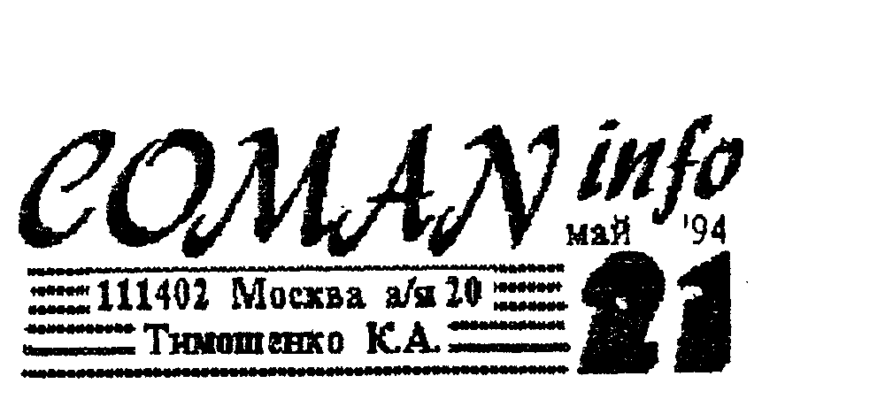
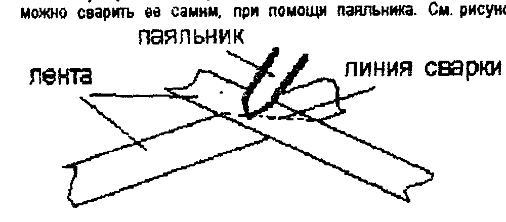
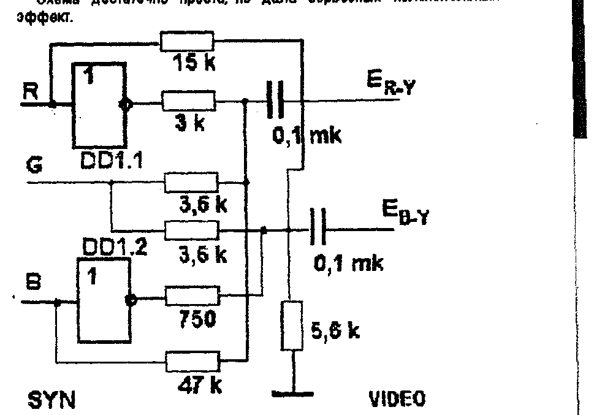

Издается фирмой COMAN, 111402 Москва а/я 20, Тимошенко К.А.

## ПЗУ "СУПЕР+" дополнение

В прошлом номере мы забыли добавить, что у ПЗУ "+" введен режим принудительной прочистки ОЗУ при загрузке с МЛ.
Поэтому будьте внимательны - при обычном запуске (по нажатию БЛК+ВВОД) очистки не происходит, и поэтому в памяти может остаться всякий мусор (программа обработки прерываний или стек от предыдущей программы).
Это может привести к неработоспособности вновь загружаемой программы, т.к. при запуске управление передается на адрес 0000Н.
Обычно там (с 0000Н по 0100Н) лежат нули, и ПК отрабатывает их как команду "NOP" - нет операции, и благополучно добирается до адреса 0100Н, где начинается программа.

В ПЗУ "СУПЕР+", для загрузки с МЛ программ, начинающихся с первого блока, нажимайте одновременно клавиши <РУСЛАТ> + <БЛК> + <ВВОД>.
В этом случае память прочистится, и запуск программы гарантирован.

Недостаток или достоинство? Конечно достоинство.
Во первых, эти ПЗУ (серии "СУПЕР") предназначены в основном для работы с дисководами и загрузка с МЛ - редкая процедура.
Во вторых, это очень мощное средство при решении тупиковых ситуаций при отладке (или при взломе).
Запустив программу, затем можно запустить другую, специальную, например в верхние адреса - и вы хозяин положения.

## Замена лент в игольчатых принтерах.

Игольчатый принтер, что и говорить, удобнее в эксплуатации для непрофессионалов, так как постоянно готов к работе.

Игольчатые принтеры используют, как правило, пластмассовые картриджи (кассеты), внутри которых находится закольцованная красящая лента (как в пишущей машинке).
Иногда она сварена лентой Мебиуса.
Это позволяет увеличить ее ресурс в два раза.
И рано или поздно лента изнашивается или просто пересыхает.
Возникает проблема ее замены.

Самый простой вариант - купить новый картридж.
Но он, как правило, недешев, да и купить его негде, особенно живущим в глубинке.

Вариант второй - восстановить ленту.
Если лента не имеет механических дефектов и не "забита" до белизны, то ее можно попытаться восстановить.
Для этого ее надо аккуратно вынуть из картриджа (запомните, как она там проходит и укладывается).
Затем ее следует окунуть в сосуд со штемпельной краской желаемого цвета.
(Ею пользуются почтовики - наводка, где купить).
И там хорошенько помять.
После этого надо медленно вынуть ленту, давая краске стечь.
Немного подсушив (1 - 5 часов) надо аккуратно заправить ленту в картридж.
Лента не должна быть влажной!
Ну и наконец, хорошенько вымыть руки.

Этот способ является радикальным, когда ничего другого не остается.
Но сказать честно, я ни разу в жизни не видел хорошо восстановленой ленты.

Наиболее оптимальным способом восстановления печатных способностей принтера является замена ленты в картридже.
Но поскольку купить готовую закольцованную ленту очень трудно, можно сварить ее самим, при помощи паяльника.
См. рисунок.



## Подключение ПК ...

### К монитору "Электроника МС6105"

Иногда при подключении к этому монитору не всегда удается получить устойчивую синхронизацию.
Простое согласование входного сопротивления при помощи диода (бюлл. №12) не всегда помогает.
В качестве дополнительной меры можно рекомендовать замену резистора R5 на входе амплитудного детектора на резистор большего номинала - ок. 1 КОм.

Иногда наблюдается смещение изображения влево, которое не удается устранить регулятором смещения R51.
В этом случае можно рекомендовать уменьшить резистор R46 (между средним выводом R51 и выводом 5 м/с XA11).

### К ламповому телевизору УЛПЦТИ

Схема достаточно проста, но дала серьезный положительный эффект.



DD1 - К561ЛН1 или ЛН2.

Питание на микросхему подается от телевизора.

## Печать из монитора - отладчика

Для получения копии экрана (текстовой) при работе в М-О, можно последовательно нажать клавиши <АР2> и <П>.
После этого все, что выводится на экран, будет печататься на принтере.
Для выключения печати надо повторить нажатие.

> Всеми этими советами поделился с нами и вами наш читатель БОЧКАРЕВ А.Н. проживающий по адресу:
> 636842 Томская обл. Первомайский р-н п. Комсомольск ул. Октябрьская д. 61 кв. 1

## И вообще, об авторстве....

Многие нам звонят и пишут "... я придумал то и то, если я вам все опишу, что я с этого буду иметь?".

Если речь идет о действительно серьезной разработке, сулящей миллионные барыши, то тут, как говорится, разговор без свидетелей.
Но таких еще не было.
Как правило речь идет об опыте или удачных находках.
Ребята, каждый номер бюллетеня обходится нам в минус 20 - 40 тыс. руб., поэтому ни каких гонораров не может быть и речи.
Хотите помочь другим и приобрести друзей по переписке - пишите.
Не хотите - не надо, и без вас обойдемся.

Мы будем печатать ваши статьи и заметки без купюр, даже если мы не согласны с изложенной в них точкой зрения.

Кстати, в ответе на анкету, многие пишут, что у 3 - 10 знакомых тоже есть ПК, но "я читатель неколлективный". А зря.
Дали бы почитать наш бюллетень этим знакомым, глядишь, и подписчиков у нас стало больше, и бюллетень подешевле, и выходить бы стал почаще (поскольку перестал бы быть убыточным).
Но многие предпочитают процесс тормозить.
Ну тормозите, тормозите.
У нас и так, 98% населения "тормознутые".

Или боитесь потерять "клиентуру"? Не бойтесь, все равно потеряете.
Мы уже начинаем принимать меры.

## Упаковка информации

Каждый нормальный владелец ПК обязательно имеет у себя копии всех своих программ - свой архив.
А он имеет обыкновение распухать не по дням, а по часам.
И пользоваться не только архивом, но и "рабочими" копиями становится не очень удобно.
Обилие дискет или кассет раздражает не столько своим количеством и затратами на них, сколько необходимостью знать "где-что", длительными поисками нужного файла.
Хорошо бы иметь все и сразу!
Проблемы составления своей картотеки оставим на совести каждого владельца ПК, а мы рассмотрим принципы упаковки (сжатия) информации.

Что такое упаковка информации? Это уменьшение ее количества без ухудшения качества.
Т.е. преобразование ее по определенным правилам, позволяющее затем провести обратный процесс - распаковку (при необходимости).

Вообще говоря, нет универсальных копировщиков, которые паковали бы все и плотно.
Алгоритмов упаковки превеликое множество и применяют их по мере необходимости и в определенных условиях.
Некоторые алгоритмы достаточно прозрачны и получили широкое распространение, став своего рода стандартами, другие очень специфичны.

Рассмотрим несколько алгоритмов (может это подвигнет вас на создание своего упаковщика).

Как говорилось выше, обсуждать эффективность того или иного упаковщика довольно бессмысленно - на разной информации они себя по разному ведут.
Поэтому и будем рассматривать их относительно типа информации.

**ГРАФИКА.** Среди упаковщиков графической информации самым распостраненными стали работающие в формате PCX (читается пи-си-икс).
Упаковка производится по принципу "если много одинаковых байт - заменяем их тремя".
Первый из трех байт - признак упаковки, показывающий, что далее идет упакованная информация.
Затем следует количество повторений и байт-содержание (порядок может быть и иной).
Например, такая последовательность байт

```
07 13 13 13 13 13 13 13 13 A5 C3 23 17 C5 C5 C5 C5 C5
```

после упаковки превратится в такую

```
07 A1 08 13 A5 C3 23 17 A1 05 C5
```

Как догадались, байт "A1" - признак упаковки, и после процедуры последовательность укоротилась.
Но распаковщик без проблем возвратит ей исходный вид.

Выбор байта - признака упаковки не такая простая задача, как кажется на первый взгляд.
Проблема заключается в том, что такой же байт может встретиться и в самой информации, и как его отличить от признака упаковки?
Придется его паковать принудительно, хотя это и "растянет" информацию - из одного байта сделалось три.
Отсюда вывод - в качестве байта-признака упаковки надо применять такой, который в информации самый редкий - тогда потери будут минимальны.
А для поиска такого надо просмотреть всю иформацию и посчитать чего сколько.
Упаковщик получается не такой простой, но эффективный.
Кроме того, паковать следует только те последовательности, у которых количество одинаковых байт 3-4 и более.

Для вывода спрайт вовсе не обязательно распаковывать.
Это можно делать и в процессе его вывода на экран.
И этим можно съэкономить много памяти.
Более того, если программа вывода сделана грамотно, то выводится упакованый спрайт быстрее, чем простой.
Это происходит потому, что при выводе каждого байта обычно проверяются "конец строки (столбца)?"
При выводе упакованого спрайта ту пару байт, которая определяет "сколько - чего", сразу грузят в регистры, один из которых счетчик, другой - содержимое заполнения.
Не надо тащить адрес "откуда брать" и цикл получается более "шустрый".

Совет программистам - лучше сначала паковать спрайты, а затем вставлять их в программу, чем паковать затем готовую программу.
Так вам не придется таскать за собой в процессе программирования десяток - другой лишних килобайт.
И еще один совет.
Как мы уже говорили, глаз человека больше ориентирован на вертикальные объекты.
Поэтому упаковывать лучше по "столбцам", а не по "строкам".
Организация экрана на Векторе этому способствует, да и выводить спрайты будет проще.
А вот на Львове - придется написать нечто отличное от "стандарта".

Как понимаете, программы упаковки и распаковки графики - это совершенно самостоятельные программы, работающие независимо друг от друга.
Упаковщик нужен во время разработки программы, при вставке спрайтов.
Распаковщик (обычно совмещенный с выводом на экран) - вставляется в программу.

Существуют и другие способы сжатия графики, например, разбиение на стандартные элементы - "кирпличики".
Правда, в этом случае речь идет не о сжатии, а о конструировании изображения из этих кусочков.

**ТЕКСТ.** Как вы понимаете, описанный метод совершенно непригоден для упаковки текста.
Известно только одно слово, в котором есть три одинаковые буквы подряд - "длинношеее".
Большое количество пробелов также практически не встречается - их делают табуляцией.
Поэтому для упаковки текста необходимо применять другие алгоритмы.

Если, например, заведомо известно, что текст русскоязычный (допустим, рассказ, статья и т.п.), и в нем не встречается других букв, кроме русских, то обозначить букву или знак препинания можно не байтом (8 бит - 256 комбинаций), а 6 битами - 64 комбинации.
Или даже 5-ю (32 комбинации), а отдельные, редко встречающиеся знаки и символы - сочетанием из 10 бит.
(Давно известно, что частота повторения букв очень различается - в сотни раз.
В поэме (!) А.С.Пушкина "Медный всадник" буква "Ф" встречается только 1 (!) раз).
Разумеется, при распаковке, вы должны рассматривать не байт, а только 5-6 бит.
После принятия решения, вы должны сдвинуть информацию на соответствующее количество бит и снова принимать решение.
Конечно, такой упаковщик будет иметь очень узкую специализацию, но и 20-30% сжатия - уже не плохо.

Текст, вообще говоря, это человеческая речь, преобразованная в символы.
Но человек говорит не буквами, а фонемами.
Например слово "небо" - 4 буквы, но две фонемы - "не" и "бо".
(Фонемами условно можно считать то, что можно произнести не закрывая рта или не прикасаясь языком к губам или небу.
Более подробно - в спец литературе или у нас, чуть попозже "Sound sys.")
Фонем не так много - несколько сот.
Поэтому можно использовать байт не как определение буквы, а как определение фонемы, т.е. 1-2-3 букв.
Если не хватает байта, задействуют лишние биты.
Упаковщик и распаковщик получаются более громоздкими, но игра стоит свеч - сжатие идет уже "в разы".
Упаковщики подобного типа тоже "текстоориентированы".

Упакованный текст может быть как с автораспаковкой (если он предназначен для самостоятельного использования), так и без таковой (предназначен для импортирования в какую либо оболочку или т.п.).

**ПРОГРАММЫ.** Сложнее всего сжимать программы.
Не игровые, у которых половина объема это графика (см. выше), а собственно исполняемые фрагменты.
Если вы пользовались пресловутым "PRESS"-ом, то замечали, наверное, что сжатие игровых программ происходит за счет графики.
Участки с кодами процессора сжимаются только за счет "НОПОВ", или областей памяти, оставляемых автором под данные.
Эффект - единицы процентов (если вообще наблюдается).
Попробуйте-ка сжать "POWER"!
Поскольку поведение и замыслы авторов программ непредсказуемы, а разработчики процессоров постарались максимально использовать систему команд (и придать каждому байту команды какое то значение), то выявить закономерности неможно, а посему и сжатие команд дается трудно.
Есть, правда, один способ, который называется

**СИГНАТУРНАЯ СВЕРТКА.** Смысл ее заключается в следующем.
Если взять какую либо (сколь угодно большую) последовательность байт, и пропуская ее через сдвиговый регистр, производить сложение определенных разрядов этого регистра "по модулю 2" с предыдущим результатом, то, зная конечный результат и формулу сложения, с вероятностью 99,99% можно восстановить всю исходную последовательность.
Другими словами, можно восстановить всю последовательность байт (читай программу), если есть несколько байт конечного результата и правила, по которым эта последовательность складывалась.
Перестановка или изменение одного байта тут же приводит к изменению контрольной суммы.

Сжатие в этом случае абсолютное - с десятки, сотни и тысячи раз.
Конечно, если бы все было так просто, то этим бы все и пользовались.
Проблема заключается во времени.
Если при сжатии все более-менее быстро и ясно, то для распаковки надо потратить либо колоссальные материальные ресурсы (быстродействующую аппаратную часть), или временные - распаковывать программно и медленно.
И то и другое дороже носителя, поэтому информационное развитие движется по пути удешевления носителей информации, увеличения их емкости и увеличения быстродействия обмена информацией.
А сигнатурный метод применяют в системах диагностики.

## Часы в ПК

Многие в ответе на анкету отметили, что хотели бы иметь часы в своем ПК.
Давайте рассмотрим, почему их до сих пор там нет и нужны ли они там.

Что представляют собой часы, встроенные в ПК.
Это специальная микросхема, имеющая АВТОНОМНОЕ ПИТАНИЕ (литиевая батарейка, срок службы 5 - 6 лет, за это время компьютер обычно меняют).
Эта микросхема имеет собственное ОЗУ в несколько десятков байт, генератор и все такое, что нужно часам.
Программно можно установить определенное состояние часов, и они далее будут ходить как обычные электронные часы.
По мере надобности можно считывать их состояние и использовать по своему разумению.

**ЦЕНА.** Микросхема компьютерных часов (К512ВИ1) достаточно "левая", в свободной продаже не встречается даже на московском радиорынке.
Поэтому либо она попадает к вам случайно, либо надо приобретать импортную, а это дорого.
Возможно, конечно что то сгородить на "россыпи", например на 176-й серии (ИЕ12 + ИЕ13 + ПР...), с питанием от батарейки, но это а) уже маленькая плата, б) программно не управляется простыми методами.
И стоить будет (с трудозатратами) 5 - 8 тысяч рублей.
Не велика ли цена за возможность лицезреть цифры на экране.

**ЗАЧЕМ?** Часы в профессиональные ПК ставят по необходимости.
Наличие часов позволяет автоматически фиксировать время прихода какой либо информации (все нормальные ПК имеют доступ к тем или иным сетям), использовать внутреннее время для ведения различных протоколов, блокнотов и пр.
Вобщем часы нужны тем, кто проводит за ПК 6 - 8 часов в день, и его работа действительно "завязана на время".
Когда в анкете читаешь "90% на игры, 10% на Бейсик, 3-5 часов в неделю..." как то слабо верится, что этому человеку позарез нужны часы в его ПК.
Это во-первых.

Во-вторых, вывод показаний часов на экран - это отдельная программа, причем не примитивная (если вывод красивый).
А это значит, что она 1) отбирает ресурсы у процессора, 2) работает эпизодически (когда позволяет основная программа), т.е. по прерываниям.
А система прерываний в домашних ПК как раз совершенно не развита.

Кроме того, потребуется целая система, которая позволит общаться с часами - дешифратор адреса, буферы данных и пр.
Поэтому вопрос "зачем?" отнюдь не праздный.

И все же, хотите иметь часы в ПК? И очень недорого!
Покупаете китайские наручные часы в пластмассовом корпусе за пару тысяч рублей, откусываете ремешок, а сами часы приклеиваете на переднюю панель монитора.
Будут всегда перед глазами.
Пару лет они проходят, а потом и выкинуть не жалко.

## ПК - мультиметр?

Также многие хотели бы превратить свой компьютер в мультиметр (т.е. амперавольтомметр).
Нам подобная затея кажется, мягко сказать, не очень умной.
И вот почему.
Мультиметр - вещь достаточно универсальная, несомненно очень нужная, и должна быть всегда под рукой и всегда готова к работе.
Запускать ПК ради измерения напряжения - смешно.
Да и ладно бы ПК сразу мерил все необходимые параметры.
Но ведь нужна такая штука, как АЦП (аналого-цифровой преобразователь).
Да не один, а с кучей делителей, причем очень точных (иначе зачем затея)!
Плюс крутая программа.
Дороговато получается.

В тоже время, существуют специальные микросхемы для мультиметров - серии 572ПВ....
Такая микросхема стоит 2 - 3 тысячи рублей.
На ее основе можно собрать достаточно простой, точный и дешевый мультиметр.
Описания подобных приборов публиковались во всех радиолюбительских журналах.
Впрочем мы можем повторить их в "UMниках".
Кроме того, мы можем выслать желающим микросхему 572ПВ5 (3000 руб. с пересылкой).
А так же жидкокристаллический индикатор - 2000 руб.

Компьютер надо использовать в тех случаях, когда проблема не решается более простыми методами, или когда возможна дальнейшая программная обработка результатов, дающая эффект.

## Новые игрушки ПК Львов

**С81 (5) MONEY BOX** - (Попов А.) Отличная динамичная игрушка.
Внизу имеется несколько копилок, а сверху падают монеты разного достоинства.
Бери да складывай.
Проблема в том, что в копилку нельзя положить больше 35$.
Поэтому надо уметь быстро соображать и считать.
В этой игре есть что-то от Тетриса... Наверное, азарт.

**С82 (6) FROGGER** - (Попов А. Тимошенко К.) Весной выводятся из икры маленькие глупые лягушата.
Но на этот раз лужа оказалась далековато от болота.
Много опасностей подстерегает их на пути - коршун, ежи, змеи, дорога и пр.
Постарайтесь провести как можно больше лягушат до болота.
У вас получится, если не будете суетиться.

**С83 (5) FARMER** - (Попов А. Тимошенко К.) Фермер растит клубнику.
Но ею не прочь полакомиться и разные козявки.
У фермера полно химикатов, но на каждого паразита требуется свой.
Поэтому фермер должен успевать менять химикаты, прежде чем те подгрызут клубнику.
Но главное - запомнить "что от кого"...

**С84 (6) COOKIE** - (Попов А. Тимошенко К.) Повар должен за определенное время сварить суп из продуктов, которые разлетелись по всей кухне.
Он должен затолкать их в кастрюлю своим телом или при помощи пара.

**С85 (6) ROTORS** - (Попов А. Тимошенко К.) Игровое поле занято картинками, разбросанными в беспорядке.
Ваша задача расположить одинаковые по вертикали, горизонтали или диагонали.
Для сдвига надо повернуться к картинке и нажать пробел.
Вам мешают разные ядовитые козявки и дефицит времени.
Соображайте побыстрее!

**С86 (6) PAIRS** - (Попов А. Тимошенко К.) В этой игре поле так же покрыто картинками, попарно одинаковыми.
Прав-да лежат они тыльной стороной.
Открыть можно только одну картинку.
Если открываемая картинка точно такая же, как и открытая, то они обе исчезают.
А если нет - предыдущая закрывается.
Отличная тренировка памяти.
Вредители те же - козявки и время.

**С87 (8) AIDS-JUNIOR** - (Попов А. Тимошенко К.) Описание игры в предыдущем номере (для Вектора).
Версия для ПК "Львов".

**С88 (10) AIDS-SEX** - (Попов А. Тимошенко К.) То же самое, но с пикантными картинками.
Управление: перемещение маркера - курсор; установка/снятие вакцины - буквы клавиши; вскрытие клетки - пробел.

**С89 (5) PING-PONG** - (А.Данюк) Постарайтесь продержаться как можно дольше за игровым столом настольного тенниса (ваш соперник ПК).
Правила просты - надо обеспечить присутствие ракетки в нужное время и нужном месте.

**С108 (4) GBR** - (А.Данюк) Отличная тренировка памяти - надо в точности повторить цветовое сочетание, предложенное компьютером.

**С109 (5) STARWAR** - (Голубов И.) Солнечная система изнывает под гнетом инопланетян.
Они понастроили свои базы на всех планетах.
Вы должны уничтожить их базы и космические корабли.

**С110 (5) ЧЕЛЮСТИ** - (Котиков) Динамичная игрушка, своеобразный "PACMAN", но в иной интерпретации.
Цель игры - собрать все ягодки в лабиринте, увертываясь от сторожей.

**С111 (10) SINGLE** - (Котиков) Игрушка в лучших традициях "Странника".
Сюжет практически такой же, но новые лабиринты, враги и приключения.
Только графика получше.

**С112 (5) DIGGER-S** - (Сумкин И.) Вариации на тему "Диггера".
Надо прогрызать тоннели, собирать золото и призы, а также убить всех пауков.
Много уровней и хорошая графика.

**С113 (8) ЗМЕЙКИ** - (Сумкин И.) Отличный вариант "Удава".
Отличие в том, что на поле присутствуют два удава-соперника.
Один ваш, другой ПК-шный.
Борьба за каждого "кролика" (или морковку).
Красочная и динамичная игрушка с удачным сюжетом.

**С114 (8) TETR-S** - (авт. Сумкин И.) - еще один вариант TETRIS-а.
Наплохой, на наш взгляд.
Выбор палитры, скоростей, подсказка, возможность начального завала для асов...

> Запись с дублем, без защиты.
> 1 балл = 100 руб. МК-60 = 8 балл.; С90 (Кит/фир) = 15/25 балл.; Дискета (Изот/фирм) = 5/15 балл.; Пересылка = 8 балл.

## Некоторые изменения нашей ценовой политики или в сто первый раз о пиратстве и о том, как правильно сделать заказ и быстро его получить.

Похоже, что наша контора остается почти в единственном числе из тех, кто более-менее серьезно возится с ПК "Вектор" и "Львов".
Судя по анкетам, никто не использует их в качестве "основного места работы".
У всех это в порядке хобби или приработка на пиратстве.
Для нас же это хлеб, и мы за него будем бороться, и серьезно.
Поэтому хотим немного рассказать о своих планах и порядке работы.

В ближайшее время мы намерены очень серьезно доработать ПК "Вектор", с тем, чтобы он стал крутой машиной (круче "Поиска" и "АТМ-турбо").
Решения уже найдены, и дело за временем.
Следите за нашими сообщениями.
Расширение ОЗУ до 2-х Мбайт - это только первая птичка Феникс.

Аппаратно расширять "Львов" очевидно не имеет смысла, т.к. у него очень слабый видеоконтроллер (4 цвета при плохом разрешении, это все таки несерьезно).
Будут только небольшие прибамбасы, в основном универсального направления, т.е. без привязки к конкретному типу ПК.

Публиковать описания "ломовых" разработок мы не будем в бюллетене, т.к. это "ноу-хау" фирмы.
Такие разработки нам влетают в копеечку и вкупе с "минусовым" бюллетенем.....
Знаете, бесплатно как то не хочется работать, да и семью надо кормить.
Мы будем продавать готовые усторойства и документацию.
В любом случае, труд разработчика будет оплачен.

(Нам, кстати, часто предлагают разную "лабуду" из двух-трех микросхем и требуют за это 100 - 500$.
И мы их понимаем - страна, которая не ценит интеллектуальный труд - страна без будущего (пример - СССР)).

Что касается мелких разработок или разработок на уровне идей - это будет на наших страницах опубликовано.

Программное обеспечение.
На многих анкетах - "ну почему вы не пишете таких хороших программ, как на синклере?..."
А потому что вы денег не платите, бестолковые вы наши.
А "синклер" авторы деньги давно на западе получили, а тут только объедки оттуда.
А "Вектор" и "Львов" - наши, родные.
Тут писать не будут - нигде не будут.
На "Львов" мы "тормознули" новые программы - много их появилось?
Десяток-полтора, из них половина посредственные.
Ну что ребята, будем вести себя как свиньи под дубом, и чрез год никто про "Львов" не вспомнит, или еще поиграем и поработаем?

Получаем письмо "вы мой заказ уже месяц держите. Я и мои друзья вам больше не верим. Я ваши программы в другом месте купил, и впредь буду покупать не у вас, а у пиратов."

Во первых, почему "твои друзья" нам за программы не платят?
Во вторых - не купишь, потому, что мы ничего больше делать не будем, а если будем, то по такой цене, что и пираты тебя "разденут".
А мы свои деньги все равно получим.

Короче, мы решили немного навести порядок в этом деле.
Наше предложение в бюлл. 11 остается в силе.
Что касается новых наших программ, то система будет такая.

Все новые программы идут сборником.
Сейчас каждая программа обходится в 100-200 тыс. руб.
Т.е. сборник из 6-8 программ - примерно миллион.
Смотрим сколько продалось по такой-то цене.
Прибыль - цена остается прежней, привлекаем новых программистов и "рожаем" что то покруче и побыстрее.
Убыток - закладываем его в цену следующего сборника и цену повыше.

Ребятишки с "Дендями" за новую игрушку платят по 20-40 шт., а мы за эти деньги предлагаем 15 дискет с 300 программами.
Тысяч 5-6 за новую крутую игрушку - на наш взгляд не дорого будет.
Пираты купят и окупят.
Заказов будет меньше и делать их мы будем быстрее и качественнее.
Обидно, конечно, что честные люди пострадают.
Ну уж страна такая...

А хотите много хороших и дешевых программ - покупайте у авторов.
У пиратов можно купить первый раз, по незнанию.
Если вас несколько - скиньтесь "по чуть-чуть", чтобы потом не сдыхаться помногу.
Или не забыть про ПК.

Мы, со своей стороны, минимизируем сроки выполнения заказов.
Но и от нас не все зависит.

Как правильно заказать.
Заказ - на отдельном листе, аккуратно и разборчиво.
Обязательно обратный адрес и полностью фамилия.
Хотите душу излить - пожалуйста, только отдельно, копировщику это не интересно.
Письмо-заказ лучше продублировать, а оплату телеграфом.
А то вертят вертят прайс, высылают почтовым, а цены уже уехали.
И пошла "бодяга" - вы мошенники, нет ты дурак.

## Подключение принтера ПЗСУ-1

К ПК "Вектор".

| Контакт разъема "ПУ" | сигнал | контакт принтера |
| --- | --- | --- |
| A02 | D7 | 4 |
| A03 | D6 | 5 |
| A04 | D5 | 6 |
| A05 | D4 | 7 |
| A06 | D3 | 8 |
| A07 | D2 | 9 |
| A08 | D1 | 10 |
| A09 | D0 | 11 |
| C05 | строб | 21 |
| C09 | готовн. | 2 |
| C01 | общ | 12 |
| A10 | общ | 22, 23, 24, 25, 26, 27 - 28, 29, 30, 31, 32 |

## Всякая всячина

- Цвет бордюра экрана на ПК "Львов" хранится в ячейке памяти с адресом 48696 (десятич.).
Если записать в эту ячейку значение, отличное от "0", например командой

```
POKE 48696,55
```

то бордюр будет полосатый. Поэкспериментируйте!

- Для того, чтобы написать на экране что либо такими же буквами, как выводится заставка на ПК "Львов", надо использовать следующую программу.

```
10 CLS
20 FOR I=33173 TO 33179: READ K$: POKE I,ASC(K$): NEXT
30 FOR I=33180 TO 33185: READ K$: POKE I,ASC(K$): NEXT
40 DATA C,O,M,A,N,.......
50 DEF USR=(32980): X=USR(X)
```

- При написании программ на Бейсике V2.5, иногда надо перемещать фон, на котором происходит игра.
Сделать это поможет эта программа

```
10 POKE&7FF0,&21,&FF,&7F,&23,&24,&48,&25,&70,&7C,&FE,&9F,&FA,&F3,&7F,&C9
```

Необходимо зарезервировать память - HIMEN&7FEF.

При вызове п/программы A=USR(32752), содержимое 1-й страницы видеоОЗУ (8000Н-9FFFH) сдвинется на 256 байт, т.е. на 8 пиксел влево.
Сдвигается изображение, нарисованное 8-м цветом.
В остальных плоскостях изображение остается неподвижным.
Только не забывайте дорисовывать справа освободившееся место.

Например, можно рисовать рельеф местности...

```
20 Y=0:COROR 8
30 Y=ABS(Y+ INT(RND(1) 3-1)): IF Y>200 THEN Y=Y-1
40 PLOT 248,0:LINE 255,Y, BF: A=USR(32752): COLOR 0:
   PLOT 248,0: LINE 255, 200, BF: COLOR 8: GOTO 30
```

666810 Иркутская обл. п. Мама ул. Октябрьская 39 кв 2 Жуков А.В.

## По многочисленным просьбам! Хит-парад программ

Мы возрождаем ХИТ-ПАРАД ПРОГРАММ. Ждем ваших хитов!

> АНОНС - 22
>
> - источник бесперебойного питания.
> - NEW! игровые картриджи для ПК!
> - школа программиста.
> - краткие итоги анкеты.
> - советы, короткие заметки и многое другое...

> Подписная цена - 200 руб./номер. Для подписки вышлите п/перевод по адресу:
>
> 111402 Москва а/я 20 Тимошенко К.А. с пометкой "за бюллетень с ....номера".
