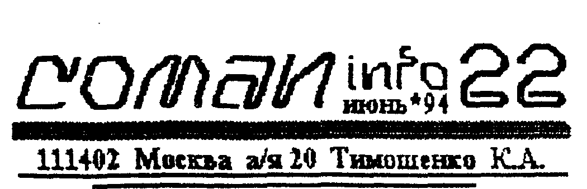
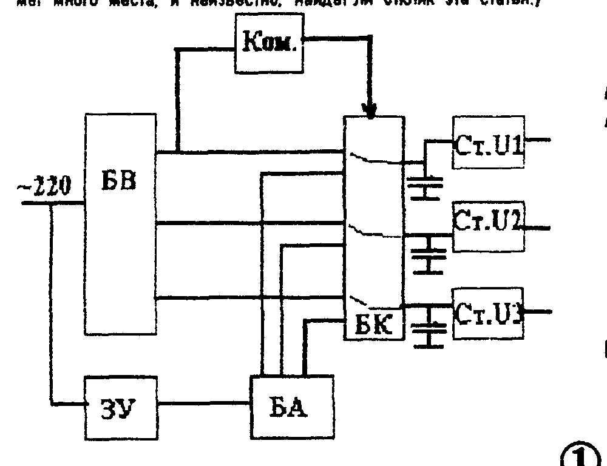
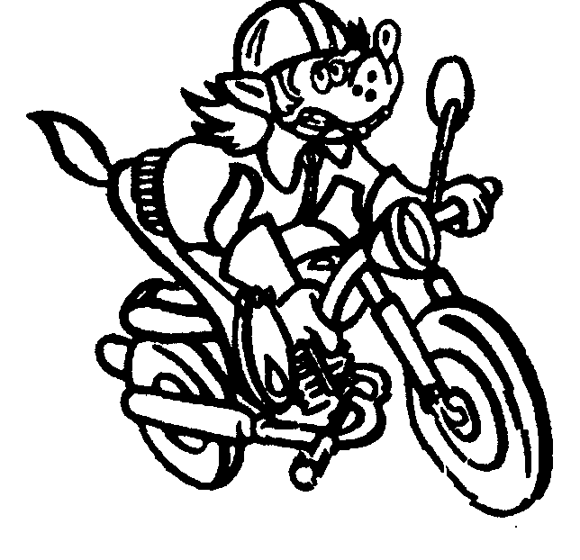
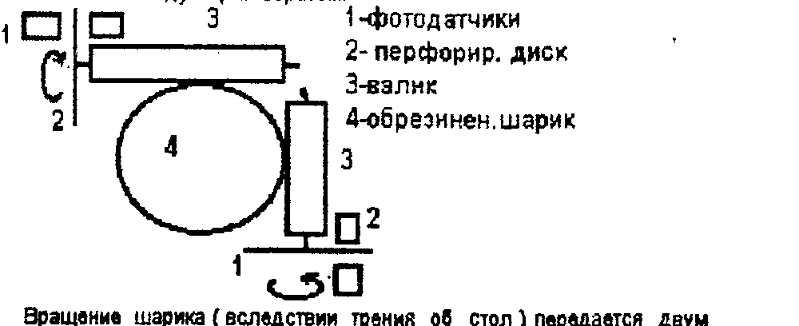

## Источник бесперебойного питания

Распостранение дисководов, электронных дисков, БОЗУ и пр. переферии, сделало домашние ПК практически полупрофессиональными машинами.
Пользователи начинают работать с уже более-менее серьезными объемами информации (ок. 1 Мб) и, как и ожидалось, это порождает ряд проблем - надежность её сохранения.
Речь идет о том, как не потерять информацию в случае появления "непреодолимых сил".
В данном случае - при пропадании питающего напряжения.

Вообще говоря, эта проблема стоит очень серьезно, даже для профессиональных сред.
Хороший ИБП стоит 500 - 1000 $.
Конечно, для "игрунов" это не имеет никакого значения (пока, по крайней мере).
Но если вы работаете со сложным спрайтом, большой базой данных, большим текстом - внезапное "вырубание" тока не только "гробит" несколько часов вашего времени, но и тысчёнку-другую нейронов.
А они, как говорят, не восстанавливаются.

Что обычно требуется от ИБП. Как правило, речь не идет о том, чтобы обеспечить длительную бесперебойную работу при отсутствии основного питающего напряжения.
(Хотя, для банковских сетей и обороны как раз наоборот, но у них свои электростанции.)
При пропадании напряжения важно успеть сохранить текущее состояние объекта (спрайта, БД, текста и т.д.) - т.е. пользователю надо: а) узнать о том, что наступила аварийная ситуация, и б) иметь резерв времени 10 - 20 мин. + возможность сделать копию на носитель (дискету или маг. ленту).

В профессиональных средах (например WINDOWS), сама среда автоматически делает копии текущего рабочего файла через определенный промежуток времени (хоть через 10 сек), причем незаметно для пользователя.
В этом случае, максимум, что вы потеряете - несколько минут своего труда.
На домашних ПК, увы, такой возможности нет.

Конечно, если ваш ПК оснащен дисководом, то задача значительно облегчается.
Вам надо завести себе за правило делать резервные копии своего объекта каждые 10 - 20 минут.
В этом случае потери будут невелики.
И даже при работе с ЭД или БОЗУ "слив" информации с него на дискету - секунды.

Гораздо сложнее, если вы работаете с БОЗУ или ЭД, но без дисковода.
Делать копии каждые 10 минут на ленту просто невозможно.
В этом случае без дополнительной аппаратной части не обойтись.
Да и тем, у кого есть дисководы и кто больше работает, а не играет, тоже ИБП будет небесполезен.

**Как устроен ИБП и как он работает?**

Ваш блок питания можно рассматривать как "черный ящик", куда подается 220 вольт переменного тока, а выходит 2 - 3 номинала напряжений, необходимых для работы ПК.
В ИБП все по-другому.
Блок схема ИБП представляет собой примерно следующее.
(Мы не приводим принципиальную схему, т.к. она займет много места, и неизвестно, найдет ли отклик эта статья.)



На блок-схеме обозначены:

БВ - Блок Выпрямителей. Представляет собой трансформатор, выпрямительные диоды и конденсаторы фильтра. Выходное напряжение на выходе БВ должно быть примерно в 2 - 2,5 раза выше номинального, необходимого для питания. Например, для номинала "+5В", оно должно быть +12 - +15В.

БА - Блок Аккумуляторов. Пакет аккумуляторов, имеющий вмкость 1,5 - 3 А/ч и больше. (Чем больше - тем более длительное время можно будет работать.) Напряжение у БА также должно превышать сумму необходимых разнополярных напряжений раза в полтора.

ЗУ - Зарядное Устройство автоматическое. Поддерживает аккумуляторы в постоянной готовности.

БК - Блок Ключей. Должен иметь максимальное быстродействие при переключении с БВ на БА. (У "фирменных" ИБП - 5 - 10 мс). Можно применить реле, работающие на размыкание - 3 - 15 мс.

Ком. - Компаратор, следящий за напряжением на выходе БВ. Напряжение срабатывания компаратора должно быть таким, что бы он не срабатывал при пульсациях напряжения, но оставлял запас по напряжению для срабатывания БК.

Ст. - Стабилизаторы и сглаживающие конденсаторы. Конденсаторы должны сглаживать бросок напряжения при срабатывании ключей.

Рассмотрим работу ИБП на примере одного из каналов.
БВ вырабатывает пульсирующее напряжение +15В.
Допустим, установленные в нем емкости обеспечивают пульсации 3В.
Т.е. напряжение колеблется от 12 до 15 вольт с частотой 100 Гц.
Для того, чтобы получить стабилизированное напряжение +5В, на вход стабилизатора необходимо подать 8 - 9 вольт (1,5 - 2 вольта падения на стабилизаторе и 1,5 - 3 вольта запаса на стабилизацию и на время переключения БК).
По расчетам получается, что если ток потребления примерно 3А, а время переключения 10 мс, то емкости на входе стабилизатора должны быть не меньше 20000 мкФ.
Тогда "проседания" напряжения по "+5в" практически не будет.

При пропадании напряжения в сети, напряжение на выходе БВ начнет снижаться, и при уменьшении его до 10 - 11 вольт должен сработать компаратор (в качестве него может быть обмотка самого реле).
И соответственно, сработать ключи.
Время срабатывания реле обычно находится в пределах 15 - 30 мс, а отпускания - 2 - 10 мс.
Поэтому реле должно срабатывать "на отпускание", с целью повышения быстродействия.
В момент, когда контакты реле находятся "в полете", стабилизаторы питаются от входных емкостей.
Ну а затем подключаются аккумуляторы.

Система, конечно, должна подавать сигнал тревоги, аккустический и световой.
А владелец ПК, приняв этот сигнал, должен "слить" нужную ему информацию на носитель.
От системы, конечно, запитывается и сам дисковод или магнитофон и монитор (их следует подключать непосредственно к БК, минуя стабилизаторы).

Применить ИБП можно не только для компьютера.
Это довольно универсальная вещь и может использоваться в сторожевых или блокировочных устройствах, питании стационарных радиостанций и многих других ситуациях.

Вообще говоря, проблема эта нами очень подробно не исследовалась, но если эта статья будет иметь некоторый резонанс, мы готовы рассмотреть её на наших страницах более подробно, с конкретными схемами и предложениями готовых ИБП или деталей для их самостоятельной сборки.

> НЕМНОГО РЕКЛАМЫ
>
> КУПИТЬ КОНТРОЛЛЕРЫ ДИСКОВОДА И ДРУГИЕ ПРИБАМБАСЫ К "ВЕКТОР"-у ВЫ МОЖЕТЕ В ГОРОДЕ КИРОВЕ.
>
> г.КИРОВ ул Сормовская 40 кв 2 Пупышев А.В.

> Фирма XUIDO предлагает БЛОКИ МУЗ. СОПРОЦЕССОРА для "Вектор 06ц", сопутствующие программы и документацию
>
> 392000 г. Тамбов ул. Маратовская д.2 кв 94 тел. 47-1535 Кобзев С.Д.

## Картриджи игровые

Многие с нами согласятся, что игровые и прикладные программы на ПК "Вектор" и "Львов" дошли до точки по своему объему.
Если задействовать в игре хорошую графику, то под саму программу места остается чуть более 30 Кб.
Упаковка дает кое-какой эффект, но не решает проблем.
Какой же выход?

**Решение 1.** Начать писать программы с дозагрузкой по ходу игры.
Игра начинается, а на определенном этапе требует подзагрузки (так организованы многие игры на ZX...).
Плюсы этого способа: - практически неограниченный объем программы; - возможность модифицировать программу, заменяя отдельные элементы, создавая, тем самым, новые версии; - резкое повышение уровня программ и обильное применение графики.

К минусам можно отнести: - игра прерывается, как говорится, на самом интересном месте.
И если с дисководом еще можно организовать более-менее толковый обмен, то с магнитофоном - кошмар; - полная непереносимость магнитофонной версии на диск и наоборот; - обилие файлов, и в случае порчи одного, может рухнуть все; - даже организовав быструю подкачку информации с диска, невозможно работать в реальном времени (например, выводить спрайт).

**Решение 2.** Расширение ОЗУ до 1/4 - 2 Мб.
ПК становится существенно мощнее и возможна работа в реальном времени.
Но если расширение ОЗУ для владельцев дисководов - это логично, то загружать 200 - 500 Кб с кассеты - не в кайф.

**Решение 3.** Разработать ПЗУ (по типу нашего ROM-диска), в котором были бы прошиты все сколь нибудь необходимые программы и подпрограммы.
И любой программист мог бы их использовать.
Это наложит определенные ограничения на игрушки или прикладные программы (без этого ПЗУ они не будут работать).
Но низкая цена все же позволяет купить такое ПЗУ практически любому.
Поэтому со временем оно станет "стандартным" дополнением ПК.

**Решение 4.** (на наш взгляд, наиболее оптимальное). Применение специальных картриджей - ROMдисков. Что это дает?

- в распоряжении программиста 128 Кб - это уже кое-что;
- отсутствие самого факта "загрузки" - воткнул и используй;
- "равноправие" дисковых и магнитофонных копий - одинаково нет;
- работа в реальном масштабе времени и возможность анимационного вывода спрайтов;
- огромная трудоемкость "лома", и как следствие, - отсутствие пиратских копий (что для нас, разработчиков, очень немаловажно);
- возможность совместного использования с магнитофонными или дисковыми программами, что позволяет увеличить память на 48 Кб (итого 172).

Единственный недостаток, на первый взгляд, - цена. Но давайте разберемся.
Цена картриджа на 128 Кб. получается в пределах 25 тыс. руб.
Много это или мало?
1) Это в два раза меньше, чем у Dendy.
2) из-за многократного использования одних и тех же элементов графики, подпрограмм и пр. 128 Кб в ПЗУ эквивалентны 300 - 500 Кб в ОЗУ.
А это 2 - 3 кассеты + столько же на запасные копии.
3) Все новые программы будут иметь достаточно высокую цену - 5 - 10 тыс. руб. (пираты, пираты...).
Прошивка их в ПЗУ позволяет держать цену на нынешнем уровне - 500 - 1000 руб./программа.

Выбирайте, что вам выгоднее и удобнее.
А мы имеем честь предложить вам

### Картридж "Карты"

Все нам известные "карточные" программы на ПК "Вектор" или "Львов" имеют один серьезный недостаток - игра идет на пару с ПК.
В то же время большинство самых интересных и умных игр требует наличия 3 - 4 игроков.
Нами разработан и, начиная с июля, будет продаваться блок для игры в карты.

Включив блок в ПК, вы можете выбрать одну из 15 игр, среди которых "Очко", "Дурак", "Покер", "Сека", "Тысяча", "Преферанс", "31", "66" и другие.
Даже если вы не умеете играть - не горюйте.
К каждому картриджу прилагается брошюра с описанием правил игры.

После выбора игры вы выбираете себе партнеров.
Среди них Ельцин, Черномырдин, Жириновский, Фарада, Шварценегер и другие (9 партнеров).
Это не просто "болваны".
У каждого из них свой характер.
Кто-то более рисковый, кто-то более фартовый.
Даже в одинаковых ситуациях они ведут себя по разному, а уж если карты разные...

Выбрав себе соперников, вы переходите непосредственно к игре.
Разнообразие характеров игроков, отличное перемешивание карт, хорошая графическая прорисовка и дружественный интерфейс для играющего - все это сделает картридж "Карты" вашим любимцем на долгое время.

Кроме того, игра в карты отлично тренирует мозги и память, что необходимо программисту.

**ВНИМАНИЕ! Картридж подготовлен как для "Вектора", так и для "Львова". Цена одинаковая.**

**С 1-го по 31 июля картридж продается по специальной вводной цене - 22000 руб. с пересылкой (наземной).**

Спешите - с первого августа эта цена недействительна!
Оплату высылать п/переводом по адресу
111402 Москва а/я 20 Тимошенко Константину Андреевичу.

Господа пираты! Вы можете приобрести картриджи оптом.
Картриджи 2, 3, 4 и 5-й будут стоить по 20 тыс., начиная с 6-го - по 18 тыс. руб.

## Анкета. Краткие итоги

Народ, в целом, положительно отнесся к "переписи населения", и мы спешим поделиться с вами краткими итогами и комментариями.
Более подробно мы будем рассматривать некоторые вопросы по ходу дела, а пока...

Среди наших подписчиков (без учета читателей, которые "сидят на хвосте"), владельцев ПК

**"Вектор 06ц" и "Вектор Старт 1200" - 61 %**

Из них - "магнитофонщиков" - 37 %, с ОС Микродос - 22 %, а с CP/M-53 - 41 %.
Т.ч. имеет прямой смысл активизировать разработку "чисто дисковых", но крутых программ.
Колеблющемуся контингенту без дисководов - см. стр. 4.

Принтеров не имеют вообще - 45 %.
У остальных в наличии такая техника: МС6312 - 23 %; МС6313 - 12 %; МС6337 - 11 %; других разных типов - 9 % (убедительно просим этих людей поделиться информацией по подключению - может кому пригодится).

Вообще говоря, мы не ожидали такого высокого процента насыщения дисководами, и особенно принтерами.

Другой массовой категорией наших читателей являются владельцы ПК "Львов" - 27 %.
Насыщенность дисководами у них гораздо ниже - 29 %.
А принтеров нет у 65 %.
21 % имеют принтер МС6312, 2 % - МС6313, 3 % - МС6337 и 9 % - всякие другие.

Неожиданно много (относительно, конечно,) среди наших подписчиков владельцев "ZX-Spectrum" - 8 %.
Вообще говоря, их гораздо больше, т.к. очень популярен тандем из "Спектрума" и другого ПК.
"Спектрум" работает как игрушка, а "Вектор" или "Львов" - для души и работы.
Это наводит нас на мысль, что информация по "Спектруму" тоже была бы в ходу.
Однако перегружать бюллетень еще одним ПК мы не хотим, а попробуем завязаться с конторами, которые работают по "Спектруму".

Совсем маленькой категорией граждан, получающей наш бюллетень, являются владельцы ПК всех других типов - "РКВ6", "Поиск", "Орион-128" и др. (залетел даже один с "Правец-8д") - 4 %

Как видите, распределение информации в бюллетене примерно соответствует распределению читателей по типу ПК.
Поэтому инсинуации "по этому больше, по этому меньше..." не состоятельны.
Просто из номера в номер трудно выдерживать эти соотношения, но в целом все так и выходит.

> UMник-3 - 2500 руб. с дискетой и пересылкой
>
> в номере:
> - дисковый Бейсик и его компилятор
> - исходные тексты драйверов работы с дисководом
> - вирусы - что это такое и борьба с ними
> - многое другое...

## Букварь программиста

### Микросхема К580ВВ55 и работа с ней

Увеличение количества "примочек" к ПК требует управления, а следовательно, драйверов - управляющих программ.
В "Векторе" и "Львове" (да и в других отечественных и полуотечественных ПК) в качестве порта обмена с внешними устройствами применяется м/с ВВ55.
Что она из себя представляет и как ею управлять.
Электрическую принципиальную схему вы можете посмотреть в документации к своему ПК.

Эта БИС представляет собой универсальный программируемый порт ввода/вывода.
Она содержит три независимых 8-ми разрядных канала, каждый из которых может работать в различных режимах.
Каналы имеют условное обозначение А, В, С.
Канал С можно рассматривать как два четырехразрядных канала - Ch - старшая тетрада (разряды с 4-го по 7-й), и Cl - младшая тетрада (разряды с 0-го по 3-й).

Все каналы могут работать в **режиме "0"**.
В этом режиме обеспечивается однонаправленный обмен данными без подтверждения.
Информация на выходных регистрах не "защелкивается" и остается неизменной до следующего вывода или смены режима.

Каналы "А" и "В" могут работать в **режиме "1"**.
В этом случае обеспечивается однонаправленный обмен с подтверждением.
При этом входная/выходная информация фиксируется в регистрах, которые управляются определенными битами канала "С".

Канал "А" может работать в **режиме "2"** - режим двунаправленой трехстабильной шины, под управлением канала "С".

Для задания микросхеме того или иного режима работы, существует Регистр Управляющего Слова - РУС, куда записывается информация, определяющая режим.
При записи УС все каналы сбрасываются о "0".
РУС можно использовать для установки в "0" отдельных битов выходного порта "С", когда они управляют процессом обмена данными.
При этом содержимое остальных регистров не изменяется.
Для реализации этого режима в РУС записывается слово установки битов канала "С".

Установить тот или иной режим работы м/с вам поможет таблица.

| бит | слов.выбор.реж. | сп.устан. битов "C" |
| --- | --- | --- |
| 0 | CL "1"-in,"0"-out | содержимое бита |
| 1 | B "1"-in, "0"-out | номер изменяемого разряда |
| 2 | режим "B" | |
| 3 | Ch "1"-in,"0"-out | |
| 4 | A "1"-in,"0"-out | 0 |
| 5 | режим | 0 |
| 6 | канала "A" | 0 |
| 7 | "1" | 0 |

Так например, на "Векторе", микросхема D27, предназначена для работы с внешними устройствами и все ее каналы выведены на разъем "ПУ".
Адресация портов такова:

```
РУС    - 04
канал C - 05
канал B - 06
канал A - 07
```

Если в порт 04 (РУС) записать байт 83Н, то каналы будут настроены таким образом, что возможна безконфликтная работа модуля ПЗУ и принтера, подключенных одновременно к "ПУ".

## Еще есть в продаже дискеты "Изот" 2S/2D!

первые 50 шт. - по 350 руб./шт.
вторые 50 шт - по 300 руб./шт.
третьи 50 шт - по 250 руб./шт.
все последующие - по 200 руб./шт.
пересылка - 1000 рублей (наземн.), 4000 - "авиа".

## Всякая всячина - всячина всякая - всякая.....

Ассемблерный вариант программы движения рельефа для ПК "Вектор" предлагает наш читатель Жуков из п. Мама (см. б.№21)

```
7F00  LXI H,7FFFH
7FF3  INX H
7FF4  INR H
7FF5  MOV B,M
7FF6  DCR H
7FF7  MOV M,B
7FF8  MOV A,H
7FF9  CPI 9FH
7FFB  JM 7FF3H
7FFE  RET
```

Еще одна программа звуковых эффектов на "Львове" (по утверждению автора, эта программа воспроизводит звук сирены)

```
      MVI  D,28H
      LDA  M3
      ANI  1FH
      ADI  32H
      MOV  B,A
      MVI  C,3CH
M1:   MVI  E,14H
M2:   PUSH B
      MVI  A,03
      OUT  0C2H
M3:   DCR  C
      JNZ  M4
      MVI  A,02
      OUT  194
      MOV  C,B
M4:   DCR  B
      JNZ  M3
      POP  B
      MOV  A,L
      ADD  C
      MOV  C,A
      DCR  E
      JNZ  M2
      MOV  E,B
      MOV  A,L
      CMA
      INR  A
      MOV  L,A
      INR  B
      DCR  D
      JNZ  M1
      MVI  A,02
      OUT  0C2H
      RET
```



Проблема бессмертия по прежнему продолжает мучить многих.
Приводим ячейки памяти в некоторых играх на "Вектор"

| Игра | Хитрость |
| --- | --- |
| "Химия" | по адресу 5E3DH записать NOP |
| "Кираш" | по адресу 39DFH записать NOP |
| "Пекманенок" | по адресу 080EH записать NOP |
| "EXOLON" | по адресу 41D6H записать NOP |
| "FLAER" | по адресу 0E51H записать NOP |
| "FIRE RESCUE" | по адресу 1526H записать NOP |
| "ERIC.." | по адресу 0B4CH записать FF |
| "SIDE ARM" | код бессмертия 222517 |
| "UP THE RIVER" | проиграв все три жизни, нажмите БЛК+СБР |
| "RISE OUT" | увеличение жизней - УС+СС+2, другой уровень - УС+СС+3 |
| "ROCKFORD" | "меню" - "F1", друг.уров. - УС+СС+РУС/ЛАТ |
| "ZODIAK.." | быстрое раздевание - УС+пробел (отпускать УС после музыкального фрагмента) |
| "УЖАС-3" | другой уровень - УС+СС+ТАБ+РУС/ЛАТ |

Ждем ваших "маленьких хитростей"!

## Предлагаем услуги по разработке и изготовлению оригинальных радиоэлектронных устройств

От идеи до воплощения.
В сжатые сроки и с высоким качеством!

> 111402 Москва а/я 20 "COMAN"

## СР/М или МикроДОС?

### Или кто кому морочит голову?

Не так давно попал к нам в руки бюллетень Волгоградской фирмы "Системотехника", которая "пасет" "Вектор".
Почти половина выпуска посвящена инсинуациям в нашу сторону.
Мол, фирма "COMAN" голову вам морочит своим контроллером.
А вот мы... Далее следуют дифирамбы в пользу своего контроллера.

Во-первых, наша система не "левая" и не "убогая", а ОБЫЧНАЯ ОС фирмы MicroSoft.
Если эта ведущая мировая фирма не авторитет для "системотехников", то по поводу достоинств той или иной ОС споры можно прекратить.

Во-вторых, что толку от того, что на МикроДОСе 800 Кб., а у нас "только" 640, если наша дискета стоит 400 руб., а у них - 1200 (того же качества).

В третьих, утверждение о том, что "все остальное МЕРКНЕТ рядом с электронным диском" - не более, чем реклама умирающего монстра.
Этот ЭД существует уже более 6-ти лет.
За это время не появилось ничего сколь-нибудь стоящего и доказывающего, что без ЭД жить нельзя.
Наш БОЗУ только родился, но выводит "Вектор" на качественно иной уровень - ОЗУ в Мегабайт (или два) не у всякой "Писишки".
Мы не собираемся держать в тайне систему управления (она прилагается к каждому БОЗУ) и уже началась работа над созданием ПО в стиле WINDOWS (очень крутая оболочка, допускающая параллельную работу нескольких программ).

В четвертых, мы выпустили в продажу ИСХОДНЫЕ ТЕКСТЫ ДРАЙВЕРОВ непосредственной работы с дисководом (см. UMник-3).
Это значит, что программы смогут общаться с дисководом напрямую, без ОС.
И в ближайшее время следует ожидать появления новых интересных системных и игровых программ.
Но, увы, на МикроДОСе они работать не будут.
Так что, ребята, чем дальше, тем больше небо над МикроДОСом затягивается тучками.

Ну и наконец, в пятых. Вы посмотрите, что предлагаем мы, а что "системотехники", и по каким ценам, и сами поймете, кто вам "морочит голову".

|  | "COMAN" | "Системотехника" |
| --- | --- | --- |
| Контроллер дисковода | 25-30 тыс. | 40 - 45 тыс. |
| ROMдиск 32 Кб. | - отсут.- | 20 - 25 тыс. |
| -//- 64 Кб. | 14 тыс. | отсут. |
| -//- 128 Кб. | 22 тыс. | отсут. |
| ЭД (или БОЗУ) 258 Кб. | 35 тыс. | 45 тыс. |
| -//- 512 Кб. | 45 тыс. | отсут. |
| -//- 1 Мб. | 55 тыс | отсут. |
| -//- 2 Мб. | 80 тыс. | отсут. |
| Готовые дисков. блоки | 130 тыс. | отсут. |

О программном обеспечении вообще речи не идет.

Мы приносим глубокие извинения своим читателям за то, что потратили некоторую часть бюллетеня на эти разъяснения.
Но может быть они помогут 37% "бездисководных" вектористов сделать правильный выбор.

Тем же владельцам МикроДОС, кто в сердцах написал на анкете "..когда будет совместимость?... почему несовместимы?.." мы можем посоветовать только одно - либо купите готовый КД CP/M-53, либо соберите сами.
Плату мы вам за 3000 руб. вышлем.

Иногда в письмах нам пишут "...вы меня предупредите, когда у меня закончится подписка...".

По окончании подписки мы вкладываем в конверт вкладыш с сообщением.
Кроме того, на каждом конверте с бюллетенем, напротив вашей фамилии в скобках стоит цифра.
Многие его считают своим регистрационным номером.
На самом деле она указывает, до какого номера у вас подписка.
Например, "Иванов А.Б. (23)". Это значит, что для Иванова 23-й номер бюллетеня - последний, и получив его, он должен прочитать на 4-й странице текущую стоимость бюллетеня и отправить ПОЧТОВЫЙ перевод с пометкой "за бюллетень с 24-го номера" (если желает быть и дальше в курсе дел, конечно).

УБЕДИТЕЛЬНАЯ ПРОСЬБА, НЕ ВЫСЫЛАТЬ ПЕРЕВОДЫ "ЗАРАНЕЕ".
("с 28-го номера"). ЭТИ ДЕНЬГИ НЕ ИНДЕКСИРУЮТСЯ, а пересчитываются по текущей стоимости бюллетеня при выходе того номера, с какого "заказано".
(Деньги на подписку не такие большие, что бы их можно было "крутить" и отслеживать инфляцию.)

Для подписки на бюллетень необходимо выслать п/перевод из расчета 200 руб./номер по адресу: 111402 Москва а/я 20 Тимошенко К.А.
Укажите разборчиво свой адрес и номер, с которого хотите получать бюллетень.

## Мышь

В ответах на анкету многие упомянули, что хотели бы иметь в своем ПК такую штуку, как мышь.
Что такое мышь, зачем она и как с ней работать.

Мышь относится к простейшим дигитайзерам ("оцифрителям" - т.е. устройствам, переводящим какие-то параметры в цифру).
Устройство мыши достаточно простое, но требует прецизионной механики, поэтому самостоятельное изготовление мыши нецелесообразно.
Устроена мышь следующим образом.



Вращение шарика (вследствии трения об стол) передается двум взаимно перпендикулярным валикам.
На оси валиков насажены перфорированные (т.е. с отверстиями) диски.
С обеих сторон дисков имеются фотодатчики, причем реверсивные, которые выдают импульсы "+1 по Х", "-1 по Х", "+1 по У" и "-1 по У".
Эти импульсы передаются в компьютер.
А в компьютере, в свою очередь установлен либо адаптер мыши, либо просто программа-драйвер.

Как видите, ничего сложного в мыши нет.
Электрическую схему самой мыши вы можете найти в журналах (например "Микропроцессоры и вычтехника" за 89-й год).
Но, повторяем, самому делать мышь - маразм.
Она стоит в пределах 8 - 12 тыс. руб. (в зависимости от качества и фирмы).

Главное в применении мыши, как вы догадались, не сама мышь, а программа, с которой она работает.
Домашние ПК слишком слабы, что бы тащить мышь по системе прерываний, поэтому без адаптера мыши не обойтись.
В самое ближайшее время мы постараемся опубликовать схему такого адаптера, расписать основы драйверов, наладить их выпуск и предложить вам сами мыши.

Мышь обычно применяется как целеуказатель.
Она гораздо "шустрее" светового пера, не связана с типом экрана, и не требует никаких подстроек.
Но за это приходится платить - существенно выше цена и сложнее программная поддержка.

Часто можно слышать легенды о том, что мышью очень легко будет рисовать.
Так вот - мышью рисовать очень плохо, т.к высока погрешность преобразования механического перемещения в электрические сигналы.
Например, провести прямую мышью очень трудно.
Но все, конечно, зависит от программы, где она используется.

Существует еще одна разновидность мыши - трэкбол.
Он обычно применяется в переносных компьютерах типа "NOTEBOOK".
Что бы иметь возможность работать "на коленках", без стола, его встраивают прямо в компьютер.
Трэкбол представляет собой ту же мышь, но "на спине".
Обрезиненный шарик (увеличенного размера) вращается рукой.
В остальном - все как у обычной мыши.

Современный компьютер трудно представить себе без мыши, поэтому мы намерены всерьез за нее взяться.
Будет разработан крутой графический и текстовый редакторы, ориентированные на работу с БОЗУ, мышью и другими устройствами, а также на взимную интеграцию своих продуктов друг в друга.
Судя по тому, что большинство наших читателей занимаются электроникой, небесполезным будет и полуавтоматический трассировщик печатных плат, который в сочетании с плоттером позволит выдавать приличные чертежи.
И многое другое.

Будем очень благодарны вам за присланные идеи и мысли.

> 23
> АНОНС
>
> В номере:
> - драйверы светового пера и его применение.
> - технология замены емкостной клавиши на герконовую
> - букварь программиста
> - технология ремонта ПК
> - многое, многое другое
