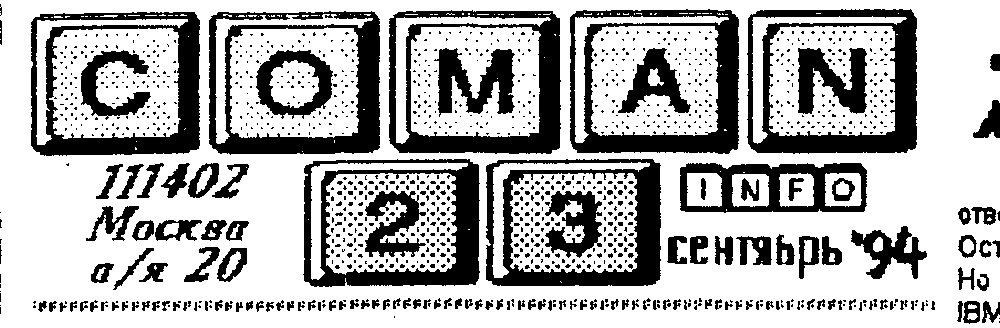
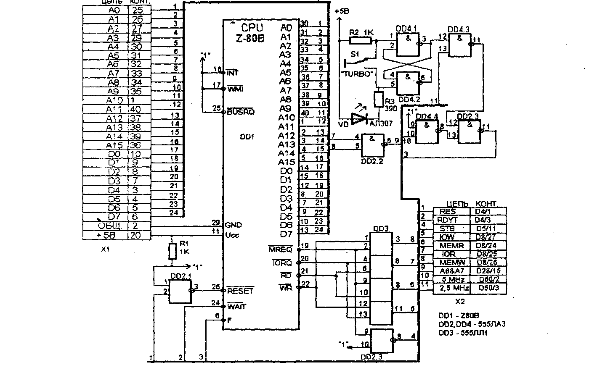
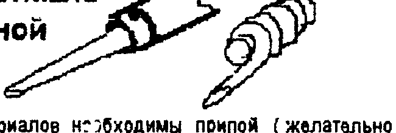
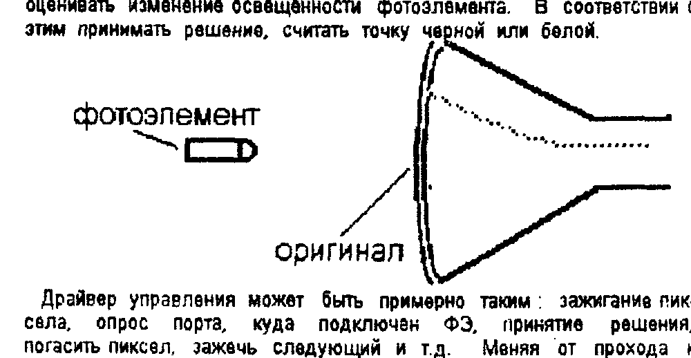

## Слухи о нашей смерти сильно преувеличены

Нельзя сказать, что нас завалили письмами "..а куда вы делись?..", но их немало.
Поэтому разъясним, почему мы два месяца молчали.
Во-первых, фирмы "COMAN" формально больше не существует (если честно, то уже достаточно давно).
И вы теперь имеете дело исключительно с частными лицами, которые возятся с "Вектором" и "Львовом" так же как и вы - в свободное время.
Разумеется, это в несколько десятков раз уменьшило нашу производительность
Нам просто нечего было вам предложить.
Во вторых, неудачное стечение обстоятельств, связанных с очередным переездом, затянуло его более чем на месяц.
В результате у нас сейчас вообще нет помещения и уже не будет.
В третьих, обвальное падение спроса на любой товар (и на ПК в частности), привело к огромной убыточности нашей работы (если заниматься ею профессионально).
А убыточность, мягко сказать, отбивает охоту к работе очень быстро.
Например, только каждый десятый из зарегистрированных у нас владельцев "Вектора" с трудом наскреб 5-8 тысяч рублей, что бы купить сборник новых программ.
А остальные где?
Им что, новые программы не нужны?
Нужны, и еще как!
Но только бесплатно.
Тысяча рублей за пачку сигарет или бутылку "Пепси" - это нормально.
А вот за новую программу - что то многовато.
И некоторые откровенно об этом пишут "... я уж подожду, пока у местных пиратов ваши программы появятся, уж очень лениво на почту идти, да ждать...".
Ну что можно на это ответить.
Ребята, ищите дураков, которые будут вам бесплатно программы писать на "Вектор" и "Львов".
Мы с этим "завязываем".

**Издание бюллетеня** всегда было "минусовым" делом, но убытки покрывались за счет других доходных статей.
Сейчас эти статьи исчезли и выкладывать свои собственные деньги как то не хочется.

Тот аргумент, что "уплочено", просто смешной.
Мы не недвижимостью занимаемся, и не наркотиками, а компьютерами.
Когда рубль был рублем, ПК стоил 1000 руб.
Сейчас он стоит 80 - 80 тыс.
Сравните с ростом цен на продукты, транспорт и т.д.
Т.ч. ни о какой крутой прокрутке средств речи не идет.
Хотите вы, или нет, цена на бюллетень будет существенно увеличена - до 1000 руб. за один комер, причем независимо от срока получения денег.
Т.е. за каждый разосланый номер будет вычеркиваться из подписки четыре.
Либо он будет выходить так, либо никак.
Выбирайте.
Деньги за подписку возвращаются по первому требованию.

Хотя и эти деньги огромными не назовешь, постараемся их отрабатывать, поменьше пускать воды, побольше конкретики.

**Заказы**, которые на нас висят, (блоки, БОЗУ, и пр.) постараемся выполнить в течении сентября - октября.
Никаких доплат производить не потребуется.
Желающих сделать заказы на железо просим повременить немного.

Давненько мы не печатали "хитов", поэтому просим не пугаться больших цифр.

### программы-ХИТ

| № | ПК "Вектор-06ц" | ПК "Львов" |
| --- | --- | --- |
| 1 | Карты (картридж) (112) | Арканоид (67) |
| 2 | Space safari (65) | Circus (62) |
| 3 | Болдер (63) | Странник (41) |
| 4 | Tankwar (43) | Cheese (32) |
| 5 | Karate (37) | King vallei (27) |

Ждем ваших писем с хитами!
Наш адрес прежний
111402 Москва а/я 20 Тимошенко К.А.

## Я хочу сменить свой компьютер на ...

На этот вопрос анкеты мы получили совсем неожиданные ответы.
Более половины вообще не хотят менять свой компьютер
Остальные хотели бы сменить свой ПК на "...IBM-совместимый".
Но как написал один читатель "... что вы все заездили, IBM да IBM, других компльютеров нет, что ли?".
Другие то есть, но счастливые - только эти.

Мы хотим немного рассказать о том, какие компьютеры "в ходу", и принесет ли вам удовлетворение смена ПК.
Немного непонятно желание тех, кто хочет сменить "на IBM".
Рынок более чем насыщен, и если есть деньги - отчего не меняете.
А если нет денег - Обломовщина еще никого до добра не доводила.

Но даже если вы твердо поставили перед собой цель - хочу IBM, что вас ждет.
Покупать "Поиск", "Турбо", "Искру", фирменную XT, и даже 286-ю - глупейшее занятие.
В лучшем случае вам доступны будут только примитивные (для своего класса, конечно) программы, редакторы и проч.
Графика CGA (4 цвета) при разрешении 320 на 240.
Первоначальный восторг от "крутых" программ (по сравнению с "Вектором", "Львовом" и "Синклером") через месяц пройдет, и вы будете чувствовать себя еще более ущербным, чем раньше.
Говорю это по своему опыту.
Я набираю этот текст на 386-й, 40 МГц, ОЗУ 4 Мб, винчестер 180 и пр.
И я чувствую, что машина, черт побери, СЛАБА !
На профессиональном ПО, (Windows, CorelDRAW, PageMaker и других, дающих действительно неограниченную свободу действий) она "тормозит по страшному".
От былых времен осталась "ХТ"-ка, 12 Мгц - на ней совершенно невозможно работать - медленная, да и программ нет.

Даже новые крутые игрушки требуют большого количества мегабайт ОЗУ, высокой тактовой частоты, хорошего графического адаптера и системы MultiMedia - звуковых плат, CD-ROM (оптический диск только для чтения), и др.
Представляете себе "игрушку" объемом в 2 Гигабайта?

Но в то же время я с удовольствием сажусь за "Вектор" или "Львов" - на них программы адекватные их мощности, и это не раздражает.
А после их турбирования - вообще стало очень приятно на них работать.

Ожидать, что цены на старые "писишки" пойдут вниз не приходится - их просто снимают с производства.
Сейчас купить XT просто невозможно - нет комплектующих.
Только "совковые" аналоги, но с ними лучше не связываться.
Они совместимы программно, но не совместимы аппаратно.
Кроме того, существует сговор производителей и прсдавцов (их не так много, как кажется) IBM-машин - не опускать цены ниже ...
Когда мы дернулись продавать их по кускам, то при подсчете оказалось, что собранная машина стоит столько же (!), что и разобранная (только головная боль на сборку прибавляется).

Поймите нас правильно, мы не говорим "все на "Вектор" !".
Просто мы не советуем тратить деньги на ерунду.
Если вы хотите потратить 600 - 800 $ на ерунду, то лучше добавить еще 300 и купить хотя бы 386-ю или 486-ю.
Они еще несколько лет протянут.
Хотя и им уже колотят гробы Pentium и процессоры других фирм с тактовой частотой 60 и даже 100 МГц !

В то же время, вложив в "Вектор" или "Львов" немного денег (эквив. 30 - 100$) можно получить очень приличные результаты - ОЗУ 1-2 Мгб, процессор Z80, клавиатуру от IBM и пр.
А главное - простор для творчества - архитектура прозрачна как слеза.

Что касается "других", то среди домашних лидируют "Amiga" - довольно крутой, среди профессиональных - "Apple".
Однако фирмы производители и разработчики программ не торопятся делиться секретами.
Поэтому цены на все прибамбасы к этим ПК намного (в разы) выше, чем к "писишкам".
Наша страна долгое время была закрытой для этих ПК по решению СОСОМ (экспорт в соц.страны), поэтому так получилось, что ТУТ доминируют "IBMы".
Если вам будет кто-то предлагать такие ПК, мы не советуем покупать.
Они действительно крутые, но ни литературы, ни описаний архитектуры вы не найдете - намучаетесь потом.

Ну и конечно, при решении сменить ПК, вы должны четко себе представить, что вы теряете, а что приобретаете.
Подавляющее большинство времени (ок. 80 %) "писишки" работают как "интеллектуальные пишущие машинки".
Стоит ли тратить миллионы рублей ради этого?
Ведь и десятая часть этих средств, вложенная в модернизацию "Вектора" или "Львова" обеспечат вам практически такой же результат.

Цеплять же разные прибамбасы, удобнее к простой и дешевой машине.

## Львов ПК01 умер! Да здравствует Львов-TURBO!

Лебединой песней наша фирма закончила свои работы по компьютеру "Львов ПК01" - установкой в него процессора Z80 и повышением тактовой частоты до 5-ти МГц.
Такая доработка значительно улучшает параметры этого ПК.
Посудите сами:

- **100 %-я совместимость** со всеми программами, существующими для "Львова" на сегодняшний день.
Процессоры Z80 и 580ВМ80 совместимы снизу вверх, т.е. все, что идет на 580-м, идет и на Z80.
Обратное неверно.
Из-за увеличения тактовой частоты в некоторые игры (особенно авт. Чистякова) стало очень трудно играть.
Введен переключатель "Турбо / норм.".
- **расширение системы команд** процессора с 78 до 150-ти, то, на что раньше у вас уходило несколько операторов, теперь займет одну команду (см. литературу по процессору Z80).
Стоит ли говорить о том, что исполняемая часть программ сокращается в несколько раз, освобождая место под графику.
Процессор Z80 имеет 24 (!) внутренних регистра.
Программисты поймут, что это дает.
Операции "регистр-регистр" самые быстрые операции.
- **увеличение быстродействия** при работе программ из ПЗУ в 2 раза, а при работе из ОЗУ - в 1.6 раза.
(особенность "Львова" - программы, расположенные в ПЗУ работают быстрее тех, что находятся в ОЗУ).
Игра в "Circus" на доработанном "Львове" - сплошное удовольствие.
- вообще говоря, возможна **адаптация программ** с ПК типа "ZX-Spectrum" (правда в монохромном режиме - из-за разности видеоконтроллеров).
Правда, это возможно в том случае, если будет на них спрос.
А вот его как раз нет.

Вобщем, вам выбирать, дорабатывать свой ПК или нет.
Заметим, что "Ассемблер-91" не будет поддерживать расширенную систему команд (он будет продолжать транслировать как для 580-го).
А вот макроассемблер М80 - поддерживает Z80.

Как видите из приведенной ниже схемы, доработка не содержит никаких дефицитных деталей.
Правда при покупке процессора будьте осторожны - он должен быть с буквой "В" (такт. 6 МГц) или "Н" (такт. 8 Мгц).
Применяемые в "Синклерах" процессоры с буквой "А" (такт. 4 МГц) не подойдут - "тормознутые".
Так что, не покупайтесь на дешевизну.

Доработку можно выполнить на "слепыше" или растрассировать печатную плату.

Плату с новым процессором удобно вмонтировать вместо старого.
Для этого необходимо старый удалить (просто выкусить), а контактные отверстия прочистить с помощью иглы или спички (см. бюл. № 9).
Нумерация разъема X1 на схеме соответствует нумерации ножек процессора 580ВМ80.
Разъем X2 на схеме необходимо монтировать проводами от платы нового процессора к указанным ножкам и микросхемам.

Переключатель "Турбо / норм." и светодиод "Турбо" расположите в удобном вам месте на корпусе ПК.

Доработка не сложна, и по силам радиолюбителю средней квалификации.
Если вы все сделали без ошибок, настройки не требуется.

При работе с турбированным "Львовом" не забывайте, что при общение с магнитофоном надо быть корректным, т.е. не забывать переключать в режим "норм.".
Хотя можете и поэкспериментировать.

Как показала практика, демонстрация турбированного "Львова" в действии, производит шоковый эффект на владельцев НЕтурбированного ПК, поэтому будьте осторожны !
Столбняк через некоторое время проходит, и звучит сокраментальное "ХОЧУ!!!".
При появлении достаточного числа покупателей (примерно 100), мы можем изготовить партию плат, готовых к установке.
Ор. стоимость будет 20 - 25 тыс. руб.
Если вы хотите купить такую плату (или несколько), можете прислать заявку + конверт с вашим адресом для ответа.

На плате компьютера:

1. Удалить микросхему D6 (К580ВМ80)
2. Перерезать дорожки, подходящие к D4/7, D8/2, D8/22, D28/14, D28/15
3. Соединить D8/2 с D8/22 и D5/13; D2/9 с D2/10
4. Разъем X1 монтировать в посадочное место удаленного процессора.
5. Разъем X2 монтировать проводами к ножкам указанных м/схем.

## Немного о модемах

Согласно итогам анкеты, практически каждый владелец ПК хотел бы иметь модем.
Но в действительности, более половины слабо себе представляют, что это такое.

Модем - это устройство для МОдуляции и ДЕМодуляции сигналов (в нашем случае - сигналов ПК).
Служит для повышения достоверности при их передачи по радиоканалу, проводам (в нашем случае - телефонным).
Модем с одной стороны подключен к ПК, с другой стороны - к телефонной сети.
И два компьютера, при наличии соответствующих драйверов, поддерживающих одинаковый протокол обмена (т.е. правила кодирования информационных и служебных сигналов), могут обмениваться информацией при участии человека или без него.

Программа, которая обслуживает модем (или модемы) в автоматическом режиме называется СЕРВЕР.
Часто сервером называют мощный ПК, имеющий большой объем памяти и предназначенный для работы по обслуживанию сети из многих ПК.

Какие проблемы тормозят развитие модемной сети для домашних ПК (по опыту нашей фирмы).

1) Качество телефонной сети - ниже всякой критики.
Уровень помех бывает такой, что сигнал вообще не определяется.
Связь очень неустойчивая.
Даже на профессиональных модемах передача 10 Кб занимает несколько минут.
В реальном масштабе времени работать не получается.

2) Высокая стоимость междугородней связи.
Маловероятно, что человек захочет заплатить 10 - 15 тыс. рублей за попытку принять файл 30 Кб, например, с новой игрушкой.
Именно за попытку, т.к. связь может прерваться в любой момент, результата нет, но деньги плати.
Внутри же одного города проще встретиться и передать копию на кассете или дискете.

3) Высокие затраты на организацию сети - большой ПК, покупка номера, организация обслуживания и пр.
Недаром все сети, включая "грандиозные" еле-еле дыбают.
Кап.вложения составят примерно 5 - 10 млн.руб.
Скинемся ?

4) Отсутствие информации, пригодной для передачи.
Что передавать по этой сети, если число программ для "Векторв" или "Львова" не превышает цифру 500, включая 197 копировщиков.
У всех есть все, новые программы практически не создаются.
Что бы вы хотели получить по модему ?

Таким образом, можно констатировать, что в этой стране не будет в обозримом будущем никакой сети для домашних ПК.
А жаль ...

В свое время, центр "Компьютер" (Кишинев) предлагал модемы для "Векторв".
Мы взяли, пощупали....
Работа на уровне "...Вася, нажми кнопку, сейчас я тебе информацию буду передавать...".
Несерьезно.

### price-list

| Товар | Цена |
| --- | --- |
| ROM-диск 64 Кб. для "Вектор-06ц" | 15000 руб. |
| PROM-system для "Львов ПК01" | 15000 руб. |
| Чистые платы для них | 1000 руб. |
| Разъём "ПУ" (папа или мама) для ПК "Вектор" | 2000 руб. |
| "Карты" игровой картридж для ПК "Львов" и "Вектор" | 25000 руб. |
| Супер-ПЗУ- плюс с сакетой | 3000 руб. |
| Кабель 40 жил, шаг 1.25 мм | 2500 руб./м. |
| Дискеты "ИЗОТ" 2S/2D | 500 руб./шт. |
| Дискеты пр-ва Гонконг 2S/2D | 700 руб./шт. |
| Дискеты пр-ва Гонконг 2S/HD | 1300 руб./шт. |
| Дискеты 3,5" 1.44 Мб | 2000 руб./шт. |
| ВЧ-модулятор (ч/б) | 3000 руб. |

1 балл в каталоге ПО = 150 руб.

ПОЧТОВЫЕ УСЛУГИ - 1000 руб. за каждый полный и неполный килограмм.

## Новые игрушки для ПК "Вектор-06ц"

Несмотря на почти отвесное пикирование домашних ПК, не хочется бросать тот программно-аппаратный задел, что был создан за годы общения с этими ПК.
Нет-нет, да и тянет порезвиться с ними в картишки или пострелять тарелки...

**СБОРНИК "Б"** формат ROM, запись с двумя проходами на кассете С90 фирмы ""SKC", или на дискете (с верификацией) формат СР/М-53.

**COLOR LINES** (авт. Барвиненков С.) - адаптация с IBM.
Отличная логическая игрушка, графика 1.1.
На игровое поле выпадают по случайному закону цветные шары.
Задача играющего расставить их по цветам в линию из 5-ти шаров.
Подробная инструкция прилагается к программе.
Дисковая версия сохраняет результаты игры на диске.

**PIPES** (авт. Барвиненков С.) - адаптация с IBM.
Логическая - динамическая.
Необходимо проложить водопровод максимально возможной длины по игровому полю, прежде чем по нему пустят воду.
Графика 1:1.
Описание прилагается.
Дисковая версия сохраняет рекорды на диске.

**ELECTROBODY** (авт. Барвиненков С.) - адаптация с IBM.
Великолепная "ходилка-стрелялка".
Нечто среднее между "Гротоходом", "Болдером" и "Exolon".
Описание прилагается.
Дисковая версия сохраняет промежуточное состояние на диске.

**SQUARES** (авт. Барвиненков С.) - Логическая игра.
Адаптация с IBM.
Задача играющего подобрать парные предметы из предлагаемого набора.
Предметы расположены в сложном лабиринте.
Описание прилагается.

**HAWK** (авт. Кошелев И. & Тимошенко К.) Вы пилот штурмового вертолета, оснащенного всевозможным оружием.
Ваша задача - прорваться через ПВО противника и уничтожить цель.
Но командование ставит перед вами все более сложные задачи...
Описание прилагается.

**MANIAC 1-5** (авт. Кошелев И. & Тимошенко К.) Пять простых игрушек с эротическими картинками (качество выше, чем в AIDS-SEX).
Смысл в том, что бы загнать девушку в угол (в прямом смысле), и тогда она ваша...
Игрушки имеют не только разные картинки, но и разную выигрышную стратегию.
Описание прилагается.

Желающие приобрести сборник, должны прислать нам письмо-заявку, конверт для ответа со своим адресом и 5000 руб.
**20 октября** вам будет выслано письмо с указанием конкретной стоимости сборника, и после получения остатка оплаты - сам сборник.

Ожидаемая цена - 20 ± 10 тыс. руб.
Система, как вы догадываетесь, проста: больше покупателей - меньше цена, меньше покупателей - больше цена.

При отказе от оплаты (в указанных пределах), 5000 руб. переходят в подписку на бюллетень.

Все купившие сборник будут считаться его официальными распостранителями и их адреса будут напечатаны в бюллетене.
Мы не будем считать их пиратами.
В тяжелый период, переживаемый домашними ПК, каждый владелец на счету.
Каждый должен иметь контакт хотя бы с несколькими другими "ПКшниками".

> Из-за отсутствия серьезного спроса на программы для ПК "Львов", мы прекратили их разработку.
> Для приобретения новых программ просим обращаться непосредственно к авторам программы.
>
> 420052 г.Казань ул.Молодежная д.14б кв 122
> Сумкин Иван Николаевич
>
> 426068 г.Ижевск ул.Петрова д.1 кв.106
> Голубов К.Л.

Что касается "Hardware" ("железа"), то для "Львова" оно будет разрабатываться в фоновом режиме - по мере разработки его для "Вектора".

## Ремонт ПК своими силами

Участившиеся в последнее время письма с просьбой починить ПК, вышедший из строя, побудили нас к печати цикла статей, посвященных ремонту.
В этих статьях мы будем кроме приемов ремонта рассказывать и о внутреннем устройстве ПК (в основном "Вектор-06ц"), принципах работы отдельных элементов и узлов ПК.
Все это позволит не только быстро и с минимальными затратами починить компьютер, но и использовать его внутренние резервы.

Залогом плодотворной работы являются не только знания но и качественный **ИНСТРУМЕНТ**.
Начнем с механического инструмента.
У вас должны быть **КУСАЧКИ-БОКОРЕЗЫ**.
Желательно такого размера, что бы их губки входили между выводами микросхем.
Ими можно будет удалять неисправные микросхемы без боязни повредить плату.
**СКАЛЬПЕЛЬ** нужен для зачистки выводов, прочистки подозрительных мест на плате, и др.
**ПИНЦЕТ** нужен для удержания мелких элементов во время пайки, отвода тепла и прочих операций, для которых пальцы человека слишком толстые.
Очень полезны будут различные модификации этих инструментов - разных размеров.
Кроме того неплохо иметь и другие инструменты - отвертки, пассатижи, пинцеты с зажимом и пр. и пр. (чем арсенал инструмента шире, тем легче работать).
Теперь инструмент, который иметь не обязательно, но желательно.
**МЕХАНИЧЕСКАЯ РУКА** позволяет закрепить плату в наиболее удобном положении.
Особенно если она небольших размеров.
**БИНОКУЛЯРНЫЕ ОЧКИ** позволяют легко обнаружить трещину на дорожке платы, "залипуху" - капельку припоя, вызвавшую замыкание, проверить качество пайки.
Да и вообще, мелкие предметы лучше разглядывать в увеличенном виде.
Глаза от таких очков не устают, т.к. глаз аккомодируется на далекое расстояние.
Если нет возможности приобрести такие очки, можно закрепить на устойчивом штативе линзу достаточно большого диаметра и работать под ней.
Кстати, очки или линза служат еще и защитой от мелких брызг припоя.

Особое место среди инструмента занимает паяльник.
Желательно иметь два паяльника.
Один мощностью 40 - 60 ватт, с толстым жалом, для работы с массивными элементами, демонтажа, прогрева.
Другой мощностью 15 - 25 ватт для работы с элементами, которые боятся перегрева.
Жало его должно быть заточено под конус и хорошо облужено.
Паяльник желательно иметь низковольтный и с заземлением.
Если у вас нет маломощного паяльника, то можно использовать и 40-ка ваттный, намотав на его жало медную проволоку диаметром 2-3 мм.

**пример заточки жала и навивки медной проволоки**

Из расходных материалов необходимы припой (желательно ПОС-61) в виде тонкой (диаметром 0,5 - 2 мм) проволоки, канифоль кусковая и растворенная в спирте или ацетоне.

О других материалах и нструментах мы будем говорить по ходу дела и по мере необходимости.

**ДИАГНОСТИЧЕСКАЯ АППАРАТУРА.**
Кроме инструмента, который необходим для работы с "мертвым" ПК (и проведения на нем операций) необходимо знать, какие процессы происходят на конкретной шине или в конкретной микросхеме.
Для этого необходимо иметь специальную аппаратуру.

Предпочтительнее всего, конечно, иметь **ОСЦИЛЛОГРАФ**.
Причем, желательно, двухлучевой или хотя бы двухканальный
Полоса пропускания усилителя вертикального отклонения должна быть как минимум 10 МГц.
Соответственно, осцилы типа Н313, ОМЛ-2, 3 выпадают из этого ряда, да и экран у них мал.
Осцил С1-94, столь популярный среди радиолюбителей, возящихся с НЧ-техникой, работает в среде ПК "на грани фола".
Желательно иметь нечто профессиональное типа С1-54, 66, 99, 73 и т.д.
Спора нет, приобрести подобный "крутой" осцил далеко не каждому по карману или просто нет возможности.
А иногда и не очень хочется - ведь стоит он свыше 100 - 200 тыс. рублей.

Первое что годится в качестве замены - **ТЕСТЕР**.
Им можно прозвонить цепь, выяснить, какой потенциал присутствует на шине и пр.
Плохо только, что им можно работать со статическими сигналами.
В ПК все сигналы импульсные и в динамике их не отследить.
(Удобнее пользоваться стрелочным прибором, а не цифровым).
Поэтому в дополнение к тестеру надо обязательно иметь **ЛОГИЧЕСКИЙ ТЕСТЕР**.
Он может быть "крутым" или не очень, но должен уметь определять состояние шины ("1", "0" или "Z" - третье, отключенное состояние), "ловить" прохождение серии импульсов, их примерную частоту и скважность и другие параметры.
Логические тестеры промышленностью не выпускаются, поэтому придется сделать его самим или купить у нас.
Схем подобных логических тестеров (пробников) опубликовано в радиожурналах множество правеликов, и вы можете сами их отрыть.
Мы же постараемся к следующему номеру разработать ЛТ максимально приспособленный для диагностики ПК и опубликовать его схему и предложить к продаже.

Тем, кто имеет осцил, весьма полезным будет **КОММУТАТОР КАНАЛОВ**.
Этот прибор позволяет увидеть на экране осциллографа одновременно несколько сигналов от разных источников.
Это очень удобно при проверке микросхем, когда вы одновременно наблюдаете входные и синхронизирующие сигналы и выходные сигналы.
По временным диаграммам вы сможете судить о процессах, происходящих в м/с, отловить "гонки" и "иголки".
Для нашего случая вполне достаточно будет иметь восьмиканальный коммутатор.
Если вы не сможете отыскать его схему, подождите намного и мы разработаем ее в ближайшее время.

В следующий раз мы поговорим о начале диагностики, о способах локализации неисправности, и экстракции дефектных элементов без повреждения платы.
Если у вас есть опыт ремонта ПК, просим поделиться им с нами и другими читателями.
Ваш адрес будет опубликован и вы приобретете себе множество друзей-ПКашников.

## ФОТОСКАНЕР ?

Наш постоянный читатель и писатель А.Н. Бочкарев поделился с нами (и вами, соответственно) интересной идеей о том, как можно сделать черно-белый сканер без прецизионной механики.

Те, кто знают, что такое фотоэкспозиметр, могут сразу догадаться, в чем дело.
А дело в том, что если "приклеить" к экрану монитора или телевизора полупрозрачную картинку, на расстоянии 0,2 - 0,5 м от экрана светочувствительный элемент (световое перо), то "зажигая", а затем гася определенный пиксел на экране, можно оценивать изменение освещенности фотоэлемента.
В соответствии с этим принимать решение, считать точку черной или белой.

Драйвер управления может быть примерно таким: зажигание пиксела, опрос порта, куда подключен ФЭ, принятие решения, погасить пиксел, зажечь следующий и т.д.
Меняя от прохода к проходу уровень чувствительности ФЭ, можно получить и градации серого цвета.
Оригинал можно нарисовать на кальке или воспользоваться ксерокопией на плистый лист качественной бумаги.
Если кто либо решится на подобный эксперимент, просим нам написать о результатах и опыта.

> Информационно-технический бюллетень "COMAN-info"
>
> выходит 1 раз в месяц и распостраняется только по подписке.
> Для оформления подписки вам необходимо выслать п/перевод из расчета 1000 руб. за один номер по адресу:
>
> 111402 Москва а/я 20 Тимошенко К.А.
>
> укажите разборчиво свой адрес и номер, с которого вы хотите получать бюллетень.
