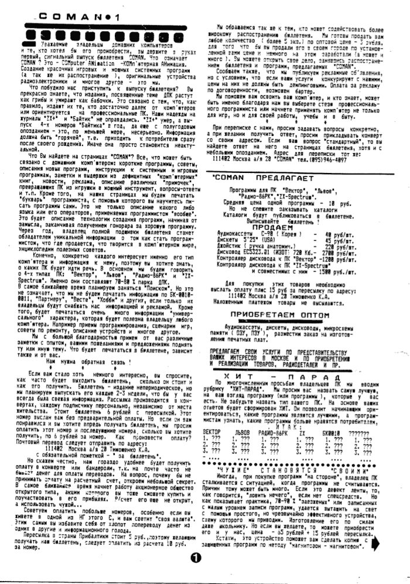

23 выпуска «COMAN-INFO».
Каждый номер лежит в отдельной директории по номеру выпуска: оригинальные страницы в DjVu, расшифровка в README и вырезанные из газеты иллюстрации.
Сканирование и обработка - Виктор Фиронов.

Текст набран со скана; явные опечатки и дефекты печати исправлены, стиль и орфография оригинала (в том числе написание «комп'ютер») сохранены.
Отдельные латинские названия в списках программ читаются в скане неоднозначно.

## Выпуски

- [№1](01) — сигнальный выпуск: программа бюллетеня, прайс-лист и правила заказа, хит-парад, устройство для перезаписи «заезженных» кассет, схема клавиатуры к «MUZIK BOX», инструкция к графическому редактору GRED, начало каталогов ZX-Spectrum (Z1—Z65) и «Радио-86РК» (PK1—PK43), начало цикла о дисководе со схемой блока питания.
- [№2](02) — вексель «COMAN» как защита от инфляции, обзоры CHEESE («Львов») и LIBERATOR («Вектор»), инструкция к музыкальному редактору для «Львова», полная схема контроллера дисковода для «Вектора» и «Львова», цветной вариант «Радио-86РК» (узлы цвета и сопряжения), начало «Букваря программиста», каталог ZX-Spectrum (Z66—Z127).
- [№3](03) — настройка контроллера дисковода с программой первоначальной активизации CP/M, инструкция к графическому редактору «Пикассо» для «Львова», каталоги программ для «Львова» и «Вектора», цены на 1 сентября 1992 г., схема ВЧ-модулятора, «Букварь программиста» (алгоритм и программа «Спортлотто»), первые итоги хит-парада, новый адрес фирмы.
- [№4](04) — новый офис и услуги фирмы, обзор системных программ для «Львова», полная инструкция к графическому редактору «Рембрандт» для «Вектора» с пиктограммами меню, объявление о CP/M для «Львова», сравнение «Вектора», «Львова», «Спектрума» и РК86, «Букварь программиста» (введение в Ассемблер), новая рубрика «Толкучка».
- [№5](05) — CP/M 53 для «Вектора» с текстом магнитофонного загрузчика, отладка и настройка контроллера дисковода, подключение дисковода к «Львову» (распайка «Внеш. 1», загрузчик, переключение ПЗУ), ТЕСТ-программа ОЗУ для «Львова», работа с дисководом в CP/M (DIR, REN, ERA, TYPE, FORMAT, SYSGEN, DIP/PIP) и перенос программ с ленты на диск, статья о пиратстве и защите программ, конкурс на эмблему фирмы.
- [№6](06) — исправления к загрузчикам CP/M, большой прайс-лист с прогнозом цен на дисководы, краткая инструкция к «Монитор+» для «Львова», новая плата контроллера дисковода с расположением деталей и списком ошибок разводки, список утилит CP/M, сравнение «Микродос» и CP/M-53, Бейсик на диске, подключение джойстика к «Вектору», распайки кабелей к принтерам, литература по ZX-Spectrum, каталоги программ для «Вектора» (1-97—1-106) и «Львова» (C76—C107).
- [№7](07) — как правильно оформить заказ в условиях инфляции, джойстик и выносная клавиатура на герконах, схемы подключения «Джойсик-П», «Джойсик-С» и «Джойсик-УСПИД», советы по подключению контроллера дисковода и схема блока питания, сборник №1 для «Вектора», большой каталог программ для «Вектора» (1-107—1-172), доработка КД, константы скорости записи на МЛ для «Львова», схемы защиты по питанию.
- [№8](08) — май 1993, полностью новое оформление бюллетеня: доработка («турбирование») магнитофона со схемой, каталог утилит и дисковых программ CP/M, система заказов EXPRESS, ПЗУ-загрузчики для «Вектора», подключение к ч/б монитору, дисковая база данных WB.COM, редактор SAMARA и «Пикассо» на диске, печать спрайтов на принтере (GPD/GPM), популярный рассказ о том, как устроен дисковод, рейтинг фирм-разработчиков.
- [№9](09) — июнь 1993, схема компаратора для чтения дискет, сравнение IBM и «Вектора», инструкция к архиватору XSID.COM, летние скидки, ремонт разъёмов и контактных площадок («Заморочки»), сборник №1 для «Львова», продолжение «Букваря программиста» с картами памяти «Вектора» и «Львова».
- [№10](10) — июль 1993, переезд фирмы и начало дилерской сети в РФ и СНГ, смена формата записи на «Векторе», супер-ПЗУ, «спрайт на бумаге», прошивка ППЗУ 573РФ2, пиктограммы меню редактора «Рембрандт», таблица знакогенератора «Львова», ремонт клавиш, каталог программ для «Вектора».
- [№11](11) — сентябрь 1993, подписка на иллюстрированный каталог программ, установка ПЗУ 573РФ2 в «Вектор» с ПЗУ 556РТ7А, компьютеры с герконовой клавиатурой в продаже, инструкция «Ассемблер-91», таблицы клавиш для стенографического набора текста, список меток системных переменных в ПЗУ, «Букварь программиста», хит-парад, CP/M-53.
- [№12](12) — октябрь 1993, подключение к телевизорам и мониторам со схемами гашения луча и инвертора цвета, продолжение о супер-ПЗУ, утилиты для CP/M-53, звуковые эффекты на «Львове» со схемой расширителя строба, обзор принтера MC6312, «Букварь программиста», каталоги программ для «Вектора».
- [№13](13) — ноябрь 1993, схема устройства управления, «Букварь программиста», каталог программ для «Вектора», ROM-диск на 64 Кбайта в продаже (пока только для «Вектора»), рассуждение о «мировых ценах».
- [№14](14) — ноябрь 1993, схема ROM-диска на 64 Кб для «Вектора», письма читателей, «Букварь программиста», всякая всячина, план проезда в магазин фирмы, ROM-диск для «Львова», дисковод на 3,5 дюйма, схема подключения джойстика к ёмкостной клавиатуре.
- [№15](15) — декабрь 1993, ROM-диск-программатор и его особенности со схемами переключения программирующих напряжений и коммутации, ROM-system для «Львова» со схемой, курсив на «Львове», музыкальный «Попрыгунчик», возможности TEXTAS, редактор «Рембрандт», дилер в Беларуси, новогодние пожелания.
- [№16](16) — январь 1994, ценовая политика 94 года, телеграфика на «Векторе», фотография на экране (фотоспрайт), супер-обложка для дискет, технология обработки больших спрайтов («джокер»-спрайт), спрайт на принтере, управление принтером из TEXTAS, «Букварь программиста», прайс-лист, головка MC6902, каталог программ для «Вектора».
- [№17](17) — февраль 1994, PROM-SYSTEM - «второе дыхание» «Львова», «Букварь программиста», быстрая очистка экрана на «Львове» (распиновка К155ТМ2), UMник-2, система защиты как в №14, модуль синхронизации, универсальный программатор со схемой переключения, BAD SECTOR.
- [№18](18) — март 1994, снижение цен на ROM-диски, три развенчанных «легенды» о приставке Dendy, друзья по переписке, техника «вечной жизни» в играх и адреса чит-кодов для «Вектора» и «Львова», «Букварь программиста» (умножение и деление), схемы укрепления клавиши и самодельного низковольтного реле, «Вопрос-ответ», особенности TEXTAS-диска, прайс-лист.
- [№19](19) — март 1994, схема блока программирующих напряжений, дешёвые дискеты, «IBM: мы вне игры пока?», PROM-SYSTEM и ROM-диск, помехозащищённость контроллера дисковода, телеграфика на «Векторе», большая статья о световом пере со схемами пера, светового пистолета и сканера, анкета читателей.
- [№20](20) — апрель 1994, итоги анкеты читателей, ПЗУ «Супер+» и расширение ОЗУ до 2 097 152 байт, масштабирование и перезаливка спрайтов, новые игры (AIR FORCE, TANKWAR, «Нашествие»), схема проверки микросхемы К580ВВ55, прайс-лист.
- [№21](21) — май 1994, дополнение к ПЗУ «Супер+», замена лент в игольчатых принтерах, схема подключения ПК к ламповому телевизору УЛПЦТИ, печать из монитора-отладчика, упаковка информации, часы в ПК, ПК как мультиметр, каталог игр для «Львова», подключение принтера ПЗСУ-1, хит-парад программ.
- [№22](22) — июнь 1994, схема источника бесперебойного питания, игровые картриджи, итоги анкеты, «Букварь программиста» (работа с К580ВВ55), дискеты «Изот», услуги по разработке электронных устройств, CP/M против МикроДОС, устройство компьютерной мыши.
- [№23](23) — сентябрь 1994, последний выпуск бюллетеня: хит-парад программ, «Львов ПК01 умер - да здравствует Львов-TURBO» со схемой доработки на Z80B, обзор модемов и их цены, новые игры для «Вектора», ремонт ПК своими силами, принцип действия фотосканера.

См.: [http://lvovpc.cu.cc/article.shtml?id=9](http://lvovpc.cu.cc/article.shtml?id=9)

[http://www.emulator3000.org/rus-vector06c.htm](http://www.emulator3000.org/rus-vector06c.htm)
