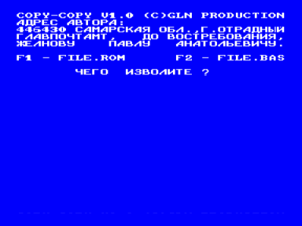
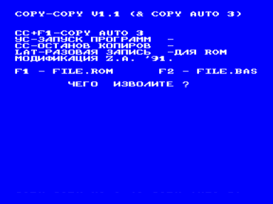

Программа предназначена для копирования файлов как в ROM-формате, так и в BASIC-формате. После запуска программы необходимо выбрать режим работы, то есть с каким форматом работать.

1. FILE.ROM — в этом режиме копирование происходит аналогично копировщику COPY V(2.1), но есть свои некоторые особенности:

COPY-COPY показывает имя загружаемой программы и позволяет изменить его, если держать клавишу CC в момент окончания загрузки.

2. FILE.BAS — в этом режиме есть возможность проверки качества записи BASIC-файлов. Для этого нажмите F5. Справа указывается длина программы в шестнадцатеричном виде.

В режиме копирования вывод — РУС/LAT, выход — УС.

В архиве версии 1.0 и 1.1

Не копирует файлы с защитой «по имени».

