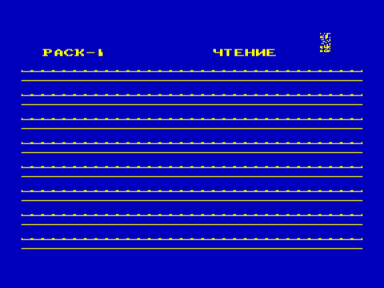
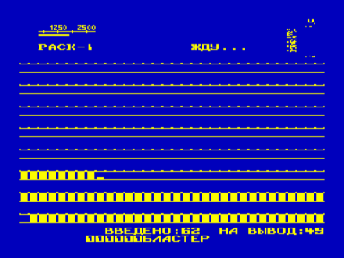

Копировщик-упаковщик (с описанием)

  Программа pack-1 копирует rom-программы с уменьшением их длины, при этом не влияя на работоспособность самих программ. Т.е. программа, упакованная pack-1 будет загружаться и работать также, как и неупакованная. Это не касается различных данных типа chip-2, chip-3, которые программами не являются.

  После запуска упаковщик находится в режиме ввода rom-файла. После ввода проверяется возможность упаковки файла. Если его нельзя упаковать, то в левом нижнем углу выводится сообщение: «нельзя», т.е. далее этот файл будет копироваться без каких-либо изменений. Если же файл упаковывается, то процесс упаковки будет визуально представлен на экране монитора. После упаковки будет выведено количество блоков и сообщение: «жду», которое говорит о готовности упаковщика к выводу файла. В этом режиме можно изменить имя файла, нажав клавишу ВК. Управление курсором — стрелки вправо и влево, изменение символа — стрелки вверх и вниз. Выход из режима изменения имени — клавиша ЗБ. Если нажать одновременно  клавиши ТАБ и ПС, то находящаяся в памяти программа запустится. Если нажать  клавиши УС, СС, РУС/ЛАТ одновременно, то установится режим вывода без дублей (noduble). После нажатия РУС/ЛАТ файл будет выводиться на ленту. Прерывание вывода — клавиша УС.

У программы pack-1 есть особенности, отличающие его от копировщиков:

1. Имя программы выводится в полном знакогенераторе кои-7.

2. Выводится дата.

3. Если при вводе возникает ошибка, то введенная часть программы не сбрасывается, и можно повторить ввод непрочтенного блока, перемотав ленту немного назад.

4. Выводится количество введенных блоков (шестнадцатиричное).

5. Копируются и упаковываются защищенные файлы.

6. При записи файла без дублей не надо удерживать клавишу РУС/ЛАТ.

7. Более удобный режим изменения имени.

