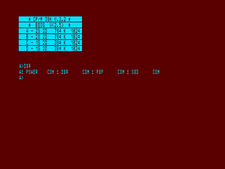

# CPM-39

Орлов С., Ростов-на-Дону, 1991 г.

Один из вариантов операционной системы CP/M для НГМД без квазидиска.
Прилагается загрузочный диск.
Также на диске записаны DIR, POWER, SID, PIP.
Упоминание данной системы можно найти в [Вектор-USER](../vector_user) № 7, стр. 2.

Данная версия операционной системы CPM предназначена для минимальной конфигурации ПЭВМ, содержащей контроллер НГМД и один или два 80-дорожечных НГМД.
Электронный диск не поддерживается и для работы ОС не требуется.
Если электронный диск имеется в составе ПЭВМ, то его содержимое при работе системы не изменяется.
Без каких-либо переключений система поддерживает односторонний и двухсторонний формат, причем возможно использование одностороннего и двухстороннего дисководов одновременно, а также двухстороннего дисковода в одностороннем формате.

Для ознакомления с работой CPM используйте любую доступную литературу по этой ОС или по ОС CCP для ПЭВМ «ROBOTRON 1715», т.к. работа на ПЭВМ «Вектор-06Ц» при использовании CPM не отличается от работы на любой другой зарубежной или отечественной ЭВМ, оснащенной этой ОС.

Версия системы предоставляет пользователю 39 Кб оперативной памяти, что позволяет использовать большинство системных программ, таких как RMAC, MAC, LINK, FORTRAN, B80, MULTIPLAN, SC, DBASE, VED.
Все игровые программы могут быть запущены с гибкого диска при использовании ОС CPM.

Позволяет загрузить с диска и запустить программу длиной до 31,75 Кб (с 100h до 7FFFh).
Программа при работе может использовать максимально 37,25 Кб (от 100h до 95FFh).

С 8000h по 95FFh расположен CCP.
При рестарте (jmp 0) он заново подгружается с диска.
BIOS расположен с адреса 9600h.

Данная версия ОС позволяет пользователю существенно уменьшить затраты на приобретение или изготовление аппаратуры и при этом получить все преимущества работы с накопителем на гибких магнитных дисках.
Отсутствие электронного диска не только экономит деньги пользователя, но и во многих случаях повышает надежность и устойчивость работы ПЭВМ.

## Совместимость

По формату дисков и подпрограммам вывода на дисплей система совместима с Микродос.
Монитор системы имеет стандартную таблицу выводов подпрограмм монитора за исключением подпрограммы ввода байта с магнитной ленты (эта подпрограмма в мониторе отсутствует).
Если необходимо чтение с магнитной ленты, то эта подпрограмма должна быть в программе пользователя.

Для переключения режимов вывода на дисплей (РУС/ЛАТ, инверсный вывод) используйте командную строку, состоящую из требуемой ESC-последовательности и заканчивающуюся клавишей [ВК].
Например, командная строка `[AR2] [\] [ВК]` включит режим вывода прописных латинских и прописных кириллических (русских) букв.

В отличие от Микродос, при работе CPM на системных дорожках диска, как правило, должна быть записана ОС.
Внимание: утилита SYSGEN из Микродос не работает в CPM.
Для создания системной дискеты используйте программу POWER.

Командой `READ 0 1 4000 103` прочитайте в память системные дорожки эталонной дискеты, затем замените диск (новый должен быть форматирован).
Командой `WRITE 0 1 4000 103` запишите на системные дорожки операционную систему.

## Версия CPM-57

Всеми перечисленными преимуществами и дополнительными возможностями обладает версия CPM, поддерживающая электронный диск (CPM-57): 57 Кб в распоряжении пользователя и отсутствие обращений к НГМД при работе с программами на электронном диске.

