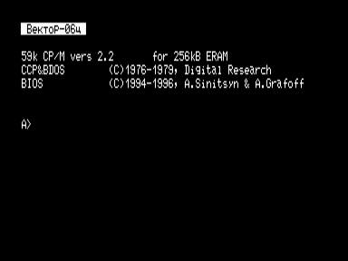

CP/M-59 представляет собой стандартную версию CP/M v2.20 с BIOS адаптированным под ПК «Вектор-06ц».
Для нормальной работы системы требуется Вектор-06ц с контроллером дисковода Coman и расширенной памятью ([ERAM](../eram) от 256 кБ) или квазидиском (256 кБ).

Имеется возможность создания ПЗУ-диска емкостью до  128 кБ.  Диск  подключается к разъему ПУ по стандарту подключения внешнего ПЗУ (порты 5 и 7  —  адрес, 6 — чтение).

