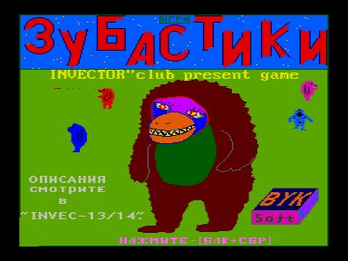
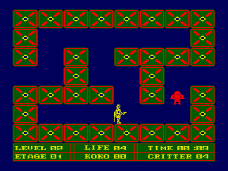

«Все мы нередко подолгу смотрим на звезды в ночное небо и мучаемся догадками о существовании жизни и других цивилизаций в космосе.
А между тем, на далеких бесчисленных планетах существует много разных цивилизаций и видов жизни, находящихся на разных уровнях развития.
Некоторые виды жизни только начинают развиваться (первобытный строй), а есть очень развитые цивилизации, изучающие бесконечные пространства космоса, пронизывающие галактики своими летательными аппаратами.
Среди этих тварей бывают опасные хищники, или не хищники, но опасные, но есть и безопасные.
Как и люди на Земле, все эти существа делятся: на злых, агрессивных и воинственных; или добрых, спокойных и миролюбивых...

И вот однажды, на нашу планету, на окраине маленького городка приземляется космический летательный аппарат, пилотами которого оказываются кровожадные хищники »&#133;

(по материалам InVector №13)

