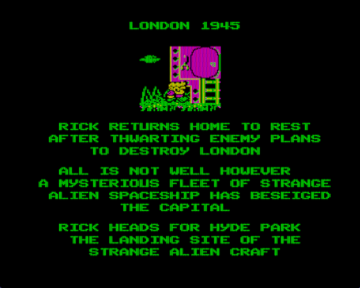
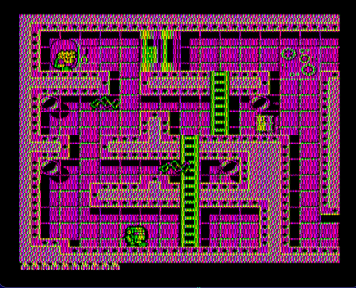

Порт игры Dangerous Rick.

Пока не завершен.

Авторы: Zelya, Dimouse, [ivagor](../../authors/ivagor), [nzeemin](../../authors/nzeemin)

Dangerous Rick - платформенная аркада про отважного Рика, бороздящего инопланетные миры на пути к злодею по имени Fat Guy.
Графика и сюжет были вчистую позаимствованы из Rick Dangerous II (1990, DOS) (версии для CGA), уровни же созданы с чистого листа.

Игра выпущена Zelya и Dimouse в 2015 году для компьютера Львов ПК-01 - см. [https://www.old-games.ru/forum/threads/dangerous-rick-novaja-igra-dlja-pk-01-lvov.64850/](https://www.old-games.ru/forum/threads/dangerous-rick-novaja-igra-dlja-pk-01-lvov.64850/)

Репо с кодом порта под Вектор - [https://github.com/nzeemin/vector06c-dangerick](https://github.com/nzeemin/vector06c-dangerick)

