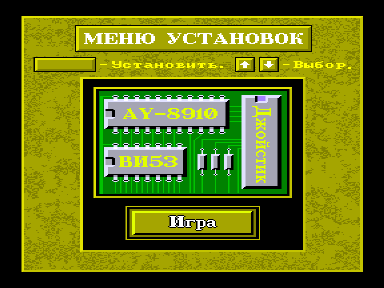
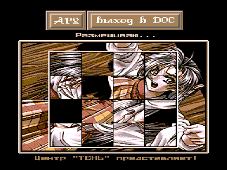

Образец отличной графики.

Из [InVector №20](../../../invector), март 2000 г.:

```
«Поступил вопрос:
— Почему дисковая игра „Порно-пятнашки“ не работает на Векторе с микропроцессором Z-80?
Ответ:
— Потому что авторы применили в программе недокументированные команды КР580ВМ80А (вероятно, для защиты от дизассемблирования). Так, например, загрузите файл BOOT.COM из этой игры в SID и просмотрите его директивой L. Вы встретите несколько кодов $ED. 580-й микропроцессор воспринимает данный код как команду CALL (что и использовал автор), а у Z80 этот код означает совсем иную команду. Вот поэтому данная программа не работает (глючит) на Векторах с неродным процессором».
```

Диск загрузочный.
Для загрузки с диска в эмуляторе http://bashkiria-2m.narod.ru/ удерживая `F1`+`F2`, однократно нажать `F11`.
После загрузки программы нажать `F12`.
Образ квазидиска должен иметь 198 Кб свободной памяти.



