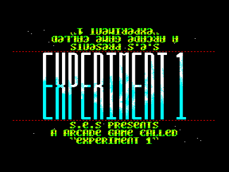
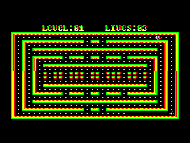

Игра создана специально для участия в [DemosFan ’99](../../1999).
Каракатица бегает по лабиринту и собирает точки, а за каракатицей охотится безжалостная бяка.
Вот что говорит об этой игре сам автор:

«Вся графика нарисована специально для этой игры. Движения персонажей плавные, но не "тормозные". […] Графика цветная.
Gameplay… Мне сложно судить, как автору, однако, замечу, что мне самому играть было интересно, хотя сам я отнес это на счет классных саундтреков.
Концовка […] тоже имеется и довольно нехилая по векторовским меркам.
20 уровней, 4 разных обликов противника, 2 типа призов.
Сюжет присуствует — кто читал "Доннерджека" загрузятся, надеюсь. […]»

(По материалам [Rage](../rage) [DF-99](../../1999))

Есть чит-коды. Если во время игры нажать H (пауза), можно менять цвета клавишей C.
Кроме того, можно ввести код «i-love-infinity!».
Он включает цифровые клавиши во время игры, которые переключают вечную жизнь, переходы на следующий уровень и т.п.

См. также [Chaser](../../../chaser)

