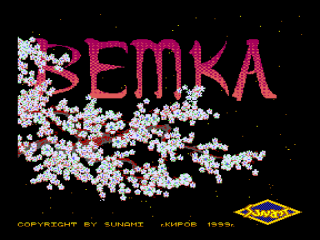
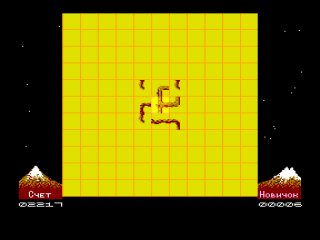

#### Загрузка
- Включите компьютер, загрузите DOS. (Игра также хорошо обходится и без DOS-а.)
- Вставьте дискету с игрой в дисковод А или B.
- Скопируйте все файлы игры на твердый диск, если он имеется!
- Наберите в командной строке "VETKA" и нажмите ENTER.
- Подождите, пока произойдет сканирование всех дисковых драйверов на наличие таблицы рекордов.
- Когда появится начальная заставка, нажмите любую клавишу.
- Если программа не найдет таблицу рекордов, то она предложит вам указать драйвер, куда производить запись таблицы рекордов.

### Игра
#### Принцип игры "Ветка".

Сначала на клеточном поле была живая, вот-вот готовая зацвести ветка неизвестного дерева.
Но когда вы посмотрите на экран, то увидите вовсе не ветку, а просто набор, казалось бы, разрозненных кусочков засохшего дерева, и лишь один кусочек в центре поля - живой.
Но на самом деле каждый фрагмент "разбитой" ветви не сдвинут со своего первоначального места, а лишь повернут внутри своей клетки.
Если повернуть его обратно нужным образом, то он "прирастет" к соседним кусочкам, и в конце концов ветка оживет!

#### Уровни сложности.
Уровень сложности игры определяется площадью игрового поля, занимаемого веткой:

- Новичок - 3x3 клетки,
- Стажер - 5x5,
- Профи  - 7x7,
- Мастер - 9x9,
- Эксперт - 11x11 клеток (полное игровое поле),
- ТОРеро - 11x11.

Для тех, кто считает, что уже перерос уровень Эксперт, ВЕТКА предлагает супер-уровень ТОРеро, чтобы доказать это на практике (не пытайтесь играть ТОРеро до тех пор, пока не станете настоящим Экспертом!).
Как и Эксперт, ТОРеро играется на поле 11x11 клеток, но его противоположные края как бы "склеены" между собой - то есть поле становится безграничным (математики сказали бы, что поле стало тором - отсюда и название уровня).

#### Управление.
Управление игрой осуществляется с помощью клавиатуры. В В игре имеется два типа управляемых объектов:
- игровые объекты - квадратики с фрагментами ветки;
- клавиши, нарисованные под игровым полем.

Для выбора объекта  поместите  на  него курсор-указатель  с помощью клавиш направления:
- для игровых объектов: "Вверх", "Вниз", "Вправо", "Влево".
- для экранных клавиш: "Вверх", "Вниз", "Вправо", "Влево".

Поворот игровых объектов во время игры осуществляется клавишами:
- "1"-против часовой;
- "2"-по часовой;

или установленными вами клавишами управления. Если вы по каким-либо причинам не смогли собрать ветку, то нажмите клавишу "ESC", после чего вам предложат сдаться.

#### Подсчёт очков
Ваши успехи в процессе оживления ветки фиксируются во время игры и в случае, если результат вошел в десятку лучших, записываются в таблицу рекордов.
Чем меньше времени вы затратите на оживление ветки и чем меньшее количество лишних (ненужных) поворотов совершите - тем большее количество очков получите.

Заметим, что таблицы рекордов для всех уровней разные.

Вы можете определить свой уровень (кто Вы - Новичок или Эксперт, а может быть ... ТОРеро?) очень просто. Начните упражняться на самом низком уровне (Новичок), затем последовательно увеличивайте его и запоминайте свои результаты: Ваш уровень тот, на котором Вы набираете максимальное количество очков. Надеемся, что Вы недолго пробудете Новичком!

Второе место в Game compo на [DemosFan ’99](../../1999)

Диск загрузочный.

Для загрузки с диска в эмуляторе http://bashkiria-2m.narod.ru/ удерживая F1+F2, однократно нажать F11.

После загрузки программы нажать F12.

Программа работает с дисководами A, B, или с винчестером без использования ДОС.

