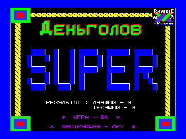
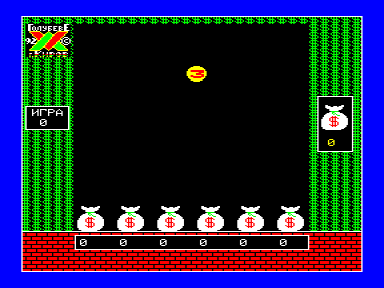

Вам предлагается логически-динамическая игра!
Ваша задача — направляя падающие монеты в мешки, набирать в каждом по 17 долларов.

Три варианта игры: «Деньголов-17», «Деньголов-Супер» и «Деньголов-Супер» с рекламой.

