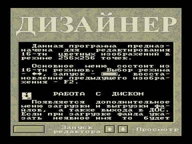
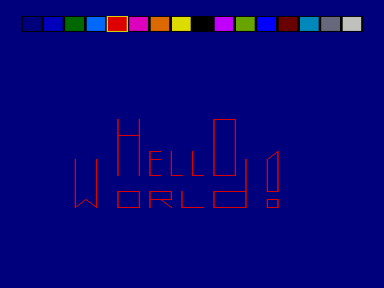

DESIGNER.COM - собственно, сам графический редактор.

VTXT256.COM - утилита для отображения текстового файла знакогенератором ZG4 в режиме 256x256 точек и выгрузки экранной области в формате SPR.

VTXT512.COM - утилита для отображения текстового файла знакогенератором ZG4 в режиме 512x256 точек и выгрузки экранной области в формате SPR.

PEREDIR5.COM - утилита для передирания графики из чужих программ.

GRFTOSPR.COM - утилита для преобразования GRF-файла в SPR-файл.

SCRTOSPR.COM - утилита для преобразования SCR-файла в SPR-файл.

RBR->SPR.COM - утилита для преобразования RBR-файла в SPR-файл.

DEMO-SPR.COM - утилита для просмотра группы SPR-файлов.

ZGEDITOR.COM - редактор знакогенераторов типа ZG1, ZG2, ZG3.

*.ZG1 - набор знакогенераторов.

*.ZG4 - набор знакогенераторов.

