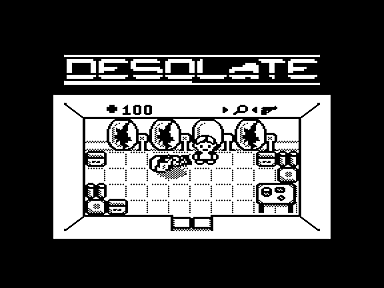
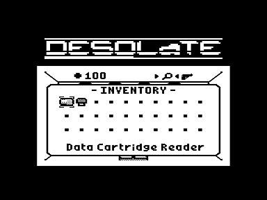

Жанр - top-down Adventure/RPG в научно-фантастическом сеттинге.

Автор оригинала - Patrick Prendergast (tr1p1ea).

Оригинальная игра написана для научных калькуляторов TI-83/TI-84 - процессор Z80, экран 94 x 64 пикселя, 4 градации яркости.

Видео оригинальной игры: [https://youtu.be/5UHqPMxeZnY](https://youtu.be/5UHqPMxeZnY)

Маппинг клавиш Вектора:

- Движение в четырёх направлениях - стрелки
- Look/shoot - УС, Пробел
- Переключатель Look/Shoot - ТАБ, РУС/ЛАТ
- Инвентарь - I, M
- Закрыть диалог (Escape) - АР2, ЗБ, ПС
- Выход в меню - P, R

Страница проекта:

[https://github.com/nzeemin/vector06c-desolate](https://github.com/nzeemin/vector06c-desolate)

