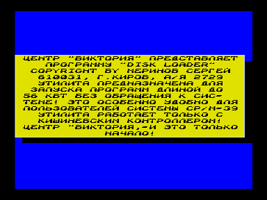
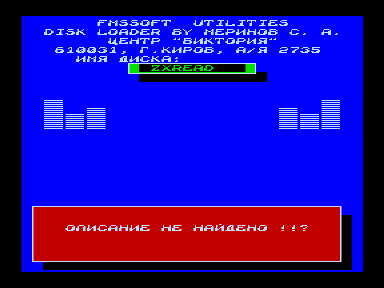

# DISK LOADER

Центр «ВИКТОРИЯ» представляет.

Автор: Меринов Сергей (FMSSOFT), 610031, г. Киров, а/я 2729.

Дисковая утилита «DISKLOAD» предназначена для быстрого запуска COM-программ без обращения к дисковым процедурам системы, что позволяет эффективно ее использовать вне системной среды, например, записав на системные дорожки игровой дискеты.
Помимо этого, программа обладает некоторыми полезными функциями, она красочно оформлена, сопровождена звуковым сопровождением в виде стереомузона под именем «MASKI».





## Работа с программой

После запуска программы появляется рекламная менюшка, высвечивание которой можно предотвратить нажатием клавиши «РУС/ЛАТ».
При последующих перезапусках рекламная менюшка не проявляется.

При нажатии клавиши «УС» появляется менюшка, с помощью которой можно сменить дисковод.

DISK LOADER поддерживает программу LABEL.COM (Spase Corp.), т.е. выдает на экран имя диска.
Вы можете давать своим дискетам имена, что позволит Вам лучше ориентироваться в них.

В менюшке каталога диска не помещается более 15 файлов.
Если на диске их больше, то добраться до них можно, используя клавиши курсора «влево» и «вправо» (постраничное листание) или, смещая файлы вниз (вверх), дойдя курсором до нижнего (верхнего) края менюшки.

В меню выводятся только COM-файлы.

## Файл-описание DISKLOAD.FMS

Для удобства в программе предназначена загрузка файла-описания с именем «DISKLOAD.FMS».
Он представляет собой набранные Вами в текстовом виде коротенькие описания программ, находящихся на диске.
Описания высвечиваются в нижней менюшке.

Формат описания прост.
Сначала идет имя файла в таком же написании, как и в каталоге, ни больше, ни меньше, без расширения.
Затем Вы нажимаете «ВК» и, начиная с новой строчки, набираете текстовое сообщение к этому файлу.
Оно должно быть не больше 28 символов в строку и 6 строк.
Затем идет код окончания сообщения - «$».
Например:

```
DISKLOAD
Дисковая утилита. Предназна-
чена  для  быстрого  запуска
COM-программ  без обращения
к дисковым процедурам систе-
мы.
$
```

Если Вы поставите в описании после имени файла точку, а затем запишите какое-то другое имя этого файла, которое Вам приятнее видеть, то оно и высветится в менюшке каталога диска.
Например:

```
DISKLOAD.ЗАГРУЗЧИК
Дисковая утилита. Предназна-
чена  для  быстрого  запуска
COM-программ  без обращения
к дисковым процедурам систе-
мы.
$
```

Если перед загрузкой файла-описания нажата клавиша «СС», то его загрузка не произойдет, ровно как и если он будет больше 24 кбт.

В программе не существует «защиты от дурака», поэтому, во избежание зависания программы не рекомендуется менять формат формирования файла-описания.

Еще один пример файла-описания посмотрите в прилагаемом файле «DISKLOAD.FMS».

Меринов Сергей (FMSSOFT), г. Киров, 07.08.1995 г.

## Благодарности

Большое спасибо Виктору Саттарову за мудрые советы и ценные указания при разработке DISK LOADER.
(Его идея, моя разработка.)
Большое спасибо Шашкову В.А. (Spase Corp.) за программу LABEL.COM.

Если Вы, уважаемые пользователи моей программы DISKLOAD.COM, найдете какие-либо ошибки в ней или у Вас появятся претензии, пишите мне по адресу: 610031, г. Киров, а/я 2729, Меринову Сергею.
