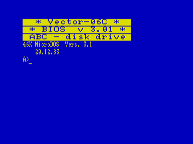

Поддерживает работу с дисками A,B (дисководы), C (квазидиск).

DOS201 — это модернизированная DOS v3.01

Отличия таковы :

1. Заменен знакогенератор. Приведен к более стандартному типу (коды некоторых русских букв и квазиграфики).
2. При наборе текстов коды знаков препинания вводятся без старшего бита независимо от регистра. Текст в результате  в любом редакторе не будет замусорен квазиграфикой,  то же — при печати на принтере.
3. Самая оптимальная работа с регистрами. Переключение на рус/лат набор осуществляется простым нажатием на РУС/ЛАТ.  То же — для клавиши СС. Если СС (РУС/ЛАТ) была нажата без любой другой клавиши, включается другой регистр (алфавит). Например, Вы работаете в нижнем регистре. Нужно набрать слово заглавными буквами. Нажмите и опустите СС. Теперь все символы будут вводиться заглавными. Другой пример.  Вы пишите строчными буквами русский текст. Нужно ввести длинное слово заглавными латинскими. Нажмите сразу СС и РУС/ЛАТ и отпустите. Результат — переход  на другой регистр (заглавный) и в другой алфавит. Следующее нажатие вернет обратно.
4. УС+1 включает клавиатуру QWERTY.  УС+0 — советская клавиатура (JCUKEN).

А «изюминка» (даже две) DOS201 в том, что она поддерживает часы реального времени  и умеет гасить экран, если определенное время никто не трогает клавиатуру (щадящий режим для монитора/телевизора).

В архиве исполняемый файл ОС, а также загрузочные системные образы дисков в форматах EDD и FDD.

