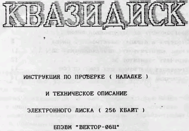

Квазидиск. Инструкция по проверке и наладке, техническое описание электронного диска (256 Кб) БПЭВМ «Вектор-06Ц».

См. так же [Электронный диск (Руководство по настройке)](../invoservis), [Инструкция по подключению квазидиска и контроллера дисковода](../unknown) и [Квазидиск (Омск)](../omsk)

