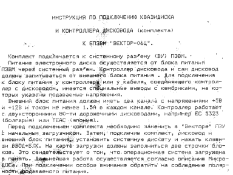

Инструкция по подключению квазидиска и контроллера дисковода (комплекта) к БПЭВМ «Вектор-06Ц».

См. так же [Электронный диск (Руководство по настройке)](../invoservis), [Квазидиск (Кишинев)](../kishinev) и [Квазидиск (Омск)](../omsk)

