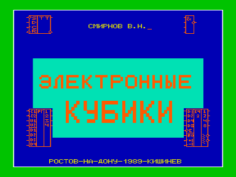
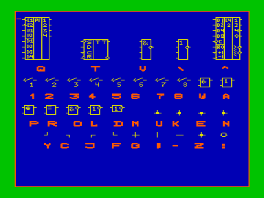
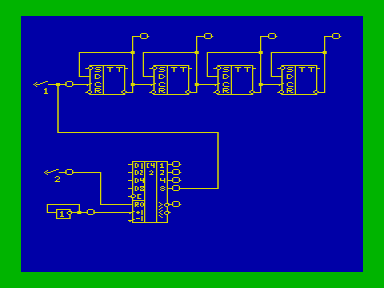
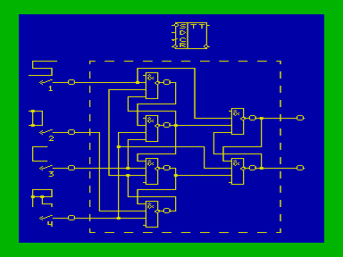
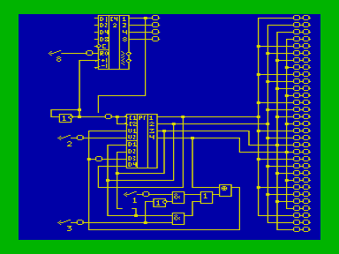
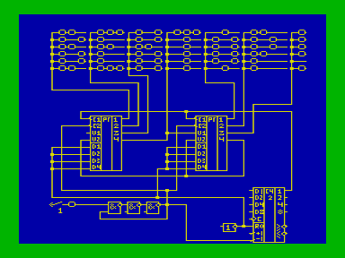

Программа «Электронные кубики» предназначена для приобретения навыков построения устройств на базе цифровых микросхем и моделирования их работы.

В архиве описание и примеры схем в формате WAV.

## Описание

Для построения схем в программе «зашита» библиотека различных элементов, которые вызываются на экран путем нажатия соответствующих клавиш компьютера.
Перемещение элементов в требуемое место экрана производится клавишами: вверх, вниз, влево, вправо.
Установка - клавишей «ВК».

Кроме десяти типов микросхем, в библиотеку входят элементы соединительных шин, позволяющие нарисовать все соединения в задуманном Вами устройстве.
Для моделирования работы схемы предусмотрены восемь пронумерованных ключей, которые подключаются к входам проектируемых устройств.
Для индикации состояния шин моделируемой схемы (соответствие логической единице или логическому нулю) служит «светодиод», вызываемый на экран клавишей «:» и устанавливаемый на те шины, работа которых Вас интересует.

Режим моделирования включается в программе клавишей «F2».
Исследование работы устройства происходит путем «подачи сигнала» на входы схемы через установленные Вами ключи (подаче сигнала с уровнем логической единицы соответствует однократное нажатие клавиши с номером ключа, подаче логического нуля - повторное нажатие).
Состояние интересующих Вас шин отслеживается по «свечению» или отсутствию «свечения» индикаторов, установленных на этих шинах.

Программа обеспечивает вывод составленной схемы на принтер - клавиша «ПС», запись на магнитофон - клавиши «F3» и «F4», чтение с магнитофона - клавиша «F1».
Кроме того имеется 10 различных экранов, в каждый из которых можно записать свою схему.

## Схемы

