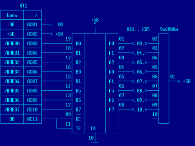

EPOS (от англ. Extension Plugs Of System bus - т.е. дополнительные разъемы системной шины) — это специальная плата, которая позволяет подключить к разъему «ВУ» «Вектора» одновременно до пяти дополнительных устройств (ЭД, контроллер НГМД, часы,  Sound Tracker, ...).
Размеры платы 115x150 мм. EPOS имеет возможность подключения к «Вектору» непосредственно через разъем «ВУ» или с помощью гибкого многожильного кабеля.
Это позволяет поместить все дополни тельные устройства в отдельном корпусе, а наличие разъемов под каждое устройство позволяет легко их ремонтировать и варьировать конфигурацию ПК.

В архиве также представлен скан печатной платы.

