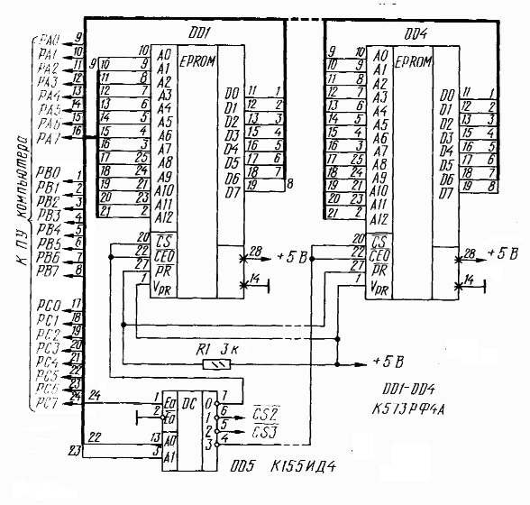
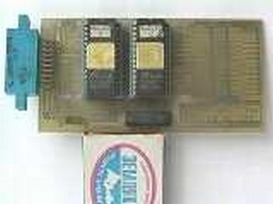

Оригинальная схема МППЗУ неизвестна. Этот совместимый вариант переделан из схемы ROM-диска для ПК «Радио-86РК» (журнал «Радио» №10-1991) по процедуре загрузки, опубликованной в Вектор-USER №12, с.2.

МППЗУ совместим с начальными загрузчиками.

На фотографии изображен оригинальный кишиневский МППЗУ (из архива Виктора Фиронова)

См. также [Внешнее ПЗУ (Описание, схема)](../)

