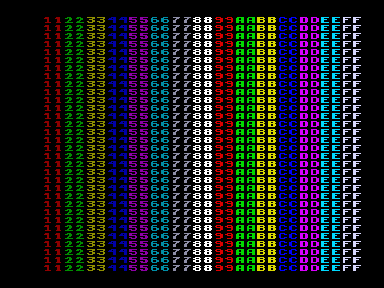

Версия 2.1: совместима с оригинальной схемой Вектора-06ц и с доработанной версией.

Нижеследующий коментарий имеет отношение только к старой версии и сохранен для истории.

От автора: — «Составил табличку с указанием, в какие моменты палитра на моем векторе не программируется.
В качестве примера использования сделал быстрый вариант полного программирования палитры (каждый цвет программируется одним out 0C), более чем в 2 раза быстрее, чем традиционные варианты.
Тест, использовавшийся при составлении таблички, не прилагаю, т.к. он "недостаточно интерактивный", а подробно описывать как им пользоваться и что там нужно менять для разных участков экрана мне сейчас лень.
Не исключено, что доработка синхры повлияла на расстановку "участков непрограммируемости".
К сожалению, тест я сделал уже после доработки».

