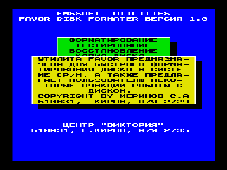
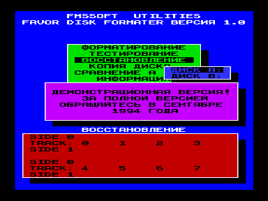

# Дисковая утилита FAVOR

Описание дисковой утилиты FAVOR1V0.COM.

Автор: Меринов Сергей (FMSSOFT), 610031, г.Киров, а/я 2729.

Рецензенты: Зорин Алексей, Виктор Саттаров, Таланов Михаил.

Программа FAVOR1V0 предназначена для быстрого форматирования дисков в системе CP/M, а также предлагает пользователю некоторые функции работы с диском.

## 1. Форматирование

После выбора функции открывается окно, в котором необходимо выбрать диск для проведения операции.
После выбора диска открывается окно, в котором необходимо выбрать режим форматирования, т.е. при выборе пункта "с проверкой" после форматирования дорожки происходит проверка записанной информации.
При выборе другого пункта проверки не происходит, т.е. Вы можете "отформатировать" чистящую дискету.
Если Вы на 100 процентов уверены в своей дискете, т.е. что она отформатируется без единой ошибки, форматируйте пунктом "без проверки".
По моим наблюдениям, абсолютное большинство хороших дискет форматируются сразу без ошибок.
Время форматирования дискет в режиме "без проверки" - 65 сек., в режиме "с проверкой" - 93 сек.
Происходит проверка на защиту диска от записи.
При форматировании диска на экран выводится информация о производимой операции (F - форматирование, Т - тестирование), причем номер форматируемой дорожки и стороны можно определить из рисунка на экране, например:

```
side 0 ■■■■■■■■■■■■■■■■■■■■■■f
Track  0         1         2         3
side 1 ■■■■■■■■■■■■■■■■■■■■■■
```

Означает, что форматируется 0 сторона 22 дорожки, правда индикации букв f, t кратковременна.
При безуспешном форматировании запорченных дорожек (повтор осуществляется 2 раза) в соответствующем месте на рисунке появляется значок "Е".
После окончания форматирования для выхода в предыдущее окно требуется нажатие клавиши "пробел"!

## 2. Тестирование

Проверка диска на чтение.
После выбора этой функции открывается новое окно, в котором необходимо выбрать режим тестирования - в режиме "неполный тест" тестируется только первый сектор дорожки, в режиме "полный тест" происходит проверка всех 5 секторов дорожки.
Разделение функции тестирования на два режима основано только на скорости.
Один сектор читается конечно же быстрее, чем 5, и, по моим наблюдениям, у большинства дискет вероятность быть запорченным у первого сектора больше, чем у оставшихся секторов, но бывают и исключения.
Выводимая на экран информация аналогична выводимой при форматировании диска.
Тестируются дорожки от 0 до 79.
Время проверки нормального диска в режиме неполного теста около 30 секунд, в режиме полного теста около 65 секунд.
Ведется проверка на диски TR-DOS и MS-DOS!
В случае безуспешного чтения дорожки в течении 3 раз, на рисунке, в соответствующем месте, появляется бува "Е", т.е. запорченная дорожка.

## 3. Восстановление

Восстановление происходит после выбора одного из двух режимов восстановления.
Режим "испорч. сектора" позволяет восстанавливать только испорченные сектора (т.е. сектора с неправильной контрольной суммой), в то время как режим "все сектора" восстанавливает все сектора.
Данная функция относится к классу дисковых докторов.
Также она помогает при плохом считывании диска, либо если дискета была записана на дисководе, юстировка головок которого несколько отлична от юстировки головок Вашего дисковода.

Восстановление происходит по схеме: сначала дорожка считывается (R), затем форматируется (F), после чего информация на дорожке восстанавливается (W) и происходит проверка (Т).
В случае безуспешного чтения дорожки в течении 3 раз открывается дополнительное меню, где Вам предоставляется возможность выбрать последующие действия программы.
Программа может попытаться считать еще 3 раза (Повторить), прервать выполнение операции (Выход), бросить текущую дорожку и перейти к следующей (След. трек) (при этом данная дорожка на экране отметится буквой "Е"), проигнорировать ошибку и продолжить выполнение дальше (След. сектор).
Время восстановления нормального диска около 2.5 минут.

## 4. Копия диска

Происходит потрековое копирование диска с A на B или наоборот.
Соответствующие дисководы задаются в меню дисков выбором позиции либо A --> B, либо B --> A.
После этого выбора в следующем окне необходимо выбрать один из двух режимов - с форматированием дорожек принимающего диска, либо без форматирования (когда принимающий диск заранее отформатирован), затем открывается еще одно окно, в котором Вам нужно выбрать один из двух пунктов - с проверкой, т.е. после записи информации с передающего диска на принимающий проверяется правильность записи, либо без проверки, когда этого не делается.
Схема копирования такая - сначала читается дорожка с передающего диска (R), затем все операции происходят с принимающим диском - форматирование дорожки (если Вы выбрали этот режим), затем запись, потом проверка записи (если Вы выбрали этот режим).
Индикация процессов такая же, как и в восстановлении.

## 5. Сравнение

Побайтовое сравнение дорожек дисков A и B.
В случае несовпадения печатается буква "Е".

## 6. Информация

Проявляется окно с информацией о функциях программы и об авторе.

## 7. Выход в систему

Происходит выход в систему.
Причем также выйти можно, нажав клавишу АР2.

## Общие элементы управления

Некоторые функции оформления проявляются во всех пунктах, и сейчас я расскажу о них:

- Существует выход из всех окон в предыдущие окна по нажатии клавиши АР2, причем, если Вы находитесь в главном меню происходит выход в систему.
- При выполнении любых функций, например форматирование, тестирование и др., нажав клавишу "пробел" Вы можете прервать выполняемую операцию и выйти в предыдущее меню, из которого можно добраться и до основного окна.

Меринов Сергей (FMSSOFT), г.Киров, 26.07.1994 г.

## P.S.

Официальным распространителем программы FAVOR1V0.COM является центр "ВИКТОРИЯ", а не центр "БАЙТ" и Луппов Г.Б.!
С заявками на приобретение этой программы обращайтесь в середине сентября 1994 года по адресу: 610031, г.Киров, а/я 2735, Центр "ВИКТОРИЯ".

Демонстрационная программа уже выпущена.
В ней в качестве демонстрации реализована только функция неполного тестирования диска.
За демонстрашкой обращайтесь прямо сейчас!!!
Мы запишем ее Вам бесплатно!
Для тех, кто приобретет FAVOR1V0.COM, к нему будет бесплатно прилагаться ассемблерный текст этой утилиты.

Большое спасибо Виктору Саттарову за данную им информацию о некоторых вопросах работы с диском.
Большое спасибо Шашкову В.А. (Spase Corp.) за программу DC.COM, из которой я понял некоторые моменты работы с дисководом, и Луппову Г.Б. за программу FORMATM.COM, из которой я взял подпрограммы чтения секторов и записи информации на диск.

Если Вы, уважаемые пользователи моей прогрммы FAVOR1V0.COM, найдете какие-либо ошибки в ней или у Вас появятся претензии, смело пишите мне по адресу: 610031, г.Киров, а/я 2729, Меринову Сергею.

## Примечание

В архиве представлена демонстрационная версия.
Полнофункциональный вариант в розыске.




