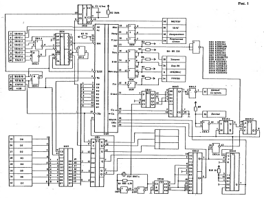

Публикации из журнала «Радиолюбитель»:

М. Чеботарев, «Усовершенствованная схема контроллера дисковода для ПК &#132;Вектор&#147;» (№11, 1992, с.9)

В. Кузьмин, «Возвращаясь к напечатанному: -//- » (№2, 1996, с.7)

