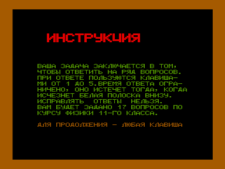
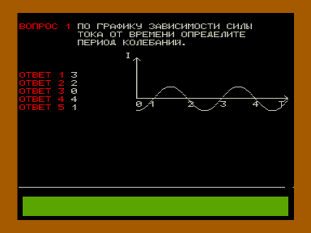

Сборник учебных программ по физике на языке Бейсик.

Для запуска в эмуляторе "Башкирия-2М":

1. Удерживая F3, нажать F11
2. Произойдет загрузка Бейсик 2.5
3. Нажать F12
4. Набрать команду CLOAD""
5. Выбрать в дилоговом окне файл с расширением ".cas"
6. После загрузки выполнить команду RUN

