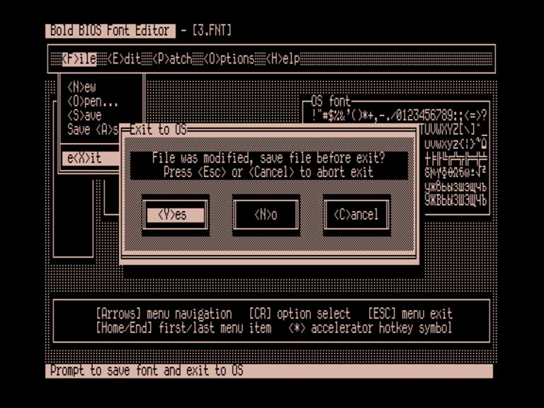
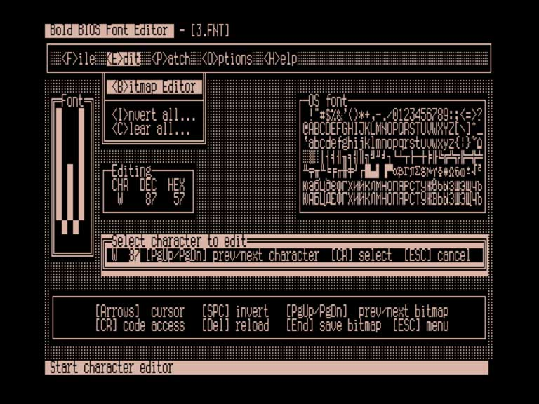

Pseudographic window I/O system version 5.0 for CP/M (source code and library for SuperSoft C 1.2.3 compiler)

Bold BIOS Font Editor version 1.2 for Vector-06c running MicroDOS with Bold BIOS (source code and executable)

Дополнительная информация: [https://zx-pk.ru/threads/35208-okna-i-ramy.html](https://zx-pk.ru/threads/35208-okna-i-ramy.html)

