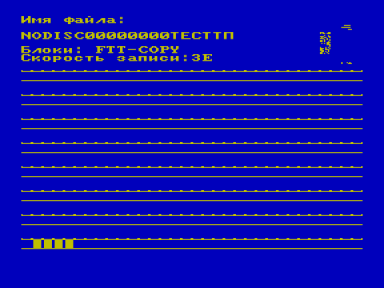
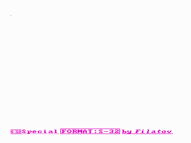

Программа выгружает файлы на МЛ в спецформате (автор назвал его «S-32») с автозапуском.
Загрузчик, предваряющий программу, универсален и, поэтому, тип ПЗУ вашего ПК не влияет на ход загрузки.
Загрузчик верифицирует загружаемую программу!
Поэтому полностью полагайтесь на ваш магнитофон.

Управляющие клавиши:

ВК — Запись на ленту

&larr;/&rarr; — изменение скорости

ТАБ — перезапуск

Примечание:

Спецформат S-32 поддерживается базовым начальным загрузчиком (512 байт).

Вопреки уверениям автора, большинство новых загрузчиков не поддерживают этот формат.

На втором скриншоте показан пример загрузки программы в формате S-32.

FTT-Copy использует метод ROM-автозапуска, упоминаемый в [Справочное руководство по компьютеру «Вектор-06Ц» (Черезов)](../cherezov).

См. также [TURBO-COPY](../turbo)

