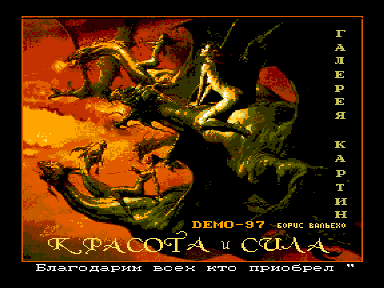
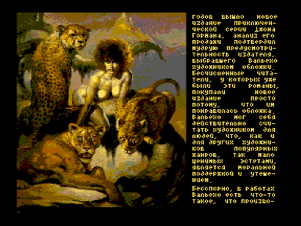

Эта демонстрационная программа познакомит вас с выдающимся художником Б.Вальехо, картины которго вы наверяка видели ранее, но ничего о нем не знали.
Благодаря ПК «Вектор-06Ц» вы посетите галерею картин и сможете прочесть рассказ об авторе и о том как создавались эти шедевры.

Управление:

СС — просмотр

РУС/ЛАТ — выход в ДОС

УС — ускоренный вывод текста (в бегущей строке)

Диск загрузочный.

