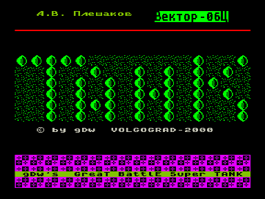
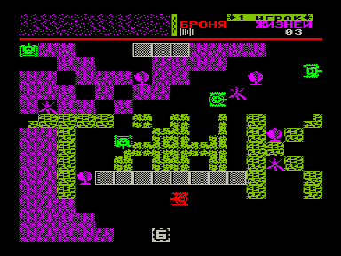

Дисковая игра в танчики.
В архиве диск МикроДОС с автозагрузкой.
После запуска набрать `GT` и ответить на вопрос `Y`.
Игра работает с квазидиском - там она хранит карты уровней.

На диске также есть редактор уровней, программа для создания спрайтов и исходники.

## Содержимое диска

| Файл | Описание |
| --- | --- |
| `gt.com` | G-Tank. Исходный код - в `gt.asm` и подключаемых `.lib`-файлах. |
| `gte.com` | Редактор уровней для G-Tank. Описание в `gte.doc`. |
| `sise.com` | Программа для создания спрайтов. С её помощью создана вся графика G-Tank. |
| `apdig.com` | AP-Digger! Представлен также отдельно: [Digger](../apdig). |

