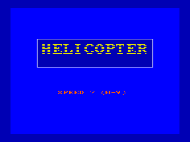
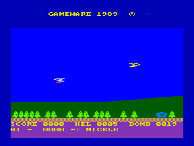

Клавиши управления:

1. ПРОБЕЛ - сброс бомбы (причем - сели Вы попали в цель - то запас бомб не уменьшается).

2. ТАБ - стрельба из пулемета (попадание во вражеский вертолет заставляет его снижаться. Он теряет на небольшой промежуток времени управление - а если он находится близко от земли, то разбивается).

3. АР2 - остановка игры (повторное нажатие продолжает игру).

4. F4 - конец игры - выход на заставку (перезапускать игру нажатием клавиш БЛК+СБР не рекомендуется, т.к. она "зависает").

5. "СТРЕЛКА ВЛЕВО-ВВЕРХ" - уменьшает скорость полета (при нажатии несколько раз до нужного минимума).

6. СТР - увеличивает скорость полета (при нажатии несколько раз до нужного максимума).

7. Вертолет управляется клавишами курсора, причем нажатие на эти клавиши вызывает движение вертолета в соответствующую сторону, остановить которое может однократное нажатие клавиши с противоположным направлением.

ТМК SOFT, г.Киров-1991, [Байт](../byte) №8, 1992

