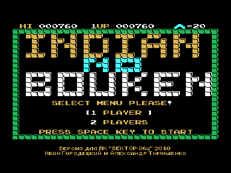
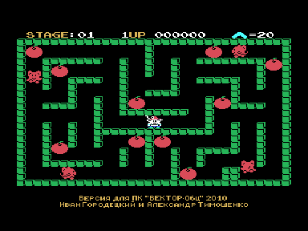

Игра Indian no Bouken является адаптацией c MSX.

Звук выводится через Sound Tracker и R-Sound 2.

Чтобы при движении главного героя был звук в эмуляторе Virtual Vector нужно использовать версию 6.16 или старше.

Управление в игре:

Клавиши курсора - перемещение;

Пробел - метнуть бумеранг.

Авторы адаптации:
Версия для Вектора-06ц - Иван Городецкий, г. Уфа, Россия, retrocomp@yandex.ru, retrocomp.narod.ru
Рекомпиляция игры с z80 на КР580 - Александр Тимошенко, г. Чернигов, Украина, timsoft@mail.ru, vector06c.narod.ru

v 1.0 - 27.04.2010

Первоначальная версия для Z80

v 1.1 - 28.04.2010

Версия для стандартного вектора с КР580ВМ80

v 1.2 - 30.04.2010

Исправлена ошибка в звуковой процедуре (была в оригинале, обнаружил Дмитрий Целиков) иногда проявлявшаяся в виде щелчков.

