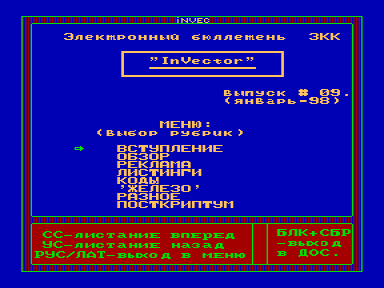
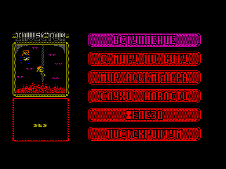

Электронный бюллетень «Заочного компьютерного клуба» [В.П. Быкова](../../authors/byk).
Самое постоянное электронное издание, пережившее 29 выпусков.
Были номера, выпущенные в сотрудничестве с [S.E.S.](../../authors/ses)

Последний, 29-й, номер вышел в июле 2001 года.

