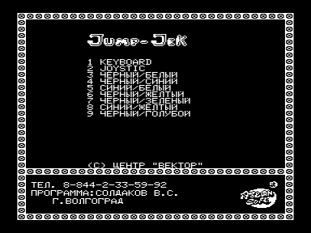
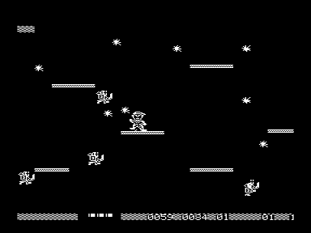

Некто, вероятно Jack, скачет по экрану, пытаясь собрать нечто, похожее на звездочки, за что ему, как ни странно, начисляют очки.
Jack не скучает в одиночестве, толпы железных рыцарей-недомерков с мечами бродят вокруг и пытаются войти с ним в контакт, но история их отношених коротка и печальна - при столкновении они взаимно аннигилируются, поэтому их лучше попытаться аннигилировать в одностороннем порядке, выстрелив звездочкой.
Для разнообразия рыцари периодически превращаются в летучих мышей (рыцари-вампиры?).
Сделав что-то выдающееся, вероятно собрав все звездочки на экране или уничтожив все живое вокруг, в общем совершив подвиг, Jack немного приоткрывает картинку.
Что же там изображено?

