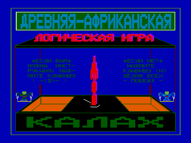
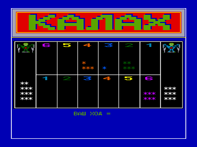

Игра "КАЛАХ" со стандартной базовой кассеты

ПРАВИЛА ИГРЫ.

ИГРОВОЕ ПОЛЕ ПРЕДСТАЛЯЕТ СОБОЙ ДВА РЯДA МАЛЫХ ЛУНОК И ДВЕ БОЛЬШИЕ ЛУНКИ-КАЛАХИ.
ВАШ КАЛАХ-СПРАВА ОT ВАС, КАЛАХ ЭВМ(СОПЕРНИКА) СЛЕВА.
ВНАЧАЛЕ ИГРЫ В КАЖДУЮ МАЛУЮ ЛУНKУ ЭВМ ПОМЕЩАЕТ НЕКОТОРОЕ КОЛИЧЕСТВО КАМНЕЙ.
ХОД ЗАКЛЮЧАЕТСЯ В ТОМ, ЧТО ИГРОК ЗАБИРАЕТ ВСЕ КАМНИ ИЗ ВЫБРАННОЙ ИМ МАЛОЙ ЛУНКИ НА СВОЕЙ СТОРОНЕ И РАСКЛАДЫВАЕТ ИХ ПО ОДНОМУ, ДВИГАЯСЬ ПРОТИВ ЧАСОВОЙ СТРЕЛКИ.
ЕСЛИ ПОСЛЕДНИЙ КАМЕНЬ ПОПАЛ В КАЛАХ, ДАЕТСЯ ПОВТОРНЫЙ ХОД.
ЕСЛИ ПОСЛЕДНИЙ КАМЕНЬ ПОПАЛ В ПУСТУЮ ЛУНКУ, ТО ВСЕ КАМНИ НАПРОТИВ БЕРУТСЯ В ПЛЕН И ПОМЕЩАЮТСЯ В КАЛАХ ИГРОКА, СДЕЛАВШЕГО ЭТОТ ХОД.
ВЫИГРЫВАЕТ ТОТ В КАЛАХЕ КОТОРОГО, В КОНЦЕ ИГРЫ, БУДЕТ БОЛЬШЕ КАМНЕЙ.

KALAH1 - оригинальная версия

KALAH2 - модифицированная версия, добавлена инициализация видео и звука

*.CAS - кассетный файл

*.BAS - дисковый файл

*.LST - листинг

Для запуска в эмуляторе "Башкирия-2М":

1. Удерживая F3, нажать F11

2. Произойдет загрузка Бейсик 2.5

3. Нажать F12

4. Набрать команду CLOAD""

5. Выбрать в дилоговом окне файл kalah2.cas

6. После загрузки запустить выполнить команду RUN

