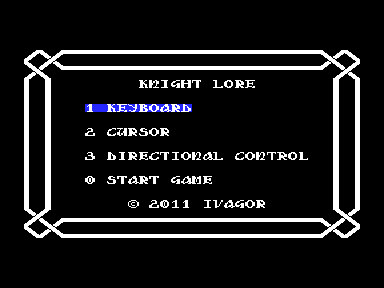
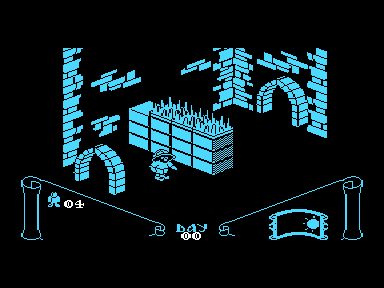

Игра Knight Lore является адаптацией c MSX.
Версия для MSX была сделана фирмой JALECO в 1985 году.

Работает только на векторе c z80 (особенности какого-либо конкретного адаптера не используются, поэтому должно пойти на любом).

На данный момент эту возможность поддерживает эмулятор Дмитрия Целикова, который можно найти на сайте [http://bashkiria-2m.narod.ru](http://bashkiria-2m.narod.ru)

Звук выводится через Sound Tracker или R-Sound 2.

Для работы требуется квазидиск любой модели. При работе игры задействуются адреса 0A000h-0DFFFh нулевой области квазидиска, поэтому, если Вы запускаете игру из под операционной системы, возможна потеря части содержимого КД.

Управление в игре:

Режим KEYBOARD

O - поворот влево

P - поворот вправо

Q - вперед

A - прыжок

0-7 - поднять/выбросить предмет

Режим CURSOR

клавиша влево - поворот влево

клавиша вправо - поворот вправо

клавиша вверх - вперед

пробел - прыжок

клавиша вниз - поднять/выбросить предмет

Режим CURSOR+DIRECTIONAL CONTROL

клавиша влево - влево

клавиша вправо - вправо

клавиша вверх - вперед

клавиша вниз - вниз

пробел - прыжок

0-7 - поднять/выбросить предмет

ВК - пауза;

Иван Городецкий, Уфа.

v 1.0 - 04.04.2011

