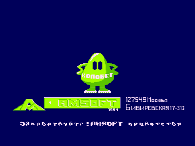

Два колобка бегут наперегонки за мухой.
На пути им встречаются препятствия, через которые надо перепрыгивать.
Неудачный прыжок через препятствие замедляет бег.
Побеждает тот, кто первым ловит муху.

В эту веселую игру можно играть соревнуясь с компьютером, или с товарищем.
Можно заставить компьютер играть за обоих колобков.

