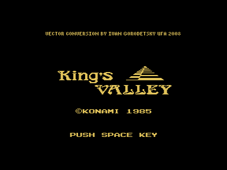
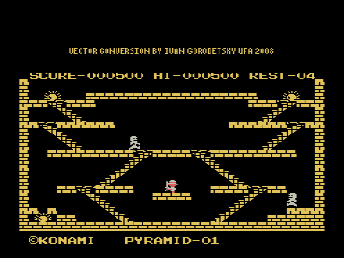

Игра King's Valley является адаптацией c MSX.

Пройти как можно больше пирамид, собирая алмазы.
Главного героя пытаются поймать монстры, которых он может временно уничтожить с помощью меча.
Подобрав кирку можно прорубать дырки в кирпичах, чтобы добраться до особо запрятанных алмазов.
После каждых 15 пирамид получаете бонус и смотрите мини-анимацию.

Работает только на векторе c z80 (особенности какого-либо конкретного адаптера не используются, поэтому должно пойти на любом).
На данный момент эту возможность поддерживает эмулятор Дмитрия Целикова, который можно найти на сайте http://bashkiria-2m.narod.ru.
Звук выводится через Sound Tracker или R-Sound 2. Квазидиск не требуется.

Управление в игре:
Клавиши курсора - перемещение, чтобы зайти на лестницу нужно одновременно с "вправо" или "влево" держать "вверх" или "вниз";
Пробел - прыжок (если нет меча и кирки), бросить меч (если он есть), применить кирку (если она есть);
F1 - пауза;
F2 - "самоликвидация" и рестарт уровня.

Если у Вас есть возможность проверить работоспособность на реале с z80 - напишите пожалуйста мне!

## v 1.0 - 28.08.2008
- Первоначальный вариант

## v 1.1 - 16.10.2008
- Другой упаковщик - rom файл стал короче, распаковка быстрее.
- Небольшая коррекция программирования палитры и в обработке прерываний.

