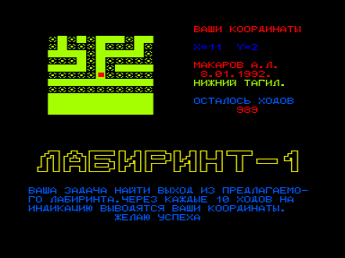
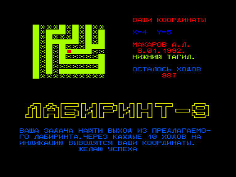

— &#132;Ваша задача: найти выход из предлагаемого лабиринта&#147;, — услышал Тесей голос откуда-то сверху.
— &#132;Эх,&#147; — подумал он — &#132;надо было брать GPS, а не ГЛОНАСС, у которого координаты чаще чем раз за 10 шагов не увидишь&#147;&#133;

Серия из 9 игр, в которых вам предлагается найти выход из лабиринта.

