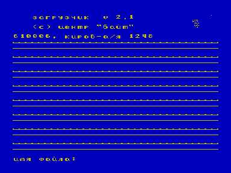

Начальный загрузчик

Центр БАЙТ, Киров, автор Григорий Луппов

Возможности загрузки:

1. Квазидиск (по-умолчанию)

2. Дисковод (при нажатой клавише СС)

3. Магнитофон (режим COPY N4 - игнорирование ошибок, вывод имени файла)

Реклама Центра БАЙТ:

-------------------------------------------------------------------

Внимание ! Новинка !

-------------------------------------------------------------------

В фирме "Байт" разработан новый загрузчик - "Load Byte". Заг-

рузчик позволяет осуществлять загрузку программ с магнитофона и

дисковода. Для пользователей магнитофонной конфигурации "Векто-

ра-06Ц" введен ряд сервисных удобств:

- вывод имени загружаемого файла на экран;

- пометка начального и конечного блоков на экране;

- возможность загрузки сбойных программ как в Copy-N4 (при сбое

программа не сбрасывается, а продолжает грузиться. Ленту мож-

но проматывать вперед-назад и повторно грузить сбойные участ-

ки). Причем загрузчик сам определит, когда программа загру-

зится без ошибок ;

- специальный маркер указывает на экране на текущий загружаемый

блок;

- более надежное схватывание начала программы по сравнению с

предшествующими версиями;

- возможность загрузки программы прямо с середины с выводом име-

ни загружаемой программы на экран. Это значительно облегчит

поиск нужной программы и ее ввод тем, кто пользуется магнито-

фонами без счетчиков;

- автозапуск загружаемой программы;

- действие клавиши УС сохраняется.

Загрузчик зашит в м/с ПЗУ РФ5 объемом 2 кбт. Прилагается инс-

трукция по замене м/с ПЗУ. Стоимость загрузчика ________ руб.

по предоплате телеграфным (почтовым) переводом. При оплате на-

ложенным платежем стоимость возрастает на 35% .

