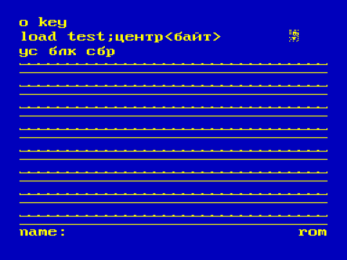
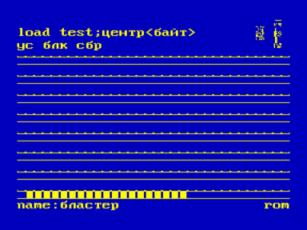

Копировщик с магнитофона на магнитофон с одновременным тестированием качества записи ROM и BAS файлов.

Поочередно загружаются программы с магнитофонной кассеты.
Если загрузка прошла успешно, память очищается и загружается следующая программа.
В случае, если попадается некачественная запись, высвечивается надпись «error» и начинает мигать светодиод РУС/LAT.

УС + БЛК+СБР — переключение режима ROM/BAS

