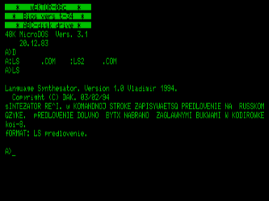

«Синтезатор речи»

В командной строке записывается предложение на русском языке.
Предложение должно быть набрано заглавными буквами в кодировке КОИ-8.

«Синтезатор речи II»

В командной строке указывается имя тесктового файла.
Текстовый файл  должен содержать текст, набранный в кодировке КОИ-8.

СС — вкл/выкл вывода текста на экран

УС — досрочный выход

