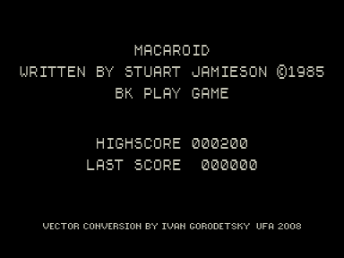
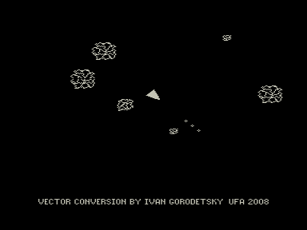

Игра Macaroids является адаптацией очень простенькой игрушки со спектрума из журнала Your Spectrum 10.85.
Работать будет только на векторе c z80 (особенности какого-либо конкретного адаптера не используются, поэтому должно пойти на любом).

Имеет смысл пройти первые три уровня, т.к. на них графика разная, потом она циклически повторяется.

На данный момент эту возможность поддерживает эмулятор Дмитрия Целикова, который можно найти на сайте http://bashkiria-2m.narod.ru.
Управление:

В меню: старт - ВК
В игре: вправо,влево,вперед - соответствующие клавиши курсора; HYPERDRIVE (так в оригинале :) - курсор вниз; стрельба - РУС/ЛАТ.

Если у Вас есть возможность проверить работоспособность на реале с z80 - напишите пожалйста мне!

v1.0 - 11.02.2008 [Иван Городецкий](../../authors/ivagor)

v1.1 - 21.09.2008 Первая версия
- Игра ускорена до скорости спектрумовского варианта
- Звуки теперь несколько менее неприятные

