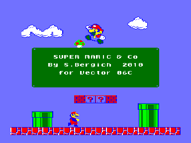
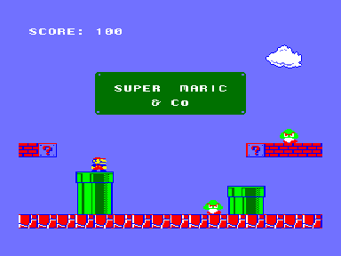

Демо-ремикс культовой игры «Mario»

От автора:

«Два года назад решил сделать ремикс известного Марио на Вектор.
К сожалению, на полноценную игру времени и сил не хватило, да и интерес после того как закончил движок и первый экран поубавился, поэтому решил поделиться с общественностью "чем есть".
Не судите строго — я не программировал на асме почти 20 лет, мнемонику 8080 забыл напрочь, поэтому писалось мнемоникой Z80, используя совместимые команды.
Ассемлер Pasmo (Включен в архив вместе с исходниками). Должно работать на родном векторе, звук через таймер.»

